=======
Day 02
=======

We have the 3 nodes ready in which docker bundle including the swarms are installed. 

- If incase ip is not working, use `dhclient <interface name>` to renew the lease.

::

    Master: ssh root@192.168.64.3
    worker1: ssh root@192.168.64.5
    worker2: ssh root@192.168.64.4

Docker is installed.

::

    [root@Master ~]# systemctl status docker
    ● docker.service - Docker Application Container Engine
       Loaded: loaded (/usr/lib/systemd/system/docker.service; enabled; vendor preset: disabled)
       Active: active (running) since Mon 2022-09-05 16:32:11 IST; 14h ago
         Docs: https://docs.docker.com
     Main PID: 1156 (dockerd)
        Tasks: 8
       Memory: 223.0M
       CGroup: /system.slice/docker.service
               └─1156 /usr/bin/dockerd -H fd:// --containerd=/run/containerd/containerd.sock

    Sep 06 07:03:43 Master dockerd[1156]: time="2022-09-06T07:03:43.503128151+05:30" level=info msg="NetworkDB stats Master(14d9c2f3a12e) - netID:cuwx...tMsg/s:0"
    Sep 06 07:08:43 Master dockerd[1156]: time="2022-09-06T07:08:43.507412364+05:30" level=info msg="NetworkDB stats Master(14d9c2f3a12e) - netID:cuwx...tMsg/s:0"
    Sep 06 07:13:26 Master dockerd[1156]: time="2022-09-06T07:13:26.476323913+05:30" level=info msg="worker l36r1bva4uldsoakpvcm8p8p8 was successfully...register"
    Sep 06 07:13:26 Master dockerd[1156]: time="2022-09-06T07:13:26.519341563+05:30" level=info msg="Node c962c249e349/192.168.64.5, joined gossip cluster"
    Sep 06 07:13:26 Master dockerd[1156]: time="2022-09-06T07:13:26.519522335+05:30" level=info msg="Node c962c249e349/192.168.64.5, added to nodes list"
    Sep 06 07:13:43 Master dockerd[1156]: time="2022-09-06T07:13:43.702509884+05:30" level=info msg="NetworkDB stats Master(14d9c2f3a12e) - netID:cuwx...tMsg/s:0"
    Sep 06 07:16:23 Master dockerd[1156]: time="2022-09-06T07:16:23.262402502+05:30" level=info msg="worker ztiqxh743crxfg4lc99cihhhr was successfully...register"
    Sep 06 07:16:23 Master dockerd[1156]: time="2022-09-06T07:16:23.326110812+05:30" level=info msg="Node 16326b566f21/192.168.64.4, joined gossip cluster"
    Sep 06 07:16:23 Master dockerd[1156]: time="2022-09-06T07:16:23.326337142+05:30" level=info msg="Node 16326b566f21/192.168.64.4, added to nodes list"
    Sep 06 07:18:43 Master dockerd[1156]: time="2022-09-06T07:18:43.901241957+05:30" level=info msg="NetworkDB stats Master(14d9c2f3a12e) - netID:cuwx...tMsg/s:0"
    Hint: Some lines were ellipsized, use -l to show in full.

Swarm: Multi-Node Setup
=========================

Multi-Node = 1 manger, multiple workers. 

Now initialize swarm. we have 3 nodes. We need to decide which one should be the manager.

Initialize my manager. `docker swarm init` for single interface. Or use `docker swarm init --advertise-addr <IPaddress or Domain name>`

::

    [root@Master ~]# docker swarm init 
    Swarm initialized: current node (l2guvkvyunse6shsl30hppe5y) is now a manager.

    To add a worker to this swarm, run the following command:

        docker swarm join --token SWMTKN-1-262a11hm4nlcn89x7j4wxm669t6t39jgscnxu74zcrgsawubeb-978z8yo1hpfa422uvo6w7vvw2 192.168.64.3:2377

    To add a manager to this swarm, run 'docker swarm join-token manager' and follow the instructions.

::

    [root@Master ~]# docker node ls
    ID                            HOSTNAME   STATUS    AVAILABILITY   MANAGER STATUS   ENGINE VERSION
    l2guvkvyunse6shsl30hppe5y *   Master     Ready     Active         Leader           20.10.17

- Default port: 2377.
- See the IP picked up automatically.
- You got a token.
- To see manager is initialized.

- Status is **ready**. He is ready to accept worker nodes. Means the private communication is ready. Cluster communication is ready and CNI Overlay driver (Ingress) is ready.

::

    [root@Master ~]# docker network ls
    NETWORK ID     NAME              DRIVER    SCOPE
    0d066b3c27c8   bridge            bridge    local
    a2468d54e9ec   docker_gwbridge   bridge    local
    3b15b0e13fad   host              host      local
    cuwxn1mifmho   ingress           overlay   swarm
    110184c53f6d   none              null      local

- See `ingress` `overlay` driver controlled by `swarm`. This is why status is shown READY.
- AVAILABILITY = active: means he is ready to accept application containers. Remember manager is a technical manager.
- Manager is Leader by default as he is the first one initialized.

Now manager is the real manager. Add worker to this. Copy the token and got to worker nodes.

::

    [root@worker1 ~]# docker network ls
    NETWORK ID     NAME      DRIVER    SCOPE
    64e72905f086   bridge    bridge    local
    3b15b0e13fad   host      host      local
    110184c53f6d   none      null      local
    [root@worker1 ~]# 
    [root@worker1 ~]# docker swarm join --token SWMTKN-1-262a11hm4nlcn89x7j4wxm669t6t39jgscnxu74zcrgsawubeb-978z8yo1hpfa422uvo6w7vvw2 192.168.64.3:2377
    This node joined a swarm as a worker.
    [root@worker1 ~]# docker network ls
    NETWORK ID     NAME              DRIVER    SCOPE
    64e72905f086   bridge            bridge    local
    30bef03102a9   docker_gwbridge   bridge    local
    3b15b0e13fad   host              host      local
    cuwxn1mifmho   ingress           overlay   swarm
    110184c53f6d   none              null      local

Management commands will work only from Manager::

    [root@worker1 ~]# docker node ls
    Error response from daemon: This node is not a swarm manager. Worker nodes can't be used to view or modify cluster state. Please run this command on a manager node or promote the current node to a manager.

Try from master::

    [root@Master ~]# docker node ls
    ID                            HOSTNAME   STATUS    AVAILABILITY   MANAGER STATUS   ENGINE VERSION
    l2guvkvyunse6shsl30hppe5y *   Master     Ready     Active         Leader           20.10.17
    l36r1bva4uldsoakpvcm8p8p8     worker1    Ready     Active                          20.10.17

Repeat the same on worker2::

    [root@worker2 ~]# docker swarm join --token SWMTKN-1-262a11hm4nlcn89x7j4wxm669t6t39jgscnxu74zcrgsawubeb-978z8yo1hpfa422uvo6w7vvw2 192.168.64.3:2377
    This node joined a swarm as a worker.

Multi node setup is ready::

    [root@Master ~]# docker node ls
    ID                            HOSTNAME   STATUS    AVAILABILITY   MANAGER STATUS   ENGINE VERSION
    l2guvkvyunse6shsl30hppe5y *   Master     Ready     Active         Leader           20.10.17
    l36r1bva4uldsoakpvcm8p8p8     worker1    Ready     Active                          20.10.17
    ztiqxh743crxfg4lc99cihhhr     worker2    Ready     Active                          20.10.17

Promote & demote a node
--------------------------

Current cluster status:

::

    [root@Master ~]# docker node ls
    ID                            HOSTNAME   STATUS    AVAILABILITY   MANAGER STATUS   ENGINE VERSION
    l2guvkvyunse6shsl30hppe5y *   Master     Ready     Active         Leader           20.10.17
    l36r1bva4uldsoakpvcm8p8p8     worker1    Ready     Active                          20.10.17
    ztiqxh743crxfg4lc99cihhhr     worker2    Ready     Active                          20.10.17

If manager is taking leave, promote worker as master. 

::

    [root@Master ~]# docker node promote worker1
    Node worker1 promoted to a manager in the swarm.
    [root@Master ~]# 

See it becomes **Reachable**::

    [root@Master ~]# docker node ls
    ID                            HOSTNAME   STATUS    AVAILABILITY   MANAGER STATUS   ENGINE VERSION
    l2guvkvyunse6shsl30hppe5y *   Master     Ready     Active         Leader           20.10.17
    l36r1bva4uldsoakpvcm8p8p8     worker1    Ready     Active         Reachable        20.10.17
    ztiqxh743crxfg4lc99cihhhr     worker2    Ready     Active                          20.10.17
    [root@Master ~]# 

Management commands are working now from worker as it is promoted as manager::

    [root@worker1 ~]# docker node ls
    ID                            HOSTNAME   STATUS    AVAILABILITY   MANAGER STATUS   ENGINE VERSION
    l2guvkvyunse6shsl30hppe5y     Master     Ready     Active         Leader           20.10.17
    l36r1bva4uldsoakpvcm8p8p8 *   worker1    Ready     Active         Reachable        20.10.17
    ztiqxh743crxfg4lc99cihhhr     worker2    Ready     Active                          20.10.17

Demote him as manager came back.

::

    [root@Master ~]# docker node demote worker1
    Manager worker1 demoted in the swarm.

Management command stopped working on worker::

    [root@worker1 ~]# docker node ls
    Error response from daemon: This node is not a swarm manager. Worker nodes can't be used to view or modify cluster state. Please run this command on a manager node or promote the current node to a manager.

To decommission the cluster
-----------------------------

First decommission the workers. Go to each and run `docker swarm leave (on workernodes)`. The token will be removed from the workers.

::

    [root@worker1 ~]# docker swarm leave
    Node left the swarm.

    [root@worker2 ~]# docker swarm leave
    Node left the swarm.

See the overlay driver also removed.

::

    [root@worker1 ~]# docker network ls
    NETWORK ID     NAME              DRIVER    SCOPE
    64e72905f086   bridge            bridge    local
    30bef03102a9   docker_gwbridge   bridge    local
    3b15b0e13fad   host              host      local
    110184c53f6d   none              null      local
    [root@worker1 ~]# 

However, nodes are still part of swarm::

    [root@Master ~]# docker node ls
    ID                            HOSTNAME   STATUS    AVAILABILITY   MANAGER STATUS   ENGINE VERSION
    l2guvkvyunse6shsl30hppe5y *   Master     Ready     Active         Leader           20.10.17
    l36r1bva4uldsoakpvcm8p8p8     worker1    Down      Active                          20.10.17
    ztiqxh743crxfg4lc99cihhhr     worker2    Down      Active                          20.10.17
    [root@Master ~]# 

Run `docker node rm nodename (on masternodes)`

Remove worker1::

    [root@Master ~]# docker node rm worker1
    worker1
    [root@Master ~]# docker node ls
    ID                            HOSTNAME   STATUS    AVAILABILITY   MANAGER STATUS   ENGINE VERSION
    l2guvkvyunse6shsl30hppe5y *   Master     Ready     Active         Leader           20.10.17
    ztiqxh743crxfg4lc99cihhhr     worker2    Down      Active                          20.10.17

Remove worker2::

    [root@Master ~]# docker node rm worker2
    worker2
    [root@Master ~]# docker node ls
    ID                            HOSTNAME   STATUS    AVAILABILITY   MANAGER STATUS   ENGINE VERSION
    l2guvkvyunse6shsl30hppe5y *   Master     Ready     Active         Leader           20.10.17

Now leave the master::

    [root@Master ~]# docker swarm leave
    Error response from daemon: You are attempting to leave the swarm on a node that is participating as a manager. Removing the last manager erases all current state of the swarm. Use `--force` to ignore this message.

You need to force leave::

    [root@Master ~]# docker swarm leave --force
    Node left the swarm.
    [root@Master ~]# docker node ls
    Error response from daemon: This node is not a swarm manager. Use "docker swarm init" or "docker swarm join" to connect this node to swarm and try again.

Swarm: Multi-Manager Setup
===========================

**Start with ODD value, End with ODD value**

Initialize swarm::

    [root@Master ~]# docker swarm init
    Swarm initialized: current node (s9gz8vgflhe0bipop434m2hm9) is now a manager.

    To add a worker to this swarm, run the following command:

        docker swarm join --token SWMTKN-1-1l4njynbm6fzbmxyccu7p5gdcmdflhftbwftnm8wyxx72g6b4c-c100fzmtvdxxfx3l39yjbd9th 192.168.64.3:2377

    To add a manager to this swarm, run 'docker swarm join-token manager' and follow the instructions.

    [root@Master ~]# docker node ls
    ID                            HOSTNAME   STATUS    AVAILABILITY   MANAGER STATUS   ENGINE VERSION
    s9gz8vgflhe0bipop434m2hm9 *   Master     Ready     Active         Leader           20.10.17

Need a manger token to add a new manager::

    [root@Master ~]# docker swarm join-token manager
    To add a manager to this swarm, run the following command:

        docker swarm join --token SWMTKN-1-1l4njynbm6fzbmxyccu7p5gdcmdflhftbwftnm8wyxx72g6b4c-94mvznl38yfdsnvprupjqlzba 192.168.64.3:2377

See the last part of token is different.

Add 2 sub-ordinate managers::

    [root@worker1 ~]# docker swarm join --token SWMTKN-1-1l4njynbm6fzbmxyccu7p5gdcmdflhftbwftnm8wyxx72g6b4c-94mvznl38yfdsnvprupjqlzba 192.168.64.3:2377
    This node joined a swarm as a manager.

    [root@worker2 ~]# docker swarm join --token SWMTKN-1-1l4njynbm6fzbmxyccu7p5gdcmdflhftbwftnm8wyxx72g6b4c-94mvznl38yfdsnvprupjqlzba 192.168.64.3:2377
    This node joined a swarm as a manager.

    [root@worker2 ~]# docker node ls
    ID                            HOSTNAME   STATUS    AVAILABILITY   MANAGER STATUS   ENGINE VERSION
    s9gz8vgflhe0bipop434m2hm9     Master     Ready     Active         Leader           20.10.17
    yutnw4pubharedlgxr7t02uvd     worker1    Ready     Active         Reachable        20.10.17
    imphrltsufd3qes3lz3toqlps *   worker2    Ready     Active         Reachable        20.10.17

Three managers are ready now with one leader.

Watch Manager node::

    [root@worker1 ~]# watch docker node ls

This will take you to watch ls command on every 2s::

    Every 2.0s: docker node ls                                                                                                            Tue Sep  6 07:45:52 2022

    ID                            HOSTNAME   STATUS    AVAILABILITY   MANAGER STATUS   ENGINE VERSION
    s9gz8vgflhe0bipop434m2hm9 *   Master     Ready     Active         Leader           20.10.17
    yutnw4pubharedlgxr7t02uvd     worker1    Ready     Active         Reachable        20.10.17
    imphrltsufd3qes3lz3toqlps     worker2    Ready     Active         Reachable        20.10.17

Power off Master node from UTM

You can see the status changed to DOWN and MANAGER STATUS is Unreachable::

    [root@worker1 ~]# docker node ls
    ID                            HOSTNAME   STATUS    AVAILABILITY   MANAGER STATUS   ENGINE VERSION
    s9gz8vgflhe0bipop434m2hm9     Master     Down      Active         Unreachable      20.10.17
    yutnw4pubharedlgxr7t02uvd *   worker1    Ready     Active         Leader           20.10.17
    imphrltsufd3qes3lz3toqlps     worker2    Ready     Active         Reachable        20.10.17

**However, the Quorum = N/2+1=2 and cluster will not fail. The one which initialized first among the active nodes will become the leader**. See worker1 is leader now automatically.

power off worker2 now. Cluster will fail as it doesn't meet Quorum::

    Every 2.0s: docker node ls                                                                                                            Tue Sep  6 15:20:06 2022

    ID                            HOSTNAME   STATUS    AVAILABILITY   MANAGER STATUS   ENGINE VERSION
    s9gz8vgflhe0bipop434m2hm9     Master     Down	   Active         Unreachable	   20.10.17
    yutnw4pubharedlgxr7t02uvd *   worker1    Ready     Active         Leader           20.10.17
    imphrltsufd3qes3lz3toqlps     worker2    Ready     Active         Unreachable      20.10.17

Cluster failed with `DeadlineeExceeded` error::

    [root@worker1 ~]# watch docker node ls

    Every 2.0s: docker node ls                                                                                                            Tue Sep  6 15:20:51 2022

    Error response from daemon: rpc error: code = Unknown desc = The swarm does not have a leader. It's possible that too few managers are online. Make sure more
    than half of the managers are online.

To bring the cluster up, bring any one node up. In this case RAFT algorithm comes in picture. Worker1 will be the leader. Bring up Master and watch!

Once master is up::

    [root@Master ~]# docker node ls
    ID                            HOSTNAME   STATUS    AVAILABILITY   MANAGER STATUS   ENGINE VERSION
    s9gz8vgflhe0bipop434m2hm9 *   Master     Ready     Active         Reachable        20.10.17
    yutnw4pubharedlgxr7t02uvd     worker1    Ready     Active         Leader           20.10.17
    imphrltsufd3qes3lz3toqlps     worker2    Down      Active         Unreachable      20.10.17

Yes!! Cluster recreated!!

Bring up other worker2 as well::

    [root@Master ~]# docker node ls
    ID                            HOSTNAME   STATUS    AVAILABILITY   MANAGER STATUS   ENGINE VERSION
    s9gz8vgflhe0bipop434m2hm9 *   Master     Ready     Active         Reachable        20.10.17
    yutnw4pubharedlgxr7t02uvd     worker1    Ready     Active         Leader           20.10.17
    imphrltsufd3qes3lz3toqlps     worker2    Ready     Active         Reachable        20.10.17

Decommission Multi-Manager Setup
----------------------------------

First decommission workers, then sub ordinate managers, then the leader.

Remember worker1 is the leader now. So leave Master and worker2. You need to force it as they are quorum members.

::

    [root@Master ~]# docker swarm leave
    Error response from daemon: You are attempting to leave the swarm on a node that is participating as a manager. The only way to restore a swarm that has lost consensus is to reinitialize it with `--force-new-cluster`. Use `--force` to suppress this message.
    [root@Master ~]# docker swarm leave --force
    Node left the swarm.
    [root@Master ~]# docker node ls
    Error response from daemon: This node is not a swarm manager. Use "docker swarm init" or "docker swarm join" to connect this node to swarm and try again.

Once it is `DOWN`, try removing it. But `docker node rm Manager` will not work. because all managers are member of the RAFT. Demote it as a worker. Worker is not a member of RAFT.

::

    [root@worker1 ~]# docker node rm Master
    Error response from daemon: rpc error: code = FailedPrecondition desc = node s9gz8vgflhe0bipop434m2hm9 is a cluster manager and is a member of the raft cluster. It must be demoted to worker before removal
    [root@worker1 ~]# 

So demote it and then try::

    [root@worker1 ~]# docker node demote Master
    Manager Master demoted in the swarm.
    [root@worker1 ~]# 
    [root@worker1 ~]# docker node ls
    ID                            HOSTNAME   STATUS    AVAILABILITY   MANAGER STATUS   ENGINE VERSION
    s9gz8vgflhe0bipop434m2hm9     Master     Down      Active                          20.10.17
    yutnw4pubharedlgxr7t02uvd *   worker1    Ready     Active         Leader           20.10.17
    imphrltsufd3qes3lz3toqlps     worker2    Ready     Active         Reachable        20.10.17
    [root@worker1 ~]# docker node rm Master
    Master
    [root@worker1 ~]# docker node ls
    ID                            HOSTNAME   STATUS    AVAILABILITY   MANAGER STATUS   ENGINE VERSION
    yutnw4pubharedlgxr7t02uvd *   worker1    Ready     Active         Leader           20.10.17
    imphrltsufd3qes3lz3toqlps     worker2    Ready     Active         Reachable        20.10.17
    [root@worker1 ~]# 

Now the Quorum has 2 managers. Remove 2nd manager. Cluster will fail as it ruin the Quorum. See the error.

::

    [root@worker2 ~]# docker swarm leave
    Error response from daemon: You are attempting to leave the swarm on a node that is participating as a manager. Removing this node leaves 1 managers out of 2. Without a Raft quorum your swarm will be inaccessible. The only way to restore a swarm that has lost consensus is to reinitialize it with `--force-new-cluster`. Use `--force` to suppress this message.
    [root@worker2 ~]# 

You need to force leave it as anyway we are decommissioning it::

    [root@worker2 ~]# docker swarm leave --force
    Node left the swarm.

As expected, the cluster failed::

    [root@worker1 ~]# docker node ls
    Error response from daemon: rpc error: code = Unknown desc = The swarm does not have a leader. It's possible that too few managers are online. Make sure more than half of the managers are online.

Anyway it is a decommission request, force remove it::

    [root@worker1 ~]# docker swarm leave --force
    Node left the swarm.

Docker Service
===============

Docker service is a swarm service rpm. If swarm is not installed, docker service will not work.

- Container will not manage the applications. It's the orchestrator takes care of application to provide high availability.
- All workers should have got equal responsibility load balanced.
- Each application can have it's own requirements. Not everyone demand high availability.

.. important:: Every application will be embedded with a docker service. no more `docker run`, a container command. Instead, we use docker service command, an orchestrator service.

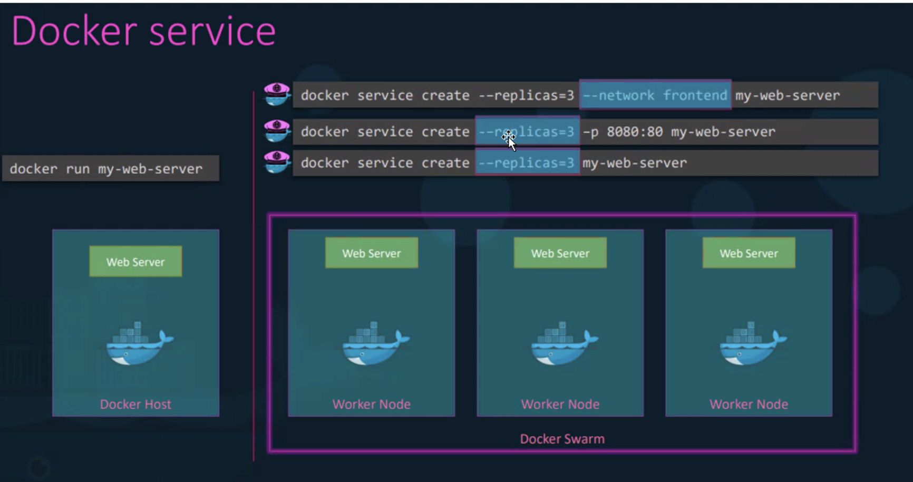

So, create a service first and embedd it with the application.

In which node we are running the orchestrator command? Only in the manager node you can do `docker service` command. Leader will take final decision.

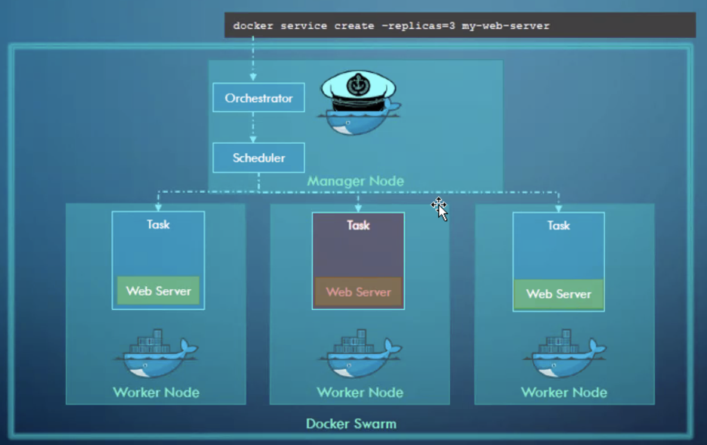

Create swarm setup::

    [root@Master ~]# docker swarm init
        Swarm initialized: current node (sz3d2x0v5optt8wiunz790vkt) is now a manager.
    
    To add a worker to this swarm, run the following command:
    
        docker swarm join --token SWMTKN-1-08id3eswxw668boq0q4u4oh753hhpa6h3f8rkcbq9qfvvji15t-2d798vdxctcxf9tjp5yklsydg 192.168.64.3:2377
    
    To add a manager to this swarm, run 'docker swarm join-token manager' and follow the instructions.

    [root@worker1 ~]# docker swarm join --token SWMTKN-1-08id3eswxw668boq0q4u4oh753hhpa6h3f8rkcbq9qfvvji15t-2d798vdxctcxf9tjp5yklsydg 192.168.64.3:2377
    This node joined a swarm as a worker.

    [root@worker2 ~]# docker swarm join --token SWMTKN-1-08id3eswxw668boq0q4u4oh753hhpa6h3f8rkcbq9qfvvji15t-2d798vdxctcxf9tjp5yklsydg 192.168.64.3:2377
    This node joined a swarm as a worker.

::

    [root@Master ~]# docker node ls
    ID                            HOSTNAME   STATUS    AVAILABILITY   MANAGER STATUS   ENGINE VERSION
    sz3d2x0v5optt8wiunz790vkt *   Master     Ready     Active         Leader           20.10.17
    uqf4hswbcrhzu40862iy4elvx     worker1    Ready     Active                          20.10.17
    3xjdz8tenj345y7fc7g73zv79     worker2    Ready     Active                          20.10.17
    [root@Master ~]# 

Let's create nginx replicas. Manager will decide on which node these replicas will be created. To access it from outside word. **Port binding from 80:8000. Inbound port is 80. Outbound 8000 is reserved for nginx on all nodes**.

::

    [root@Master ~]# docker service create --name=web --replicas=2 -p 8000:80 nginx
    jeo3hq26wn9a7gr433crhl1ee
    overall progress: 2 out of 2 tasks 
    1/2: running   [==================================================>] 
    2/2: running   [==================================================>] 
    verify: Service converged 

See the replicas. There are 2 replicas running::

    [root@Master ~]# docker service ls
    ID             NAME      MODE         REPLICAS   IMAGE          PORTS
    jeo3hq26wn9a   web       replicated   2/2        nginx:latest   *:8000->80/tcp

To know where it is running::

    [root@Master ~]# docker service ps web
    ID             NAME      IMAGE          NODE      DESIRED STATE   CURRENT STATE           ERROR     PORTS
    1nppdthmlfj4   web.1     nginx:latest   Master    Running         Running 2 minutes ago             
    o6rm8tn3gc2j   web.2     nginx:latest   worker1   Running         Running 2 minutes ago             

- It came on `Worker1` and `Master`.
- You can create any number of replicas. It's unlimited as long as you have resources. Leader manager decided to place it like this.
- Imagine number of users increased. We need to scale. If we add one more it should come on worker2 as it is load balanced.

Scale to 3::

    [root@Master ~]# docker service scale web=3
    web scaled to 3
    overall progress: 3 out of 3 tasks 
    1/3: running   [==================================================>] 
    2/3: running   [==================================================>] 
    3/3: running   [==================================================>] 
    verify: Service converged 

See it came on Worker2. This is how loadbalancer works::

    [root@Master ~]# docker service ps web
    ID             NAME      IMAGE          NODE      DESIRED STATE   CURRENT STATE            ERROR     PORTS
    1nppdthmlfj4   web.1     nginx:latest   Master    Running         Running 4 minutes ago              
    o6rm8tn3gc2j   web.2     nginx:latest   worker1   Running         Running 4 minutes ago              
    xf7nujpswa65   web.3     nginx:latest   worker2   Running         Running 35 seconds ago             

Scale again::

    [root@Master ~]# docker service scale web=9
    web scaled to 9
    overall progress: 9 out of 9 tasks 
    1/9: running   [==================================================>] 
    2/9: running   [==================================================>] 
    3/9: running   [==================================================>] 
    4/9: running   [==================================================>] 
    5/9: running   [==================================================>] 
    6/9: running   [==================================================>] 
    7/9: running   [==================================================>] 
    8/9: running   [==================================================>] 
    9/9: running   [==================================================>] 
    verify: Service converged 
    [root@Master ~]# docker service ps web
    ID             NAME      IMAGE          NODE      DESIRED STATE   CURRENT STATE                ERROR     PORTS
    1nppdthmlfj4   web.1     nginx:latest   Master    Running         Running 5 minutes ago                  
    o6rm8tn3gc2j   web.2     nginx:latest   worker1   Running         Running 5 minutes ago                  
    xf7nujpswa65   web.3     nginx:latest   worker2   Running         Running about a minute ago             
    heomj2psu7zc   web.4     nginx:latest   worker1   Running         Running 12 seconds ago                 
    4ff4elt3eodh   web.5     nginx:latest   worker2   Running         Running 12 seconds ago                 
    jbl1v4ax2f7s   web.6     nginx:latest   Master    Running         Running 12 seconds ago                 
    2a0das0qnzyt   web.7     nginx:latest   worker1   Running         Running 12 seconds ago                 
    kfocg0ulqo1z   web.8     nginx:latest   worker2   Running         Running 12 seconds ago                 
    550x39zufc7j   web.9     nginx:latest   Master    Running         Running 12 seconds ago                 
    [root@Master ~]# 

We can scale down as well::

    [root@Master ~]# docker service scale web=2
    web scaled to 2
    overall progress: 2 out of 2 tasks 
    1/2: running   [==================================================>] 
    2/2: running   [==================================================>] 
    verify: Service converged 
    [root@Master ~]# docker service ps web
    ID             NAME      IMAGE          NODE      DESIRED STATE   CURRENT STATE            ERROR     PORTS
    1nppdthmlfj4   web.1     nginx:latest   Master    Running         Running 13 minutes ago             
    o6rm8tn3gc2j   web.2     nginx:latest   worker1   Running         Running 13 minutes ago             

- This scaling is automated based on the user counts. You can use small scripts to scale up and scale down. 
- Give a threshold range and you can automate scaling.
- Suppose I have 50 applications with 50 replicas each, so 2500 replicas. Resources will be taken from Node only. So overall efficiency of the node will go 80%. In this case, you need to **scale up the Node**!!. You just need token to create a worker node from master. Who is doing this now? You can use **TERRAFORM** provisioning tool for this . There is an inbuilt tool for provisioning this which is called **DOCKER MACHINE**.

.. important:: Docker-Machine is a native provisioning tool from docker. An alternative to terraform.

Global vs Replicated Mode 
----------------------------

- Default mode is **replicated mode**. You can have unlimited replicas. **Global mode** ensures that one copy will be maintained on a node at any point in time.
- Global mode use case: **monitoring solutions**, **login solutions** etc. We can't use our normal applications as we are limiting.

Remove the service created earlier first::

    [root@Master ~]# docker service rm web
    web
    [root@Master ~]# docker service ps web
    no such service: web
    [root@Master ~]# docker service ls
    ID        NAME      MODE      REPLICAS   IMAGE     PORTS

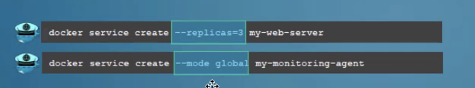

Create a service in global mode::

    [root@Master ~]# docker service create --name=web --mode=global -p 8000:80 nginx
    ryud48r3sic30k8gerl1btaot
    overall progress: 3 out of 3 tasks 
    sz3d2x0v5opt: running   [==================================================>] 
    3xjdz8tenj34: running   [==================================================>] 
    uqf4hswbcrhz: running   [==================================================>] 
    verify: Service converged 
    [root@Master ~]# docker service ls
    ID             NAME      MODE      REPLICAS   IMAGE          PORTS
    ryud48r3sic3   web       global    3/3        nginx:latest   *:8000->80/tcp

See one replica came on each node::

    [root@Master ~]# docker service ps web
    ID             NAME                            IMAGE          NODE      DESIRED STATE   CURRENT STATE                ERROR     PORTS
    8jr63d5xecek   web.3xjdz8tenj345y7fc7g73zv79   nginx:latest   worker2   Running         Running about a minute ago             
    sq0t1y2iutfo   web.sz3d2x0v5optt8wiunz790vkt   nginx:latest   Master    Running         Running about a minute ago             
    itxspneyigow   web.uqf4hswbcrhzu40862iy4elvx   nginx:latest   worker1   Running         Running about a minute ago             

Now, Shutdown worker2 on UTM and see what happens::

    ID             NAME                            IMAGE          NODE      DESIRED STATE   CURRENT STATE           ERROR     PORTS
    8jr63d5xecek   web.3xjdz8tenj345y7fc7g73zv79   nginx:latest   worker2   Shutdown        Running 3 minutes ago             
    sq0t1y2iutfo   web.sz3d2x0v5optt8wiunz790vkt   nginx:latest   Master    Running         Running 3 minutes ago             
    itxspneyigow   web.uqf4hswbcrhzu40862iy4elvx   nginx:latest   worker1   Running         Running 3 minutes ago             

As expected, it shutdown. Now start worker2 see what happens::

    [root@Master ~]# docker service ps web
    ID             NAME                                IMAGE          NODE      DESIRED STATE   CURRENT STATE                   ERROR                         PORTS
    zwr6b9q8gvvc   web.3xjdz8tenj345y7fc7g73zv79       nginx:latest   worker2   Running         Running 12 seconds ago                                        
    8jr63d5xecek    \_ web.3xjdz8tenj345y7fc7g73zv79   nginx:latest   worker2   Shutdown        Failed less than a second ago   "task: non-zero exit (255)"   
    sq0t1y2iutfo   web.sz3d2x0v5optt8wiunz790vkt       nginx:latest   Master    Running         Running 5 minutes ago                                         
    itxspneyigow   web.uqf4hswbcrhzu40862iy4elvx       nginx:latest   worker1   Running         Running 5 minutes ago                                         
    [root@Master ~]# 

We can see a replica came on the same node which wentdown. If we Shutdown one node and restart it, then the replica will be Shutdown and replica will be automatically created again on the node which went down.

Drain vs Active states
------------------------

Suppose I want to stop applications comes on a node as it went for maintainance. YOu can set the node to **drain**. The existing applications running on the node will be moved to another.

Note that the node is still part of swarm, it will just stop accepting application. It can do all the management work.

::

    [root@Master ~]# docker service rm web
    web

    [root@Master ~]# docker service create --name=web --replicas=2 -p 8000:80 nginx
    miwzztp61ydwfd4ci1ud46zkc
    overall progress: 2 out of 2 tasks 
    1/2: running   [==================================================>] 
    2/2: running   [==================================================>] 
    verify: Service converged 
    [root@Master ~]# docker service ls
    ID             NAME      MODE         REPLICAS   IMAGE          PORTS
    miwzztp61ydw   web       replicated   2/2        nginx:latest   *:8000->80/tcp
    [root@Master ~]# docker service ps web
    ID             NAME      IMAGE          NODE      DESIRED STATE   CURRENT STATE            ERROR     PORTS
    vh9nu11xcsx3   web.1     nginx:latest   worker1   Running         Running 17 seconds ago             
    op5912x7xfrn   web.2     nginx:latest   Master    Running         Running 17 seconds ago             
    [root@Master ~]# docker node ls
    ID                            HOSTNAME   STATUS    AVAILABILITY   MANAGER STATUS   ENGINE VERSION
    sz3d2x0v5optt8wiunz790vkt *   Master     Ready     Active         Leader           20.10.17
    uqf4hswbcrhzu40862iy4elvx     worker1    Ready     Active                          20.10.17
    3xjdz8tenj345y7fc7g73zv79     worker2    Ready     Active                          20.10.17

Set the Master node for maintainance::

    [root@Master ~]# docker node update --availability drain Master
    Master
    [root@Master ~]# docker node ls
    ID                            HOSTNAME   STATUS    AVAILABILITY   MANAGER STATUS   ENGINE VERSION
    sz3d2x0v5optt8wiunz790vkt *   Master     Ready     Drain          Leader           20.10.17
    uqf4hswbcrhzu40862iy4elvx     worker1    Ready     Active                          20.10.17
    3xjdz8tenj345y7fc7g73zv79     worker2    Ready     Active                          20.10.17
    [root@Master ~]# 

Nice.. the application running on Master is automatically moved to worker2::

    [root@Master ~]# docker service ps web
    ID             NAME        IMAGE          NODE      DESIRED STATE   CURRENT STATE            ERROR     PORTS
    vh9nu11xcsx3   web.1       nginx:latest   worker1   Running         Running 5 minutes ago              
    cjwecdasmr5h   web.2       nginx:latest   worker2   Running         Running 2 minutes ago              
    op5912x7xfrn    \_ web.2   nginx:latest   Master    Shutdown        Shutdown 2 minutes ago             

Now, try scaling up. let's see where the application will come on::

    [root@Master ~]# docker service scale web=10
    web scaled to 10
    overall progress: 10 out of 10 tasks 
    1/10: running   [==================================================>] 
    2/10: running   [==================================================>] 
    3/10: running   [==================================================>] 
    4/10: running   [==================================================>] 
    5/10: running   [==================================================>] 
    6/10: running   [==================================================>] 
    7/10: running   [==================================================>] 
    8/10: running   [==================================================>] 
    9/10: running   [==================================================>] 
    10/10: running   [==================================================>] 
    verify: Service converged 

See None came on Master::

    [root@Master ~]# docker service ps web
    ID             NAME        IMAGE          NODE      DESIRED STATE   CURRENT STATE            ERROR     PORTS
    vh9nu11xcsx3   web.1       nginx:latest   worker1   Running         Running 7 minutes ago              
    cjwecdasmr5h   web.2       nginx:latest   worker2   Running         Running 4 minutes ago              
    op5912x7xfrn    \_ web.2   nginx:latest   Master    Shutdown        Shutdown 4 minutes ago             
    res512po08g8   web.3       nginx:latest   worker1   Running         Running 12 seconds ago             
    kx92r3qz0n0g   web.4       nginx:latest   worker2   Running         Running 12 seconds ago             
    582a4tq513bn   web.5       nginx:latest   worker1   Running         Running 11 seconds ago             
    pi1u6tvra7kt   web.6       nginx:latest   worker2   Running         Running 12 seconds ago             
    ea3chcfq100k   web.7       nginx:latest   worker1   Running         Running 12 seconds ago             
    i7341jcyi5is   web.8       nginx:latest   worker2   Running         Running 11 seconds ago             
    pn4yrak9zjjg   web.9       nginx:latest   worker1   Running         Running 11 seconds ago             
    mtnwt4o79mr3   web.10      nginx:latest   worker2   Running         Running 11 seconds ago             
    [root@Master ~]# 

Note that Master still the leader. All management things will be done by Master only. It won't do any techinal stuff.

::

    [root@Master ~]# docker node ls
    ID                            HOSTNAME   STATUS    AVAILABILITY   MANAGER STATUS   ENGINE VERSION
    sz3d2x0v5optt8wiunz790vkt *   Master     Ready     Drain          Leader           20.10.17
    uqf4hswbcrhzu40862iy4elvx     worker1    Ready     Active                          20.10.17
    3xjdz8tenj345y7fc7g73zv79     worker2    Ready     Active                          20.10.17

Make Master active::

    [root@Master ~]# docker node update --availability active Master
    Master
    [root@Master ~]# docker node ls
    ID                            HOSTNAME   STATUS    AVAILABILITY   MANAGER STATUS   ENGINE VERSION
    sz3d2x0v5optt8wiunz790vkt *   Master     Ready     Active         Leader           20.10.17
    uqf4hswbcrhzu40862iy4elvx     worker1    Ready     Active                          20.10.17
    3xjdz8tenj345y7fc7g73zv79     worker2    Ready     Active                          20.10.17

Scale it again to 15::

    [root@Master ~]# docker service scale web=15
    web scaled to 15
    overall progress: 15 out of 15 tasks 
    1/15: running   [==================================================>] 
    2/15: running   [==================================================>] 
    3/15: running   [==================================================>] 
    4/15: running   [==================================================>] 
    5/15: running   [==================================================>] 
    6/15: running   [==================================================>] 
    7/15: running   [==================================================>] 
    8/15: running   [==================================================>] 
    9/15: running   [==================================================>] 
    10/15: running   [==================================================>] 
    11/15: running   [==================================================>] 
    12/15: running   [==================================================>] 
    13/15: running   [==================================================>] 
    14/15: running   [==================================================>] 
    15/15: running   [==================================================>] 
    verify: Service converged 
    [root@Master ~]# 

See the last 5 replicas, all came on Master. This is the beauty of load balancer.

::

    [root@Master ~]# docker service ps web
    ID             NAME        IMAGE          NODE      DESIRED STATE   CURRENT STATE            ERROR     PORTS
    vh9nu11xcsx3   web.1       nginx:latest   worker1   Running         Running 11 minutes ago             
    cjwecdasmr5h   web.2       nginx:latest   worker2   Running         Running 7 minutes ago              
    op5912x7xfrn    \_ web.2   nginx:latest   Master    Shutdown        Shutdown 7 minutes ago             
    res512po08g8   web.3       nginx:latest   worker1   Running         Running 3 minutes ago              
    kx92r3qz0n0g   web.4       nginx:latest   worker2   Running         Running 3 minutes ago              
    582a4tq513bn   web.5       nginx:latest   worker1   Running         Running 3 minutes ago              
    pi1u6tvra7kt   web.6       nginx:latest   worker2   Running         Running 3 minutes ago              
    ea3chcfq100k   web.7       nginx:latest   worker1   Running         Running 3 minutes ago              
    i7341jcyi5is   web.8       nginx:latest   worker2   Running         Running 3 minutes ago              
    pn4yrak9zjjg   web.9       nginx:latest   worker1   Running         Running 3 minutes ago              
    mtnwt4o79mr3   web.10      nginx:latest   worker2   Running         Running 3 minutes ago              
    ntmwpxp4aecz   web.11      nginx:latest   Master    Running         Running 41 seconds ago             
    00quhhr24ibo   web.12      nginx:latest   Master    Running         Running 40 seconds ago             
    62hzgvstc0cq   web.13      nginx:latest   Master    Running         Running 40 seconds ago             
    y6oqalgdufrg   web.14      nginx:latest   Master    Running         Running 40 seconds ago             
    n0posajw4zr2   web.15      nginx:latest   Master    Running         Running 40 seconds ago             

How to upgrade the application?
================================

Suppose nginx support for a version expired. you get a newer image. You need to upgrade. How can we upgrade without affecting existing customers. This is the main requirement for orchestration. With any orchestration, we can do a **non-destructive upgrade** or **rolling upgrade** or one after another. 

.. important:: Every orchestration can do rolling upgrade (non destructive upgrade). This is the main reason people want orchestration.

- To check the versions available, go to hub.docker.com
- To see nginx is working on 8000 port. You can give IP of any node.

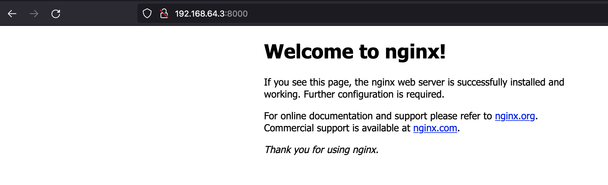

Using worker1 IP.

Using worker2 IP.

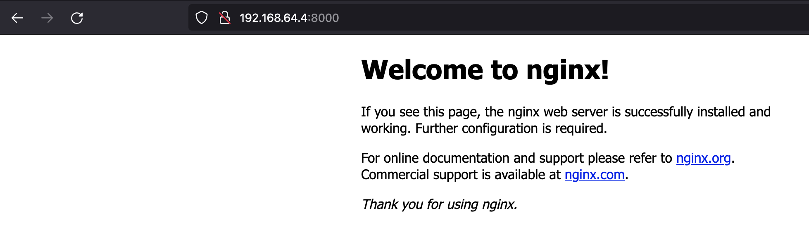

Upgrade. one after other.  it will find the replica having least I/O load. Then push the load to remaining replicas. Take a snap, create a new replica. This is rolling upgrade.

By default rolling update surge value is 40-50%, when it is touching the 6th replica (if we have 15 total), the users which are using the old replica will be moved to the new replicas. There will be very very narrow glitch only. You can't even notice this.

.. important:: You can monitor this change in **GRAFANA** or **PROMETHEOUS**.

Watch from worker1, promote it for that::

    [root@Master ~]# docker node promote worker1
    Node worker1 promoted to a manager in the swarm

    [root@worker1 ~]# watch docker service ps web

    Every 2.0s: docker service ps web                                                                                                     Tue Sep  6 16:44:03 2022

    ID             NAME        IMAGE          NODE      DESIRED STATE   CURRENT STATE             ERROR     PORTS
    vh9nu11xcsx3   web.1	   nginx:latest   worker1   Running         Running 32 minutes ago
    cjwecdasmr5h   web.2	   nginx:latest   worker2   Running         Running 28 minutes ago
    op5912x7xfrn    \_ web.2   nginx:latest   Master    Shutdown        Shutdown 28 minutes ago
    res512po08g8   web.3	   nginx:latest   worker1   Running         Running 24 minutes ago
    kx92r3qz0n0g   web.4	   nginx:latest   worker2   Running         Running 24 minutes ago
    582a4tq513bn   web.5	   nginx:latest   worker1   Running         Running 24 minutes ago
    pi1u6tvra7kt   web.6	   nginx:latest   worker2   Running         Running 24 minutes ago
    ea3chcfq100k   web.7	   nginx:latest   worker1   Running         Running 24 minutes ago
    i7341jcyi5is   web.8	   nginx:latest   worker2   Running         Running 24 minutes ago
    pn4yrak9zjjg   web.9	   nginx:latest   worker1   Running         Running 24 minutes ago
    mtnwt4o79mr3   web.10	   nginx:latest   worker2   Running         Running 24 minutes ago
    ntmwpxp4aecz   web.11	   nginx:latest   Master    Running         Running 22 minutes ago
    00quhhr24ibo   web.12	   nginx:latest   Master    Running         Running 22 minutes ago
    62hzgvstc0cq   web.13	   nginx:latest   Master    Running         Running 21 minutes ago
    y6oqalgdufrg   web.14	   nginx:latest   Master    Running         Running 21 minutes ago
    n0posajw4zr2   web.15	   nginx:latest   Master    Running         Running 21 minutes ago

Start image upgrade::

    [root@Master ~]# docker service update --image nginx:1.22.0 web
    web
    overall progress: 1 out of 15 tasks 
    1/15: running   [==================================================>] 
    2/15: preparing [=================================>                 ] 
    3/15:   
    4/15:   
    5/15:   
    6/15:   
    7/15:   
    8/15:   
    9/15:   
    10/15:   
    11/15:   
    12/15:   
    13/15:   
    14/15:   
    15/15: 

You can see replicas getting shutting down and creating::

    Every 2.0s: docker service ps web                                                                                                     Tue Sep  6 16:44:49 2022

    ID             NAME         IMAGE          NODE      DESIRED STATE   CURRENT STATE             ERROR     PORTS
    vh9nu11xcsx3   web.1	    nginx:latest   worker1   Running         Running 33 minutes ago
    8823d8vzmpl5   web.2        nginx:1.22.0   worker2   Ready           Ready 3 seconds ago
    cjwecdasmr5h    \_ web.2    nginx:latest   worker2   Shutdown        Running 3 seconds ago
    op5912x7xfrn    \_ web.2    nginx:latest   Master    Shutdown        Shutdown 29 minutes ago
    hxdraahps5w2   web.3	    nginx:1.22.0   worker1   Running         Running 33 seconds ago
    res512po08g8    \_ web.3    nginx:latest   worker1   Shutdown        Shutdown 42 seconds ago
    kx92r3qz0n0g   web.4	    nginx:latest   worker2   Running         Running 25 minutes ago
    582a4tq513bn   web.5	    nginx:latest   worker1   Running         Running 25 minutes ago
    mcs42i500pux   web.6        nginx:1.22.0   worker2   Running         Running 11 seconds ago
    pi1u6tvra7kt    \_ web.6    nginx:latest   worker2   Shutdown        Shutdown 19 seconds ago
    ea3chcfq100k   web.7	    nginx:latest   worker1   Running         Running 25 minutes ago
    i7341jcyi5is   web.8	    nginx:latest   worker2   Running         Running 25 minutes ago
    pn4yrak9zjjg   web.9	    nginx:latest   worker1   Running         Running 25 minutes ago
    puiolza19apf   web.10       nginx:1.22.0   worker2   Running         Running 7 seconds ago
    mtnwt4o79mr3    \_ web.10   nginx:latest   worker2   Shutdown        Shutdown 8 seconds ago
    3qa7kw73k698   web.11       nginx:1.22.0   Master    Running         Running 3 seconds ago
    ntmwpxp4aecz    \_ web.11   nginx:latest   Master    Shutdown        Shutdown 4 seconds ago
    00quhhr24ibo   web.12	    nginx:latest   Master    Running         Running 22 minutes ago
    62hzgvstc0cq   web.13	    nginx:latest   Master    Running         Running 22 minutes ago
    y6oqalgdufrg   web.14	    nginx:latest   Master    Running         Running 22 minutes ago
    vyfcivzs4vv2   web.15	    nginx:1.22.0   Master    Running         Running 23 seconds ago
    n0posajw4zr2    \_ web.15   nginx:latest   Master    Shutdown        Shutdown 30 seconds ago

through out the period we can access the nginx.

    .. image:: images/day02/check_port8000.png
      :width: 600
      :align: center

Update complete::

    [root@Master ~]# docker service update --image nginx:1.22.0 web
    web
    overall progress: 15 out of 15 tasks 
    1/15: running   [==================================================>] 
    2/15: running   [==================================================>] 
    3/15: running   [==================================================>] 
    4/15: running   [==================================================>] 
    5/15: running   [==================================================>] 
    6/15: running   [==================================================>] 
    7/15: running   [==================================================>] 
    8/15: running   [==================================================>] 
    9/15: running   [==================================================>] 
    10/15: running   [==================================================>] 
    11/15: running   [==================================================>] 
    12/15: running   [==================================================>] 
    13/15: running   [==================================================>] 
    14/15: running   [==================================================>] 
    15/15: running   [==================================================>] 
    verify: Service converged 

**To rollback**

Rollback::

    [root@Master ~]# docker service rollback web
    web
    rollback: manually requested rollback 
    overall progress: rolling back update: 15 out of 15 tasks 
    1/15: running   [>                                                  ] 
    2/15: running   [>                                                  ] 
    3/15: running   [>                                                  ] 
    4/15: running   [>                                                  ] 
    5/15: running   [>                                                  ] 
    6/15: running   [>                                                  ] 
    7/15: running   [>                                                  ] 
    8/15: running   [>                                                  ] 
    9/15: running   [>                                                  ] 
    10/15: running   [>                                                  ] 
    11/15: running   [>                                                  ] 
    12/15: running   [>                                                  ] 
    13/15: running   [>                                                  ] 
    14/15: running   [>                                                  ] 
    15/15: running   [>                                                  ] 
    verify: Service converged 

Monitor::

    khzpue1vf1nk   web.8        nginx:latest   worker2   Running         Running 3 minutes ago
    efywhri9rclo    \_ web.8    nginx:1.22.0   worker2   Shutdown        Shutdown 3 minutes ago
    i7341jcyi5is    \_ web.8    nginx:latest   worker2   Shutdown        Shutdown 7 minutes ago
    0onigx2jhu8h   web.9        nginx:latest   worker1   Running         Running 2 minutes ago
    6w2nipb4gtng    \_ web.9    nginx:1.22.0   worker1   Shutdown        Shutdown 2 minutes ago
    pn4yrak9zjjg    \_ web.9    nginx:latest   worker1   Shutdown        Shutdown 7 minutes ago
    f0m7ylm6ejng   web.10       nginx:latest   worker2   Running         Running 3 minutes ago
    puiolza19apf    \_ web.10   nginx:1.22.0   worker2   Shutdown        Shutdown 3 minutes ago
    mtnwt4o79mr3    \_ web.10   nginx:latest   worker2   Shutdown        Shutdown 7 minutes ago
    qfxaoo739c86   web.11       nginx:latest   Master    Running         Running 3 minutes ago
    3qa7kw73k698    \_ web.11   nginx:1.22.0   Master    Shutdown        Shutdown 3 minutes ago
    ntmwpxp4aecz    \_ web.11   nginx:latest   Master    Shutdown        Shutdown 7 minutes ago
    tdhikcr40p2s   web.12       nginx:latest   Master    Running         Running 2 minutes ago
    28yljrrj3n6v    \_ web.12   nginx:1.22.0   Master    Shutdown        Shutdown 2 minutes ago
    00quhhr24ibo    \_ web.12   nginx:latest   Master    Shutdown        Shutdown 7 minutes ago
    kcriqdl7fats   web.13       nginx:latest   Master    Running         Running 2 minutes ago
    94xulypurxm4    \_ web.13   nginx:1.22.0   Master    Shutdown        Shutdown 2 minutes ago
    62hzgvstc0cq    \_ web.13   nginx:latest   Master    Shutdown        Shutdown 7 minutes ago
    y9xk9afrrvbd   web.14       nginx:latest   Master    Running         Running 3 minutes ago
    k5hf9spuguow    \_ web.14   nginx:1.22.0   Master    Shutdown        Shutdown 3 minutes ago
    y6oqalgdufrg    \_ web.14   nginx:latest   Master    Shutdown        Shutdown 7 minutes ago
    eq4uymu69pi3   web.15       nginx:latest   Master    Running         Running 3 minutes ago
    vyfcivzs4vv2    \_ web.15   nginx:1.22.0   Master    Shutdown        Shutdown 3 minutes ago
    n0posajw4zr2    \_ web.15   nginx:latest   Master    Shutdown        Shutdown 8 minutes ago

::

    [root@Master ~]# docker node demote worker1
    Manager worker1 demoted in the swarm.
    [root@Master ~]# 

Advanced Networking
=====================

How to access the application?
--------------------------------

- in the Traditional high availability, we had separate interfaces, switches, etc.
- Now we have only one driver **OVERLAY DRIVER** which carries cluster communication. It takes care of public as well as private.

We have network drivers local to the host.  Containers can use these bridge, none and host networks. This local scope drivers can't do communications across hosts.

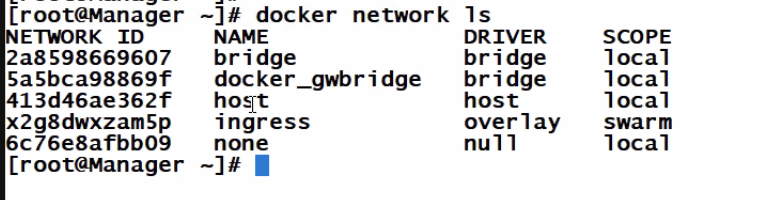

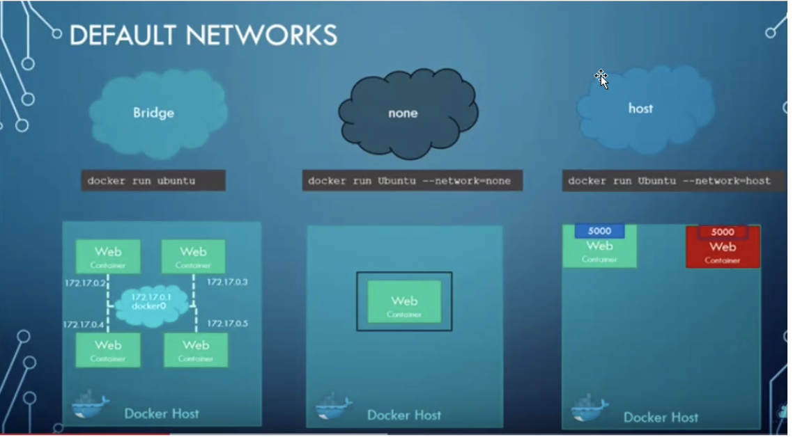

The network **driver which can do communication of container across docker hosts**. This is called overlay driver. Every orchestrator made overlay driver as the default network driver.

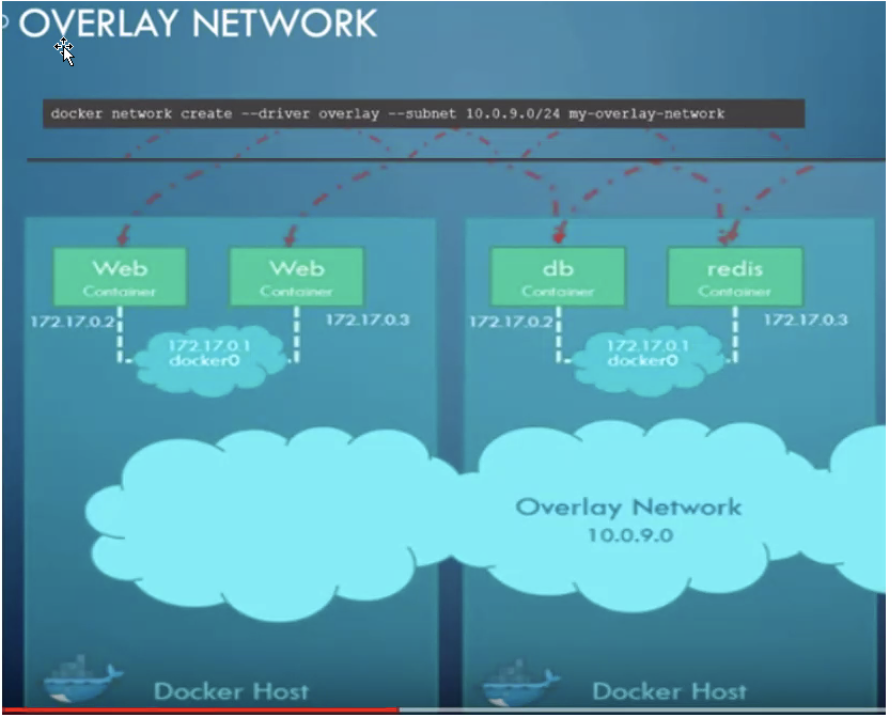

Having overlay network with high availability. If I want to make use of overlay drive, you have to configure swarm. They made it mandatory. If anyone goes down, there is no use. So make it high availability. that's why they made it mandatory.

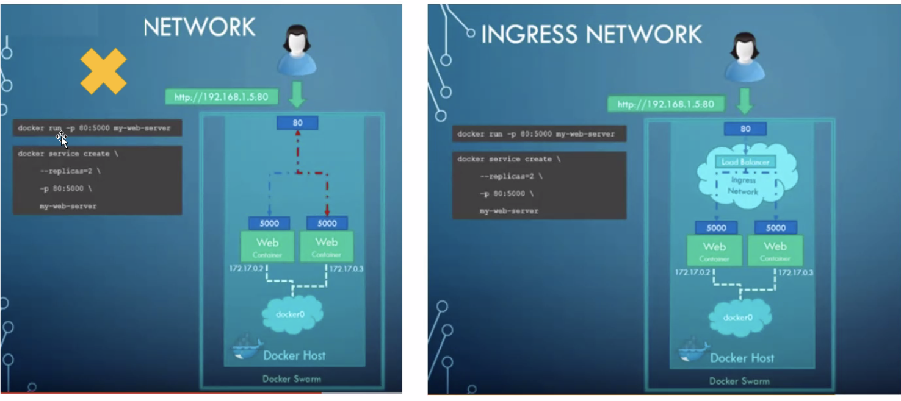

Ingress will do is when user hits with any ips (have 3 nodes, 2 replicas, 1 on manager, 1 on w1). imagine user hitting w2 ip.
overlay driver does the load balancing. 

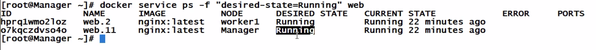

`*:8000->80/tcp`: * means any IP (any worker /manager IP 8000 is the port reserved for nginx for all containers. 80 is the port user try to access)

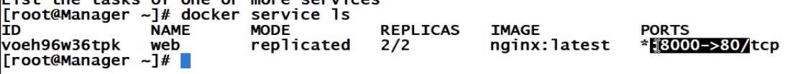

See we can access the application running on Master and Worker1 using Worker2 IP!! 

- Ingress will maintain a routing table which contains the which node: which replica. Ingress routing mesh.
- Ingress routing algorithm will send a POST gres signal will be send this will activate the node with least IO, will process the request.

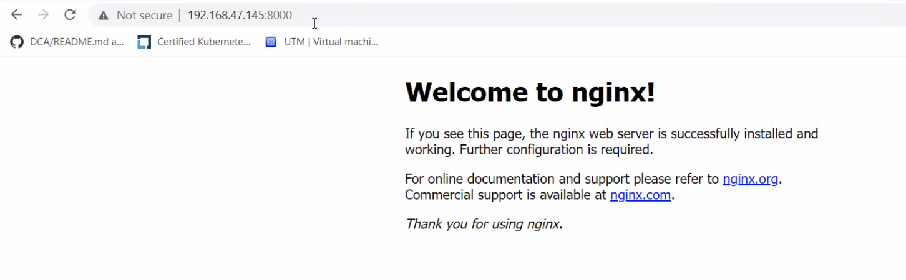

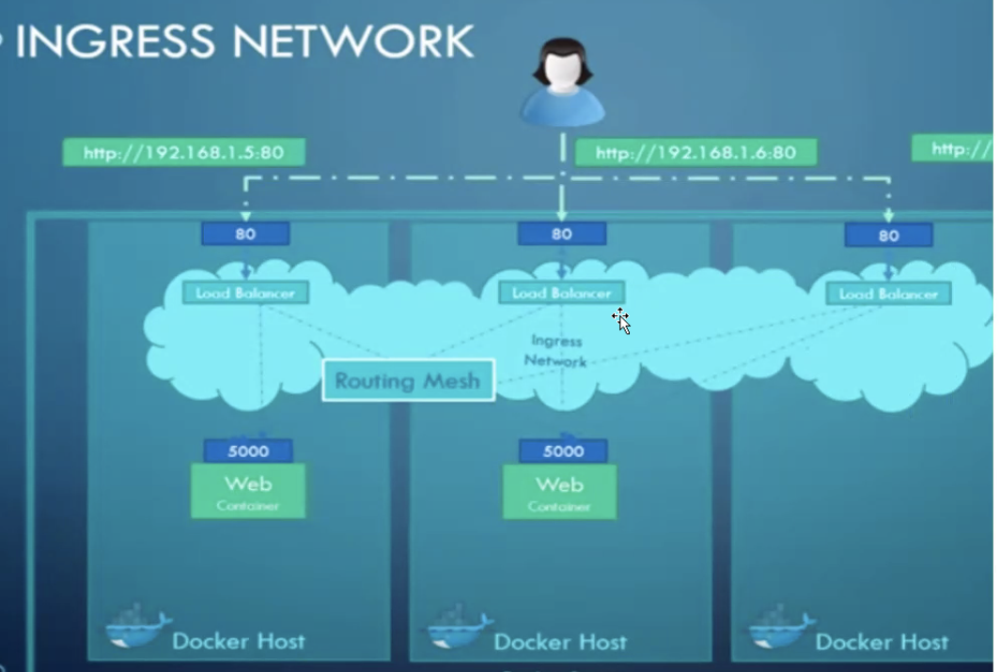

- There is an embedded DNS inside ingress.

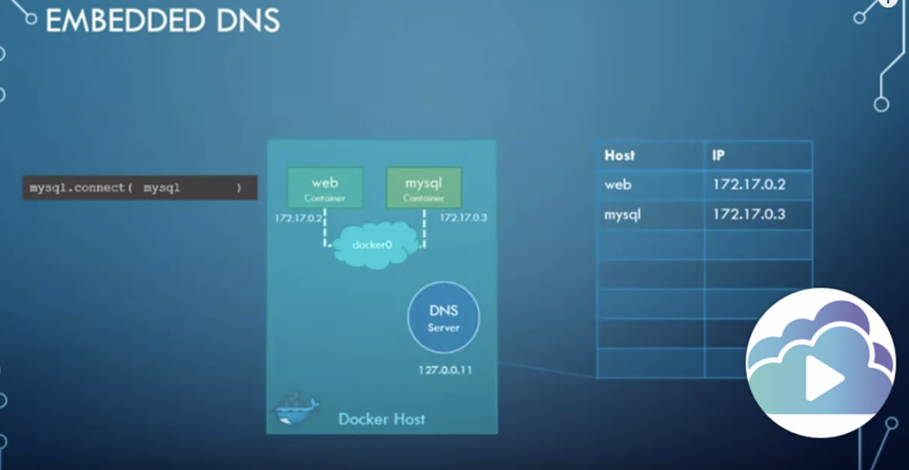

- If one node (worker2) goes down, the end user can't access worker2. So there will be a DNS on top of orchestrator. This DNS will forward the request to the available ips. User will use domain name only.

**Docker gateway bridge**

When creating a container, each container will get an IP. How overlay network put the IP in it's routing table??
 - **Docker gateway bridge** which will connect the local driver on each container to the overlay network 

Microservices
==============

So far we saw one application only.

- Monolithic --> Microservices
- Microservices: Applications consists of multiple components. 
- Biggest advantage: 
  - Separate buisiness has separate logic. Communication via well defined APIs, maily REST compliance HTTP.
  - Loosely coupled architecture.
  - scalability
- 

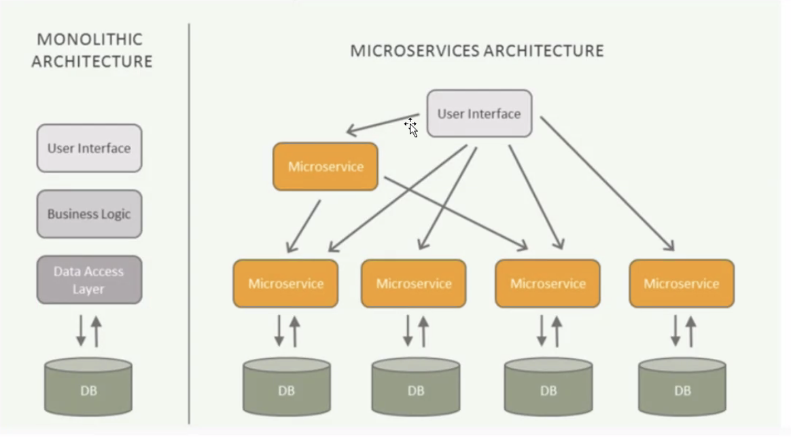

- Now we have microservices in containers.

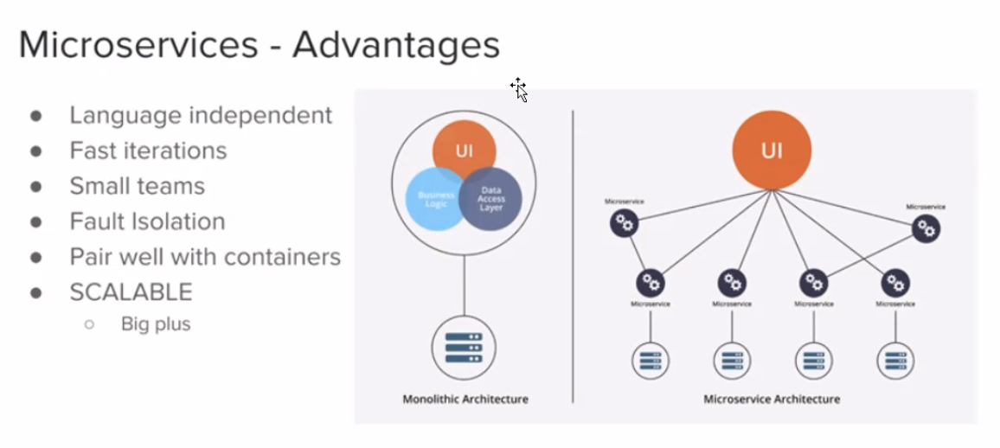

Docker Compose and Docker Stack
---------------------------------

There are 2 microservice tools in docker: **Docker Compose and Docker Stack**. Both are written in python.

Both will be based on YAML files.

- **Docker Compose: Used in Development**: works only in local networks. All applications will be on same host.
  - Compose works with swarm but will not provide high availability. It will work on local network only. Works only on one host. there is no overlay network. if host goes down, all gone.
- **Docker Stack: Used in Production**
  - works in remote scope networks. Works on **overlay** network.
  - Stack needs overlay driver. Overlay driver needs swarm configured.
  - Stack works with swarm and provide high availability.

To deploy stack, you need a microservice application defined in a yaml file.

- I have wordpress image. 
- Docker has 3 releases of yaml. Version 1 and version 2 are for docker compose. 
- Version 3 is for docker stack.
- Version 3 supports only overlay driver.

Docker version 3 file::

    [root@Master ~]# cat dockerstack.yml 
    version: '3'

    services:
       db:
         image: mysql:5.7
         volumes:
           - db_data:/var/lib/mysql
         environment:
           MYSQL_ROOT_PASSWORD: somewordpress
           MYSQL_DATABASE: wordpress
           MYSQL_USER: wordpress
           MYSQL_PASSWORD: wordpress

       wordpress:
         image: wordpress:latest
         ports:
           - "8001:80"
         environment:
           WORDPRESS_DB_HOST: db:3306
           WORDPRESS_DB_USER: wordpress
           WORDPRESS_DB_PASSWORD: wordpress
    volumes:
        db_data:

- We are creating 2 containers. One database container and one application containers.
- `db` and `wordpress` here are container names.
- I need a mysql image, I need to create a volume called db_data. This volume can come from Amazon or Azure or from anywhere.

Deploy docker stack::

    [root@Master ~]# docker stack deploy -c dockerstack.yml wstack 
    Creating network wstack_default
    Creating service wstack_db
    Creating service wstack_wordpress

Two services deployed::

    [root@Master ~]# docker stack ls
    NAME      SERVICES   ORCHESTRATOR
    wstack    2          Swarm

One replica of each service (db & wordpress)::

    [root@Master ~]# docker service ls
    ID             NAME               MODE         REPLICAS   IMAGE              PORTS
    miwzztp61ydw   web                replicated   15/15      nginx:latest       *:8000->80/tcp
    owa4dqucelme   wstack_db          replicated   1/1        mysql:5.7          
    08rbqm7c15kf   wstack_wordpress   replicated   1/1        wordpress:latest   *:8001->80/tcp

See the wstack_default overlay network created::

    [root@Master ~]# docker network ls
    NETWORK ID     NAME              DRIVER    SCOPE
    d14f8b21991b   bridge            bridge    local
    a2468d54e9ec   docker_gwbridge   bridge    local
    3b15b0e13fad   host              host      local
    jdoet4zznxie   ingress           overlay   swarm
    110184c53f6d   none              null      local
    uttv7acidq7c   wstack_default    overlay   swarm

MySQL image deployed on Master and Wordpress image is on worker1::

    [root@Master ~]# docker service ps wstack_db 
    ID             NAME          IMAGE       NODE      DESIRED STATE   CURRENT STATE           ERROR     PORTS
    hgwwwn8eyrnp   wstack_db.1   mysql:5.7   Master    Running         Running 3 minutes ago             
    [root@Master ~]# docker service ps wstack_wordpress
    ID             NAME                 IMAGE              NODE      DESIRED STATE   CURRENT STATE           ERROR     PORTS
    n5zocw638y23   wstack_wordpress.1   wordpress:latest   worker1   Running         Running 3 minutes ago             

See wordpress from the browser.

Note that all the 3 IPs will work here. http://192.168.64.3:8001/, http://192.168.64.5:8001/ and http://192.168.64.4:8001/. Overlay network and the routing mesh algorithm will take care of the request.

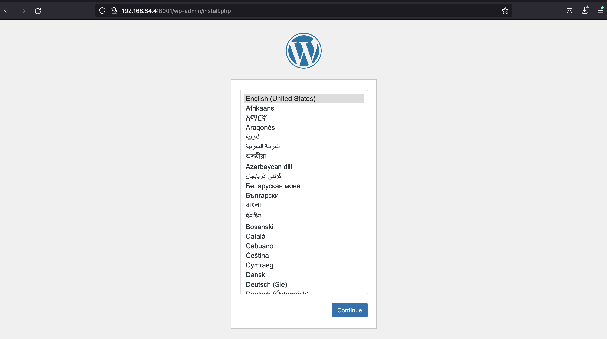

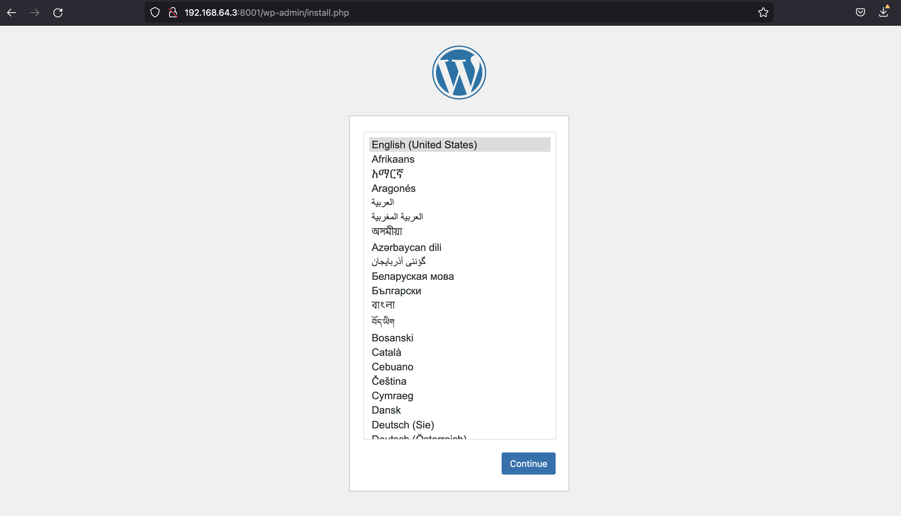

Ok, we have one replicas each. Usually front end requires more replicas, we can exclusively scale front end::

    [root@Master ~]# docker service scale wstack_wordpress=3
    wstack_wordpress scaled to 3
    overall progress: 3 out of 3 tasks 
    1/3: running   [==================================================>] 
    2/3: running   [==================================================>] 
    3/3: running   [==================================================>] 
    verify: Service converged 

    [root@Master ~]# docker service ps wstack_wordpress
    ID             NAME                 IMAGE              NODE      DESIRED STATE   CURRENT STATE            ERROR     PORTS
    n5zocw638y23   wstack_wordpress.1   wordpress:latest   worker1   Running         Running 12 minutes ago             
    m02vfhp34yg9   wstack_wordpress.2   wordpress:latest   worker2   Running         Running 9 seconds ago              
    nkkukabo9apc   wstack_wordpress.3   wordpress:latest   Master    Running         Running 12 seconds ago             
    [root@Master ~]# 

Get into the wordpress container::

    [root@Master ~]# docker exec -it feb6d815dd17 sh
    #   
    # env
    APACHE_CONFDIR=/etc/apache2
    HOSTNAME=feb6d815dd17
    PHP_INI_DIR=/usr/local/etc/php
    HOME=/root
    PHP_LDFLAGS=-Wl,-O1 -pie
    PHP_CFLAGS=-fstack-protector-strong -fpic -fpie -O2 -D_LARGEFILE_SOURCE -D_FILE_OFFSET_BITS=64
    PHP_VERSION=7.4.30
    WORDPRESS_DB_PASSWORD=wordpress
    GPG_KEYS=42670A7FE4D0441C8E4632349E4FDC074A4EF02D 5A52880781F755608BF815FC910DEB46F53EA312
    PHP_CPPFLAGS=-fstack-protector-strong -fpic -fpie -O2 -D_LARGEFILE_SOURCE -D_FILE_OFFSET_BITS=64
    PHP_ASC_URL=https://www.php.net/distributions/php-7.4.30.tar.xz.asc
    WORDPRESS_DB_HOST=db:3306
    PHP_URL=https://www.php.net/distributions/php-7.4.30.tar.xz
    TERM=xterm
    WORDPRESS_DB_USER=wordpress
    PATH=/usr/local/sbin:/usr/local/bin:/usr/sbin:/usr/bin:/sbin:/bin
    PHPIZE_DEPS=autoconf 		dpkg-dev 		file 		g++ 		gcc 		libc-dev 		make 		pkg-config 	re2c
    PWD=/var/www/html
    PHP_SHA256=ea72a34f32c67e79ac2da7dfe96177f3c451c3eefae5810ba13312ed398ba70d
    APACHE_ENVVARS=/etc/apache2/envvars
    # 

Let's see if we can login to mysql::

    [root@Master ~]# docker exec -it 1c40959989de sh
    sh-4.2# mysql -u wordpress -p
    Enter password: 
    Welcome to the MySQL monitor.  Commands end with ; or \g.
    Your MySQL connection id is 11
    Server version: 5.7.39 MySQL Community Server (GPL)

    Copyright (c) 2000, 2022, Oracle and/or its affiliates.

    Oracle is a registered trademark of Oracle Corporation and/or its
    affiliates. Other names may be trademarks of their respective
    owners.

    Type 'help;' or '\h' for help. Type '\c' to clear the current input statement.

    mysql> 
    mysql> show databases;
    +--------------------+
    | Database           |
    +--------------------+
    | information_schema |
    | wordpress          |
    +--------------------+
    2 rows in set (0.00 sec)

Now, remove the services::

    [root@Master ~]# docker stack rm wstack
    Removing service wstack_db
    Removing service wstack_wordpress
    Removing network wstack_default

Deploy a random application having a docker-stack.yml file
^^^^^^^^^^^^^^^^^^^^^^^^^^^^^^^^^^^^^^^^^^^^^^^^^^^^^^^^^^^^^^

Google docker stack examples.

https://github.com/dockersamples/example-voting-app/blob/master/docker-stack.yml

See if there is any stack yaml file provided on the github.

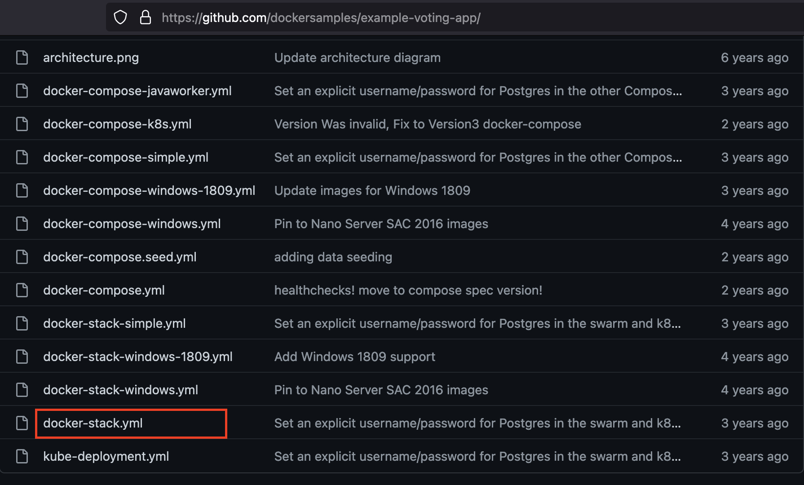

Just use the file to run the deploy command::

    [root@Master ~]# docker stack deploy -c docker-stack.yml vstack
    Creating network vstack_default
    Creating network vstack_backend
    Creating network vstack_frontend
    Creating service vstack_result
    Creating service vstack_worker
    Creating service vstack_visualizer
    Creating service vstack_redis
    Creating service vstack_db
    Creating service vstack_vote

Get the port numbers on which each app is running.

::

    [root@Master ~]# docker service ls
    ID             NAME                MODE         REPLICAS   IMAGE                                          PORTS
    57k1cyoptn6i   vstack_db           replicated   1/1        postgres:9.4                                   
    uran69rvs3xa   vstack_redis        replicated   1/1        redis:alpine                                   
    yms3390bbwih   vstack_result       replicated   1/1        dockersamples/examplevotingapp_result:before   *:5001->80/tcp
    h5azsqifcw4v   vstack_visualizer   replicated   1/1        dockersamples/visualizer:stable                *:8080->8080/tcp
    vcjs1oqj5eto   vstack_vote         replicated   2/2        dockersamples/examplevotingapp_vote:before     *:5000->80/tcp
    m7isn55idv6o   vstack_worker       replicated   1/1        dockersamples/examplevotingapp_worker:latest   
    miwzztp61ydw   web                 replicated   15/15      nginx:latest                                   *:8000->80/tcp

Try each port number on the browser (IP doesn't matter, you can give 192.168.64.3/192.168.64.4/192.168.64.5. Overlay network will takes care of that).

On 5001

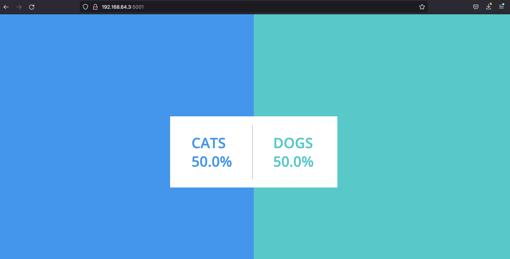

On 8080

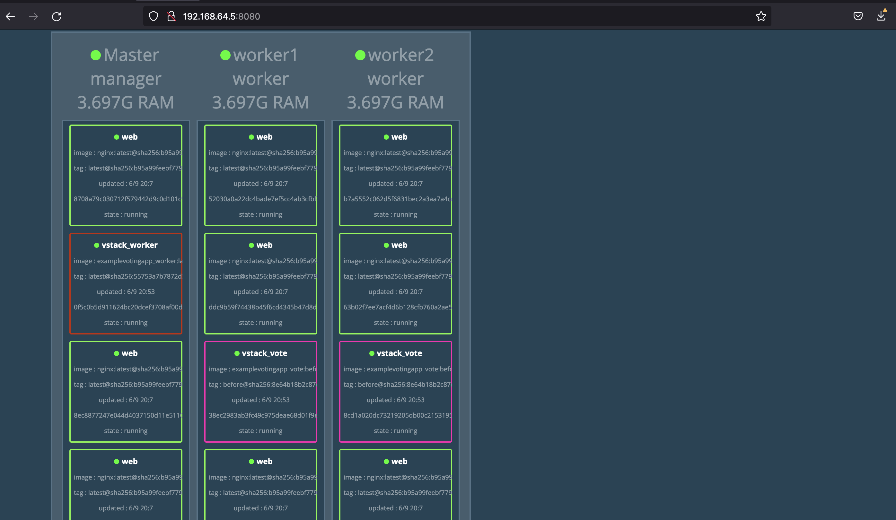

On 5000

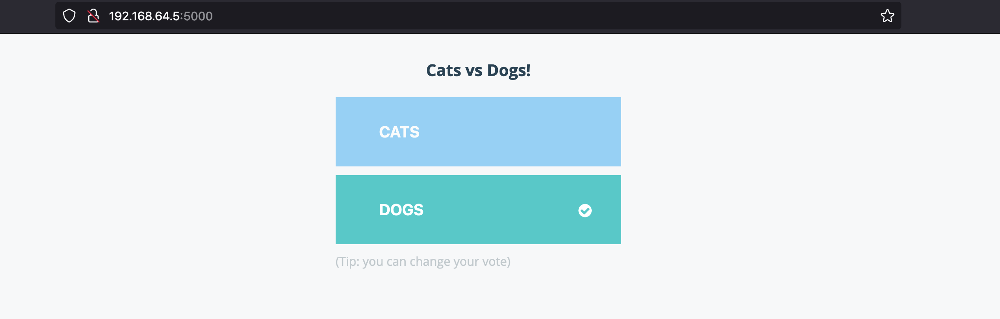

The db has postgres installed. let's try loging in.

As per yaml file the credentials are::

    db:
      image: postgres:9.4
      environment:
        POSTGRES_USER: "postgres"
        POSTGRES_PASSWORD: "postgres"

Login to postgres::

    [root@Master ~]# docker exec -it 9f6c9fb4b0de sh
    # psql -U postgres
    psql (9.4.26)
    Type "help" for help.

    postgres=# \l
                                     List of databases
       Name    |  Owner   | Encoding |  Collate   |   Ctype    |   Access privileges   
    -----------+----------+----------+------------+------------+-----------------------
     postgres  | postgres | UTF8     | en_US.utf8 | en_US.utf8 | 
     template0 | postgres | UTF8     | en_US.utf8 | en_US.utf8 | =c/postgres          +
               |          |          |            |            | postgres=CTc/postgres
     template1 | postgres | UTF8     | en_US.utf8 | en_US.utf8 | =c/postgres          +
               |          |          |            |            | postgres=CTc/postgres
    (3 rows)

Remove all services::

    [root@Master ~]# docker service rm vstack_db
    vstack_db
    [root@Master ~]# docker service rm vstack_redis
    vstack_redis
    [root@Master ~]# docker service rm vstack_result
    vstack_result
    [root@Master ~]# docker service rm vstack_visualizer
    vstack_visualizer
    [root@Master ~]# docker service rm vstack_vote
    vstack_vote

    [root@Master ~]# docker service ls
    ID             NAME      MODE         REPLICAS   IMAGE          PORTS
    miwzztp61ydw   web       replicated   15/15      nginx:latest   *:8000->80/tcp

.. important:: to use stack, you need overlay and to have overlay, you need swarm. 

Docker Storage
===============

How to make our application data persistent? What will happen to the data stored by user in your container.

An application developer should have a good understanding about storage. An architect should be able to define the best storage technology.

Docker has 2 drivers, storage driver, and a volume driver.

Storage driver: For kernel bindings.
Volume driver: this makes the application persistent.

NGING is just 135MB, it requires the proc variables, psuedo filesystem and a lot of things to make the container. From there these are coming?
At the time of creating the container. the  docker host OS to the container OS.

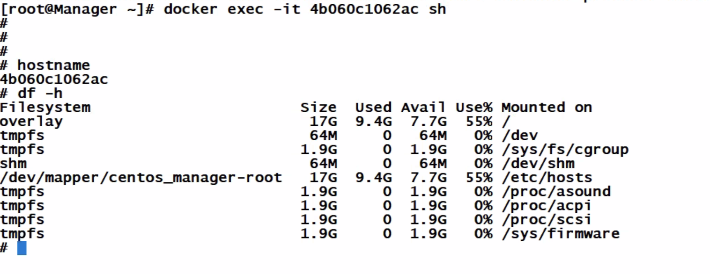

Docker has defined N number of storage drivers. **Docker was so intelligent based on the linux kernel, it will pick up the storage driver accordingly. If oracle linux, it picks up ZFS, if redhat linux, then BTRFS and so on**. There were some complications in that and that's whey docker released a universal storage driver called Overlay driver.

Ovarlay2 Storage Driver
------------------------

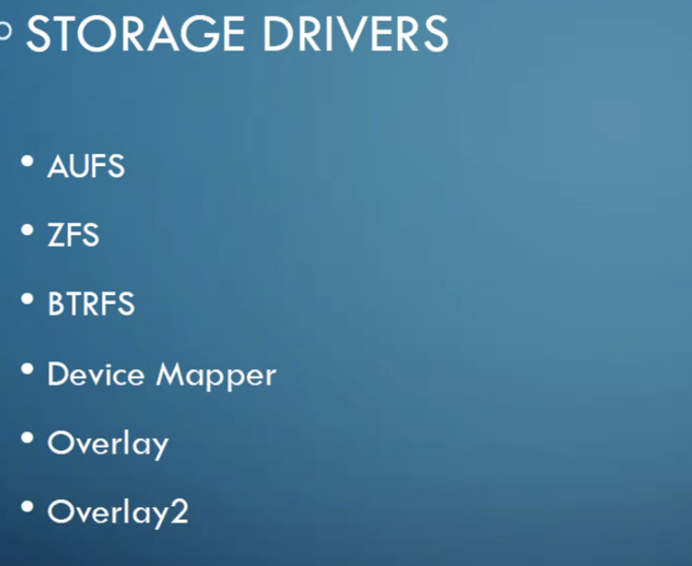

NGING is just 135MB, it requires the proc variables, psuedo filesystem and a lot of things to make the container. From there these are coming?
At the time of creating the container. the  docker host OS to the container OS.

**Ovarlay2 Driver**: Now etniversal storage driver which comes with all the characteritics of all AUS, ZFS, BTRFS etc. 

::

    [root@Master docker]# ls -lrt /var/lib/docker
    total 24
    drwx------.   4 root root    32 Sep  5 16:28 plugins
    drwx------.   3 root root    22 Sep  5 16:28 image
    drwx------.   2 root root     6 Sep  5 16:28 trust
    drwxr-x---.   3 root root    19 Sep  5 16:28 network
    drwx--x--x.   4 root root   120 Sep  5 16:28 buildkit
    drwx------    2 root root     6 Sep  7 09:54 runtimes
    drwx-----x.   4 root root    94 Sep  7 09:54 volumes
    drwx------.   5 root root    95 Sep  7 09:54 swarm
    drwx------    2 root root     6 Sep  7 10:00 tmp
    drwx--x---. 160 root root 16384 Sep  7 10:00 overlay2
    drwx--x---.  30 root root  4096 Sep  7 10:00 containers

Note that this is not the network overlay driver. this is entirely different.

Overlay2 use layered architecture. It keeps only one copy. and this is why our containers are light weight.

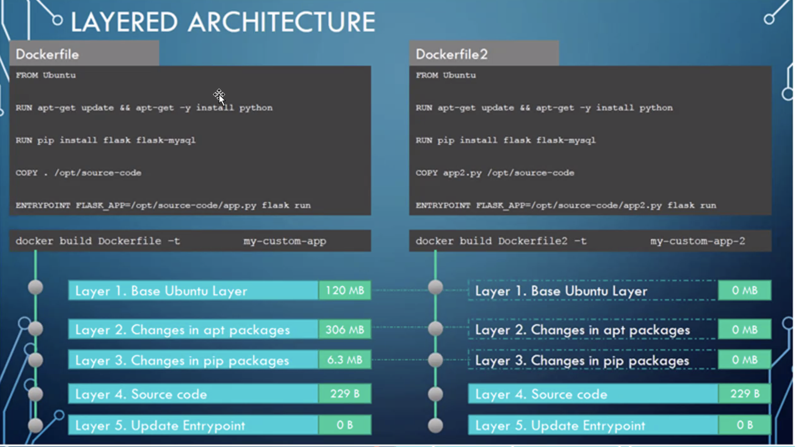

Use copy-on-write mechanism

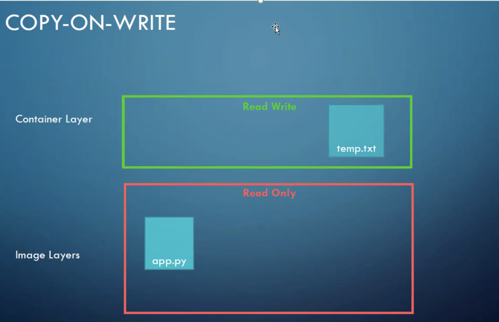

Volume Driver 
---------------

**By default the data loaded in the container is transient**. You can use 3rd party drivers as well.

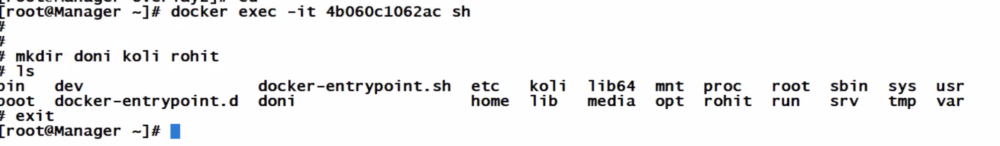

This data is gone when we rm the container.

There are 2 mounts to make data persistent

1. Volume mounts: Use docker volume solutions defined by docker. Local to the host.
2. Bind mounts: use 3rd party volume solutions.

Volume Mounts(Local to the host)
^^^^^^^^^^^^^^^^^^^^^^^^^^^^^^^^^

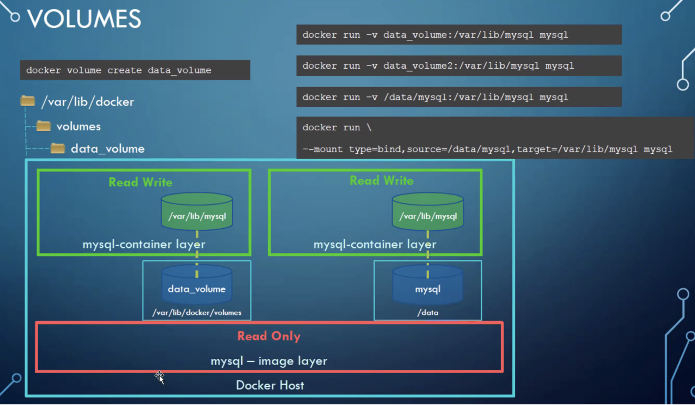

You can create a volume and bind that volume to the container. This is a container solution not a orchestration solution.

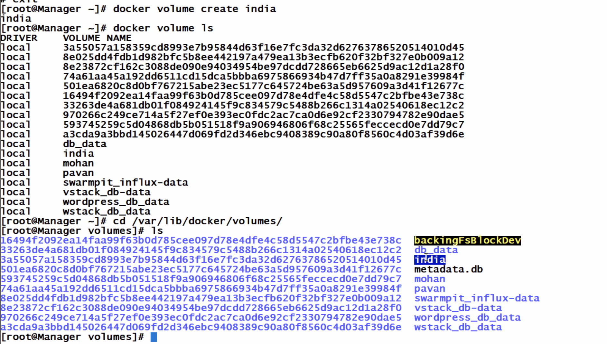

Under this `india`, all my data will stay persistent.

at the time of creating a container,  we bind this volume to the container.

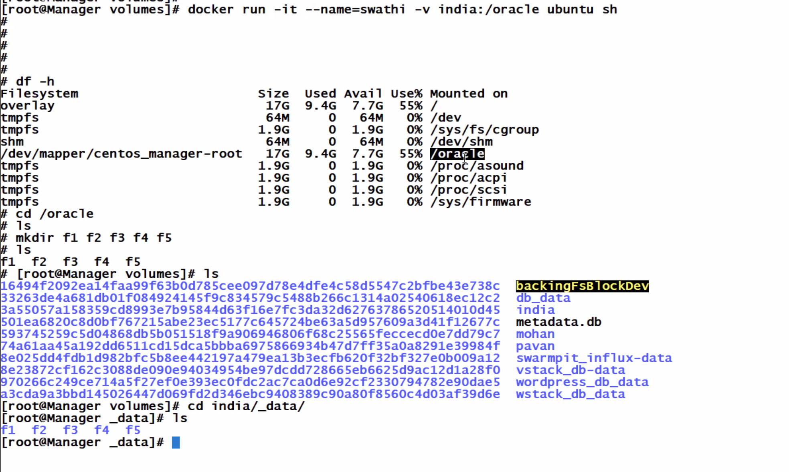

This is like our NFS filesystem, if we update here it will update there as well.

.. image:: images/day02/likenfs.png
  :width: 600
  :align: center

We can use the same in declarative way as well. see the `db_data` in the yaml file.

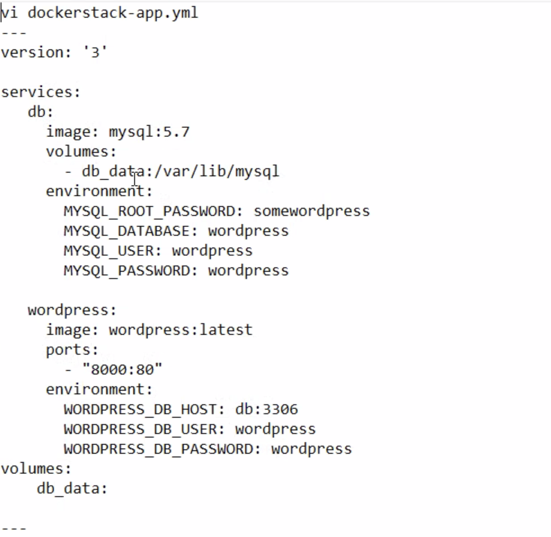

See the beauty of overlay2 driver. Create a volume called singapore.

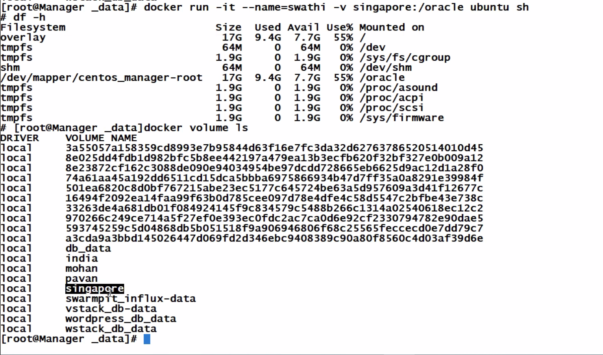

Bind Mounts (ZFS, S3, NFS, etc)
^^^^^^^^^^^^^^^^^^^^^^^^^^^^^^^^^^^^

Provide an absolute path. Here it is `/root/test`, a local absolute path.

.. image:: images/day02/bindmount01.png
  :width: 600
  :align: center

You can give any path from NFS, EBS etc as well just like this. Overlay2 will takes care of this.

https://docs.docker.com/storage/storagedriver/select-storage-driver/

We can use command like this as well

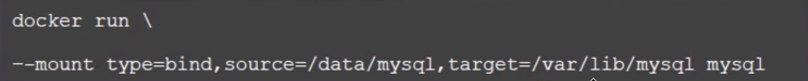

To use Amazon EBS Block storage.

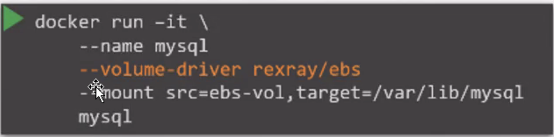

How data integrity is maintained if there are more replicas using shared luns?

Everyone (including amazon, nfs) uses a distributed driver and so that the data integrity is maintained. 
