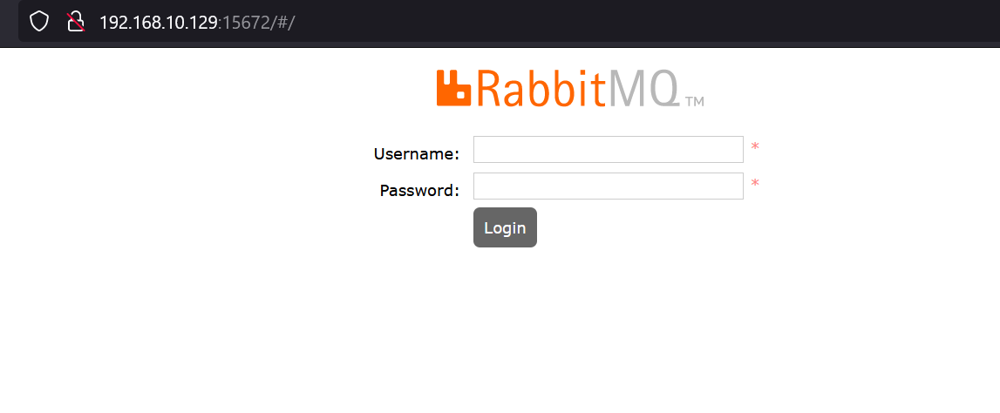

==========
RabbitMQ
==========

- **AMQP**: Starndardizes messaging using **producers**, **broker** and **consumers**.
- **Messaging**: increases loose coupling and scalability.

RabbitMQ is a open source messaging broker that implements AMQP.

- **Pubilsh** means producer adding a message to the **Exchange**.
- **Exchange** is binded with multiple **queues** with a **binding key**.
- Exchange compares **routing key** with this binding key.
- Message distribution depends on exchange type.

    - **default**: created by rabbitmq. compares routing key with queue name. Indirectly allows sending directly to the queues.
    - 

https://www.rabbitmq.com/

Docker installation
====================

- https://hub.docker.com/_/rabbitmq
- rabbitmq listens on 5672
- rabbitmq management gui listens on 15672 with default username-password `guest-guest`

::

    docker run -it --rm --name rabbitmq -p5672:5672 -p15672:15672 rabbitmq:3.11-management

To set username and password::

    -e RABBITMQ_DEFAULT_USER=user -e RABBITMQ_DEFAULT_PASS=pw

We have binded management app with 15672.

