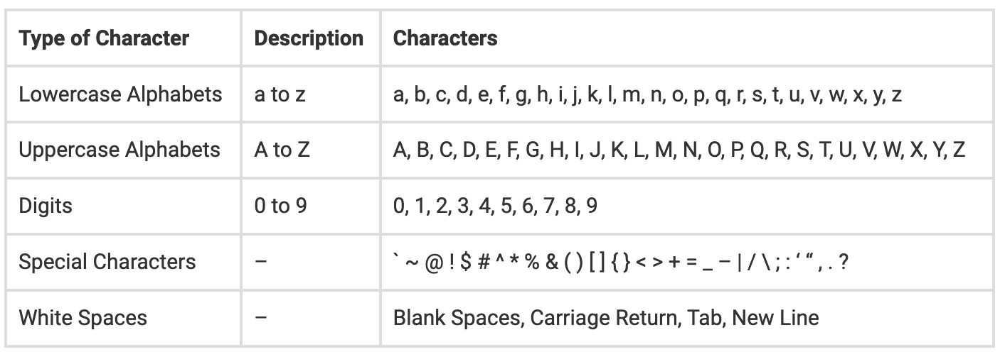
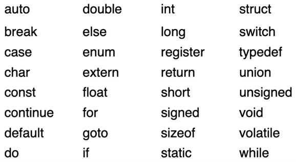
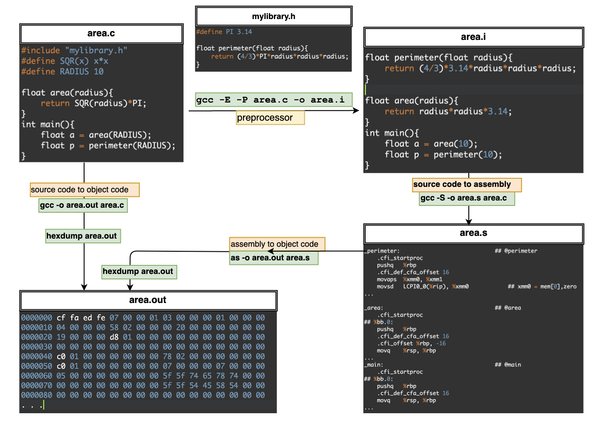

==================
Fundamentals in C
==================

.. toctree::
   :maxdepth: 3
   :caption: Contents:

- **History of 'C'**: 

  - Developed at AT & T's Bell Laboratories by Dennis Ritchie in 1972.

- **Why bother to learn C today?**:

  - Windows, Unix, Device drivers etc. written in C.
  - Performance.
  - Pre-requisites for learning advanced programming concepts.

- **Source code execution**:

  - Preprocessing
  - Compiling
  - Assembling
  - Linking
  
- **Character set**:
  
  - All the character sets used in the C language have their equivalent ASCII value.

- **Keywords**:

  - There are around 32 keywords available in C.

- **Variables**:

  - Alphabets, digits or underscores.
  - First character in the variable name must be an alphabet or underscore.
  - No commas or blanks are allowed within a variable name.
  - No special symbol other than an underscore is allowed.
  - The keywords cannot be used as variable names.

- **Constants**: 0, 1, 2, -5, 'a', 'b', "ica"
- **Number systems**:
  
  - Binary
  - Decimal
  - Octal 
  - Hexadecimal

- **Format specifiers**: %d, %f, %d, %s etc.
- **Data Types**: int, char, float, double etc. 
- **Declaration, Initialization and Assignment**

.. important::
	- **Declaration**: When we declare a variable no space is reserved for it.
	- **Definition**: When we define it space gets reserved for it in memory
	- A variable can be declared several times but can be defined only once.

This will work::

    int a, b, c, d ;
    a = b = c = 10 ;

This will not::

    int a = b = c = d = 10;

- **Comments in C**: //single line comment , /*multi line comments*/
- **Operators**

  - Arithmetic: +, -, \*, /, %
  - Increment and decrement: ++, --
  - Relational: ==, >, >=, <, <=, !=
  - Logical: &&, \|\|, !
  - Bitwise: &&, \|\|, !, ~ (Bitwise complement), ^(Bitwise XOR), >>, <<

    ::

        Bitwise XOR Operation of 12 and 25
          00001100 // 12
        ^ 00011001 // 25
          ________
          00010101  = 21 (In decimal)

        Right Shift Operator
        212 = 11010100 (In binary)
        212 >> 2 = 00110101 (In binary) [Right shift by two bits]
        212 >> 7 = 00000001 (In binary)
        212 >> 8 = 00000000 
        212 >> 0 = 11010100 (No Shift)

        Left Shift Operator
        212 = 11010100 (In binary)
        212<<1 = 110101000 (In binary) [Left shift by one bit]
        212<<0 = 11010100 (Shift by 0)
        212<<4 = 110101000000 (In binary) =3392(In decimal)

  - Assignment: =, +=, -=, \*=, /=, %=, &=, \|=, ^=, >>=, <<=
  - Conditional (ternary): expression ? statement1 : statement2
  - Size of operator

    ::

        printf("%lu\n", sizeof(myInt));
        printf("%lu\n", sizeof(myFloat));
        printf("%lu\n", sizeof(myDouble));
        printf("%lu\n", sizeof(myChar));

        // lu: Unsigned int or unsigned long

  - Comma operator
  
    - Comma as a Separator: int x, y, z;
    - Comma as an Operator: evaluates in left-to-right. x, y, z means it will return the z only.

    ::

        int main()
        {
            int x;
            x = 40, 50, 60, 70, 80, 90;
            printf("%d", x);
        }

    .. toggle::
    
        ::
            
            // comma has weak precedence when compared to assignment. So, assignment will happen first.
            // then evaluation of comma happens.ie.e X, 50, 60, 70, 80, 90; 90 is result but no L value.
            (x = 40), 50, 60, 70, 80, 90;
    
            ie. y = (x = 40, 50, 60, 70, 80, 90); will store x=40 and y=90
    
    ::
    
        int main()
        {
            int p = (40, 50, 60, 70, 80, 90);
            printf("%d", p);
        }
    
    .. toggle::
    
        ::
        
            Braces () have a higher priority, as compared to the assignment. So things inside () will
            be evaluated first. i.e. will return 90. 
    
    However, this is wrong::
    
        int x = 40, 50, 60, 70, 80, 90; as this will be **int (x=40)** 50, 60, 70, 80, 90` which is incorrect variable name.

  - Type casting operator: (data_type_name) expression

    - Value of the expression is **promoted or demoted** depending on the type of LHS variable.

    Implicit type casting::

        int i ;
        float j ;
        i = 3.5 ; // 3.5 is demoted to 3 an int and then its value is stored in i.
        j = 30 ; // 30 is promoted to 30.000000 and then store it in j

- **Operator precedence and associativity**

  - Operations within the innermost parentheses would be performed first,
  - Precedence of commonly used operators:
  
  .. image:: _images/introduction/precedence.png
    :width: 400
    :align: center
  
  - When an expression contains two operators of equal priority the tie between them is settled using the associativity of the operators.
  
  .. image:: _images/introduction/operators.png
    :width: 400
    :align: center

  Example::
  
      result = 3*6/5+6/6+8-2+5/2
      = 18/5+6/6+8-2+5/2
      = 3+6/6+8-2+5/2
      = 3+1+8-2+5/2
      = 3+1+8-2+2
      = 4+8-2+2
      = 12-2+2
      = 10+2
      = 12

- **Input and output library functions in C**

  - Formatted - scanf() and printf()

    ::

        printf ( "%f", price ) ;
        printf ( "items = %d \nTotal = %f", p, r ) ;
        scanf ( "%d", &num );

  - Unformatted

    - Character functions: getchar() and putchar()

    ::

        int main()
        {
            char c;
            printf("\nPlease enter a character: ");
            c=getchar();
            printf("\nThe character entered is: ");
            putchar(c);
        }

        Please enter a character: q
        The character entered is: q

        Please enter a character: more
        The character entered is: m

    - String functions: gets() and puts()

    ::

        int main()
        {
            char str[100];
            printf("\nEnter string: ");
            gets(str);
            printf("\nThe string entered is: ");
            puts(str);
        }

        Enter string: lorem
        The string entered is: lorem

Compiling
===========

