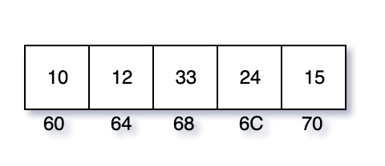

===============
Pointers in C 
===============

Pointer use cases
===================

- Accessing array or string elements.
- Dynamic memory allocation.
- Call by reference
- Implementing linked list, trees, graphs, and many other data structures.

The & and * operators
======================

The below statement tells the C compiler to:

    ::

        int i=10;

    - Reserve space in memory to hold an integer value.
    - Associate the name i with this memory location.
    - Store the value 10 at this location

    .. image:: _images/pointers/pointers01.png
      :width: 300
      :align: left

    ::

        main(){
            int i = 10;
            printf("\nValue of i: %u", i);
            printf("\nAddress: %u", &i);
            printf("\nValue of i: %u", *(&i));
        }

        Value of i: 10
        Address: 3450
        Value of i: 10

Pointer datatype
=================

Suppose if we want to store the address in a variable as `j= &i`, what should be the datatype of j?

There comes pointer type::

    int *j = &i; // tells compiler that address of an integer will be stored in j.
    char *c; // address of character will be stored in c
    float *val; // address of a floating point number will be stored in val.

.. important:: 
    - `float \*val;` **does not mean** val is going to contain a floating-point value.
    - `char \*c;` does not mean c is going to contain a character value.
    - `int *j;` does not mean j is going to contain a integer value.
    - These all stores addresses. Addresses are always whole numbers.
    - So, pointers would always store whole numbers.
    - We can use format specifier %d to print any pointer variable.

**If a pointer variable always stores address, then why we need different data types?**

This is the number of bytes an x86 64 processor takes for commonly used data types. This may be different in other processor families like ARM.

.. important:: 
    - Data stored in a any pointer is the **starting address**.
    - In x86, an int takes 4 bytes in memory. `int *j` stores just address of first byte.
    - i++ (i of type int) will increment the value stored in i.
    - j++ (j of type `int *``) will increment the address value stored in it. An address for int contains 4 bytes. So j++ will increment by 4.
    - k++ (k of type `short *`) will increment by 2.
    

**important example**

.. code-block:: c

    main(){
        int i = 256; // 00000000-00000000-00000001-00000000
        int j = 65792; // 00000000-00000001-00000001-00000000
        char *ptr1 = &i;
        short *ptr2 = &i;
        printf("\nValue of i: %u", *ptr1); // 00000000
        printf("\nValue of i: %u", *ptr2); // 00000001-00000000
        char *ptr3 = &j;
        short *ptr4 = &j;
        int *ptr5 = &j;
        printf("\nValue of j: %u", *ptr3); // 00000000
        printf("\nValue of j: %u", *ptr4); // 00000001-00000000
        printf("\nValue of j: %u", *ptr5); // 00000000-00000001-00000001-00000000
    }

.. toggle::

    ::

        Value of i: 0
        Value of i: 256
        Value of j: 0
        Value of j: 256
        Value of j: 65792

Passing by reference
=====================

.. code-block:: c

    void swap_by_value(int x, int y){
        int temp = x;
        x = y;
        y = temp;
        printf("Inside swap_by_value: x=%d, y=%d\n", x, y);
    }

    void swap_by_reference(int *x, int *y){
        int temp = *x;
        *x = *y;
        *y = temp;
        printf("Inside swap_by_reference: x=%d, y=%d\n", x, y);
    }

    main(){
        int a=10, b=20;
        printf("Initially: a=%d, b=%d\n", a, b);
        swap_by_value(a,b);
        printf("After swap_by_value: a=%d, b=%d\n", a, b);
        swap_by_reference(&a, &b);
        printf("After swap_by_reference: a=%d, b=%d\n", a, b);
    }

.. toggle::

    ::

        Initially: a=10, b=20
        Inside swap_by_value: x=20, y=10
        After swap_by_value: a=10, b=20
        Inside swap_by_reference: x=20, y=10
        After swap_by_reference: a=20, b=10

Functions Returning Pointers
=============================

The prototype `int *fun();` tells the compiler that this function returns an address of integer value. 

.. code-block:: c

    main(){
        int *p;
        int *fun(); /*prototype*/
        p = fun();
        printf("p=%u, *p=%u", p, *p);
    }

    int *fun(){
        int x = 10;
        return (&x);
    }

.. important:: 
    - The printf will not print value stored in x (=10). As soon as the function fun() returns, the x dies.
    - To overcome the life of x, use **`static int x=10`**.

::

    printf("%d\n", sizeof(NULL)); // 4. #define NULL 0 in stdio.h
    printf("%d\n", sizeof("")); // 1. empty string always contains \0 =
    printf("%d\n", sizeof("NULL")); // 5. 4 characters and \0

Null pointer
=============

For each pointer type,  C defines a special pointer value that is guaranteed not to point to any object or function of that type.

null pointer constant used to represent a null pointer is the integer 0.

.. important:: 
    - **Null pointer**: A pointer, which doesd't point anywhere.
    - **NULL macro**: Used to represent NULL pointer in c code. It has 0 value associated with it.
    - **ASCII NULL**: Character that has all bits 0. Nothing to do with null pointer.
    - **NULL string**: Empty string ""

Pointers and Arrays
===================

**Arrays**: Collection of **similar data items** stored at **contiguous memory locations** and elements can be accessed randomly using indices of an array.

Example::

    main(){
        int marks[] = {32, 45, 41, 16, 49};
        printf("%d %d\n", marks[0], &marks[0]);
        printf("%d %d\n", marks[1], &marks[1]);
        printf("%d %d\n", marks[2], &marks[2]);
        printf("%d %d\n", marks[3], &marks[3]);
        printf("%d %d\n", marks[4], &marks[4]);
    }

.. toggle::

    ::

        32 1824233456
        45 1824233460
        41 1824233464
        16 1824233468
        49 1824233472

        main(){
            short marks[] = {32, 45, 41, 16, 49};
            printf("%d %d\n", marks[0], &marks[0]);
            printf("%d %d\n", marks[1], &marks[1]);
            printf("%d %d\n", marks[2], &marks[2]);
            printf("%d %d\n", marks[3], &marks[3]);
            printf("%d %d\n", marks[4], &marks[4]);
        }

        32 362523822
        45 362523824
        41 362523826
        16 362523828
        49 362523830

Arrays cannot be assigned to::

    int num[4];
    num[] = {1, 2, 3, 4}; // will not work 
    num[4] = {1, 2, 3, 4}; // will not work
    // you need to use for loop to **assign** values one by one.

But you can Initialize::

    short marks[5] = {0}; 
    for (int i=0; i<5; i++)
        printf("%d ", marks[i]); // 0 0 0 0 0 

    int arr[10][10] = { 0 };

.. important:: 
    - array always starts with index 0. So, last element will have index 1 less than size of array.
    - If the array elements are not given any specific values, they are supposed to contain garbage values.
    - **In C, there is no array size check, `marks[7] = 50` will place the data 50 outside the array. This will give unpredictable results. There will not be any WARNING message either**.

::

    short marks[5] = {0}; 
    marks[100] = 100;
    printf("%d ", marks[100]); // This may/may not work. But suicidal practice.

Passing arrays to functions 
----------------------------

Army elements can be passed to a function in 2 ways:

1. **By value**

We can pass array elements by value as follows. See the change in fun() not reflected in the caller.

.. code-block:: c

    void fun(int x){
    printf("%d ", x);
    if (x == 33)
        x = 44;
    }    
    main(){
        int arr[3] = {11, 22, 33};
        for (int i=0; i< 3; i++)
            fun(arr[i]);
        printf("\narr[2] = %d", arr[2]);
    }

.. toggle::

    ::
        
        11 22 33 
        arr[2] = 33

Try passing the entire array now.

.. code-block:: c
    
    void fun(int a[], int n){
        for (int i=0; i<n; i++){
            printf("%d, ", a[i]);
        }
        a[2] = 44;
    }
    main()
    {
        int arr[3] = {11, 22, 33};
        fun(arr, 3);
        printf("\narr[2] = %d", arr[2]);
    }

.. toggle::

    ::
        
        11, 22, 33, 
        arr[2] = 44
        

.. important:: 
    - Even if you pass the entire array to a function, the argument decays into a pointer. An array is never actually passed to a function.

::

    void fun(int a[])
	{ ... }

    compiler turns around and pretends that you'd written a pointer Declaration

    void fun(int *a)
	{ ... }

1. **By reference**

.. code-block:: c

    void fun(int *a, int n){
        for (int i=0; i<n; i++){
            printf("%d, ", a[i]); // a+i
        }
        a[2] = 44;
    }

    main()
    {
        int arr[3] = {11, 22, 33};
        fun(arr, 3); // note that we passed array name arr, instead of &arr
        printf("\narr[2] = %d", arr[2]);
    }

    11, 22, 33, 
    arr[2] = 44

Pointer Arithmetic
-------------------

A pointer when incremented always points to an immediately next location of its type.

Don't attempt the following, they will never work out.

- Addition of two pointers
- Multiplying a pointer with a number
- Dividing a pointer with a number.

Pointers and Arrays
---------------------

.. important:: Remember these facts
    - Array elements are always stored in contiguous memory locations.
    - A pointer when incremented always points to an immediately next location of **its type**.

.. code-block:: c

    int main()
    {
        int arr[] = {10, 12, 33, 24, 15}, i;

        for (int i; i<5; i++){
            printf("arr[%d] = %d, address: %p\n", i, arr[i], &arr[i]);
        }
    }

See the output::

    arr[0] = 10, address: 0x7ffee4240a60
    arr[1] = 12, address: 0x7ffee4240a64
    arr[2] = 33, address: 0x7ffee4240a68
    arr[3] = 24, address: 0x7ffee4240a6c //68+4 = 6C
    arr[4] = 15, address: 0x7ffee4240a70 //6C+4 = 70

    

- Note that array elements are stored in contiguous memory locations and each element occupies 4 bytes.

So, change the program as.

.. code-block:: c

    int main()
    {
        int arr[] = {10, 12, 33, 24, 15}, i;
        int *ptr = &arr[0]; // address of first element.

        for (int i; i<5; i++){
            printf("arr[%d] = %d, address: %p\n", i, *ptr, ptr);
            ptr++;
        }
    }

.. toggle::

    arr[0] = 10, address: 0x7ffeec038a60
    arr[1] = 12, address: 0x7ffeec038a64
    arr[2] = 33, address: 0x7ffeec038a68
    arr[3] = 24, address: 0x7ffeec038a6c
    arr[4] = 15, address: 0x7ffeec038a70

.. important:: 
    - Accessing array elements using pointers is always faster when there is an order.
    - For random access, using subscript is convenient.
    - **Mentioning the name of the array (arr) we get the base address.**
    - `*arr = *(arr+0) = arr[0]`
    - `*(arr+n) = arr[n]`

Pointers and 2D Arrays
-----------------------

What will be the output of the following?

.. code-block:: c

    int main()
    {
        int arr[5][2] = {
            {100, 200},
            {101, 201},
            {112, 213},
            {123, 225},
            {149, 299}
        };

        for (int i=0; i<5; i++){
            printf("\nAddress of %dth 1D array: %p", i, arr[i]);
        }
    }

::

    $ ./a.out 

    Address of 0th 1D array: 0x7ffeecf9da50
    Address of 1th 1D array: 0x7ffeecf9da58 // 50 + 2*4Bytes
    Address of 2th 1D array: 0x7ffeecf9da60 // 58 + 2*4Bytes
    Address of 3th 1D array: 0x7ffeecf9da68 // 60 + 2*4Bytes
    Address of 4th 1D array: 0x7ffeecf9da70 // 68 + 2*4Bytes

int `arr[5][2]`` = is a one dimensional array of 5 elements, each of which is a 1D array of 2 elements.

- We know that `arr[0] = *(arr+0)`. we saw that `arr[0]` gives us the base address of 0th element, i.e. 0th 1D array.
- Similarly, `*(arr+1)` gives us the base address of 1st element, 2nd 1D array.
- `*(arr+i)` gives us the base address of ith 1-D array.
- `*(*(arr+i) + 0)`

::

    printf("\n1st element of 1st array: %d, %d, %d, %d, %d", arr[0][0], *(arr[0]), *(arr[0]+0), *(*(arr + 0)), *(*(arr + 0)+0));
    printf("\n2nd element of 1st array: %d, %d, %d", arr[0][1], *(arr[0]+1), *(*(arr + 0)+1));
    printf("\n2nd element of 5th array: %d, %d, %d", arr[4][1], *(arr[4]+1), *(*(arr + 4)+1));

::

    1st element of 1st array: 100, 100, 100, 100, 100
    2nd element of 1st array: 200, 200, 200
    2nd element of 5th array: 299, 299, 299

.. important:: 
    `arr[i][j] = *(arr[i]+j) = *(*(arr + i) + j)`

Pointers to an array 
---------------------

Here, `int (*x)[3]` means `x` is a pointer to an array of 3 integers. So, X will increment by 3* Size of int.

::

    int main()
    {
        int arr[][3] = {
            3, 5, 7,
            4, 6, 8,
            5, 7, 9
        };
        int (*x)[3];
        x = arr;
        printf("\n%p", x); //0x7ffeee128a50
        x++;
        printf("\n%p", x); //0x7ffeee128a5c
        x++;
        printf("\n%p", x); //0x7ffeee128a68
    }

Passing 2D array to a function
---------------------------------

There are 3 ways we can pass a 2D array to a function.

::

    void fun1(int *a, int row, int col){
        for (int i=0; i< row; i++){
            for(int j=0; j<col; j++){
                // a = base address
                // a + col = base address of second raw.
                // a + col * 2 = base address of 3rd row.
                printf("%d ", *(a + i*col + j));
            }
            printf("\n");
        }
    }

    void fun2(int (*a)[3], int row, int col){
        int *p;
        for (int i=0; i< row; i++){
            p = a + i; // will jump to next row
            for(int j=0; j<col; j++){
                printf("%d ", *(p+j));
            }
            printf("\n");
        }
    }

    void fun3(int a[][3], int row, int col){
        for (int i=0; i< row; i++){
            for(int j=0; j<col; j++){
                printf("%d ", a[i][j]);
            }
            printf("\n");
        }
    }

    int main()
    {
        int arr[][3] = {
            3, 5, 7,
            4, 6, 8,
            5, 7, 9
        };
        fun2(arr, 3, 3);
    }

Array of Pointers
------------------

Just like we have array of int, array of chars, etc. we can have array of pointers.

::

    int *arr[];

Dynamic Memory Allocation
===========================

- The standard library functions are `malloc()` and `calloc()`.

malloc()
---------

The `malloc()` returns NULL if memory allocation is unsuccessful. If successful, then it returns the address of the memory chuck that allocated.

::

    #include <stdlib.h>
    int main()
    {
        int *p = (int *) malloc (5 * sizeof(int));
        if (p == NULL){
            printf("Memory allocation failed.\n");
            return 0;
        }
        p[0] = 10;
        p[1] = 11;
        for (int i=0; i< 5; i++)
            printf("%d ", *(p+i));
    }

::

    10 11 0 0 0

calloc()
--------

The `calloc()` functions works exactly similar to `malloc()` except the fact that it will take 2 arguments.

::

    int *p = (int *) calloc (5, sizeof(int));

Pointers and strings
=====================

- Strings/ string constants are nothing but character arrays terminated by a null character **'\0'**. 

::
    
    char place[] = ['C', 'a', 'l', 'i', 'c', 'u', 't', '\0'].

.. important:: 
    - **'\0'** : Null character. It's ASCII value is 0.
    - **'0'**: ASCII value is 48.
    - if not terminated by a `\0`, it is just a collection of characters, not a string.
    - C inserts `\0` by default when you initialize a string as `char place = "Calicut";`. This is a shortcut that C provides as strings are used very often.

::

    int main()
    {
        char place[] = "Calicut";
        printf("%lu\n", sizeof(place)); // sizeof() returns unsigned long
        char *p = place;
        while(*p != '\0'){
            printf("%c ", *p);
            p++;
        }
    }

::

    8
    C a l i c u t 

However, a more elegant way to print string is using `%s` format specifier::

    printf("\n%s\n", place); //Calicut

We can take input using scanf as follows::

    int place[30]; // allocates space for 30 character.
    scanf("%s", place); //takes input as long as ENTER key is hit. place here is the base address.

Strings library functions
--------------------------

Defined in **#include <string.h>**

**strlen()**: returns length of string. Will not count null character

::

    char place[] = "Calicut";
    printf("%lu\n", sizeof(place)); // 8
    printf("%lu\n", strlen(place)); // 7

**strcpy()**::

    char place[] = "Calicut";
    char taluk[10];
    strcpy(taluk, place);
    printf("\nTaluk: %s\n", taluk); // Taluk: Calicut

**strcmp()**::

    printf("\n%d", strcmp("Calicut", "Calicut")); // returns 0 if matches
    // returns numeric difference between First non-matching pair of characters
    printf("\n%d\n", strcmp("Tirur", "Calicut")); // returns 17 (84['T']-67['C'])

**strcat()**

This will fail as place has no room to accommodate name::

    char place[] = "Calicut"; 
    char name[] = " - ICA";
    strcat(place, name); // ERROR!!!
    printf("\n%s\n", place);

This will succeed as place has enough room to accommodate name::

    char place[100] = "Calicut";
    char name[] = " - ICA";
    strcat(place, name); 
    printf("\n%s\n", place); // Calicut - ICA

Pointers and strings 
---------------------

We can't assign a string it to another::

    char place[] = "Calicut";
    char new_place[10];
    new_place = place; // ERROR!! array type 'char [10]' is not assignable

Strings are constants, once assigned, it can't be reassigned::

    char place[] = "Calicut";
    place = "Link Road"; // ERROR!! array type 'char [8]' is not assignable

However, this is not the case with char pointers::

    char *place = "Calicut";
    place = "Link Road"; // Works!!

Const Qualifier
----------------

::

    const float pi = 3.14;
    pi = 4.2; // ERROR! cannot assign to variable 'pi' with const-qualified type 'const float'