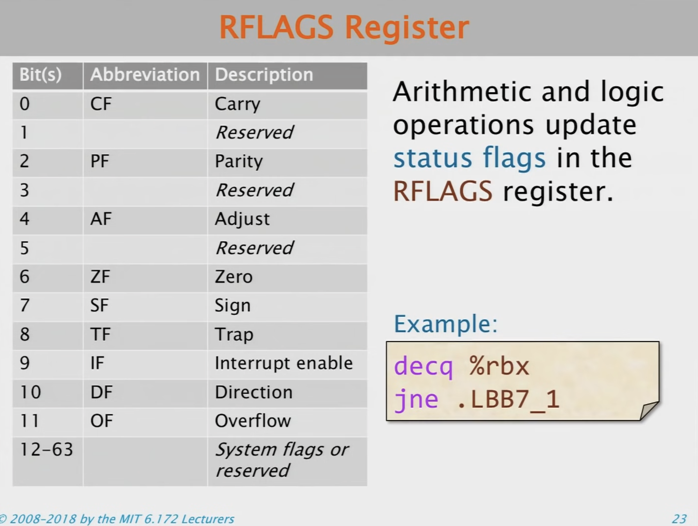

=============================================
Assembly Language and Computer Architecture
=============================================

Intro
======
- If you want to write a fast code, you need to know what's going underneath, so that you can exploit the strength of the architecture.
- Take this example of fib.c, compile it through clang and it produces a binary machine language that **the computer is hardware programmed to interpret and execute**. It looks at the bits as instructions as opposed to as data and it executes them.

Credits: MIT Lectures

- This process is not one step. It actually a 4 stage process.
  - Preprocessing. - clang -E - You can see how the macros got expanded before it actually goes through compilation.
  - Compiling - clang -S - Produces Assembly code. Assembly is mnemonic structure of the machine code. A more human readable than machine code.
  - Assembling - You can produce object file from an Assembly code.
  - Linking - since we like to have separate compilation, you don't have to compile everything as a one big monolithic hunk. There is a linking stage to produce the final executable. (ld command for gold linker)

Preprocessing
--------------

This stage is pretty straight forward. Just do a textual substitution.

Source code to Assembly
-------------------------

- Produces the symbolic representation of source code.
- Some LABELs on the side, and we have some OPERATIONS, DIRECTIVES, etc.

Assembly to executable
------------------------

- Unlike C code and binary, Assembly and machine code looks similar and you can see a bit pattern for each Assembly instructions.
- Try objdump with -g which produce disassembly of the machine code.

Why Assembly?
--------------
- The Assembly reveals what the compiler did and what it didn't.
- Bugs can arise at low level. Sometimes compiler is the source of the bug.
- You can modify Assembly by hand. 
- Reverse engineering. When you have access only to binary, you can decipher what the code is doing.

X86-64 Instruction Set Architecture (ISA)
===========================================

4 important concepts:
- Registers
- Instructions.
- Data types.
- Memory addressing modes.

Registers
----------

- Registers are the places where processes store things.
- There are lots of X86-64 registers but the most important registers are:
  - General Purpose Registers - 64 bits.
  - Flag Registers - 64 bits - which keeps track of things like whether there is an overflow, whether last arithmetic operation resulted in zero etc.
  - Instruction point registers. - 64 bits. - Assembly language is organized as a sequence of instructions, and the hardware marches linearly through that sequence one after another unless there is a conditional/unconditional jump.
  - XMM Registers (for SSE) - 128bits added quite late in the game. vector register.
  - YMM Registers (for AVX) - 128 bits in the start, now it is 512 bit. added quite late in the game. vector register.

X86-64 Registers Aliasing
^^^^^^^^^^^^^^^^^^^^^^^^^^

- The term "x86" came into being because the names of several successors to Intel's 8086 processor end in "86".
- For some advanced features, x86 may require license from Intel; x86-64 may require an additional license from AMD.
- In 8086 processor had a 16bit word (really short). 
  - How many things you can index with a 16bit word? 65,536. So, 65k bytes that you can address in byte addressing.
  - How could they possibly use that for machines? - at that time you didn't had gigabytes and that was sufficient.
  - As the machines, as moore's law, marched along and we got more and more memory. then the words had to become wider to be able to index them.
  - As the word become wider, then processor cost also become twice:)
- So, that's how they did aliaising
- Now we have 64bits and it will be 2^64 addresses.

- if we change `eax` it will change `rax` as well.
- `rsp`: used as stack pointer.
- `rbp`: frame pointer. points to the base of a frame.

Instruction Format
^^^^^^^^^^^^^^^^^^^^

- in this case, take the value in ecx and adding the value of edi into it and store result in ecx.
- As per AT&T syntax, last operand is the destination. In intel syntax the first operand is the destination.
- We use AT&T syntax for this course.

- Move is a computer science move. When we move things from one home to another, they won't stay at the source. But in computer science, we always leave a copy behind. Why don't they call it a COPY??:)
- What happens when we move a 32bit to a 64bit register?
  - Either all higher order bits will be filled with 0.
  - Or higher order bit will be filled with the sign bit.

opcode suffixes
~~~~~~~~~~~~~~~~~

- q means `quad word` means moving a 64 bit integer.

X86-64 Data types
------------------

Memory Addressing Modes.
-------------------------

There are **3 Direct addressing modes** and **3 indirect addressing modes**.

**Direct Addressing**
- Immediate: store a constant into the register specified. here 172 is right in the instruction.
- register: move the value in a register into the register specified.
- direct memory: use the value at the specified memory location, to indicate that memory it gonna take you 64 eight Bytes (on a 64 bit machine) .

How many cycles does it take if the value you are fetching from memory is not in cache or in register? If you are fetching from memory, how many cycles does it take these days? Couple of hundreds. Yeah **couple of hundred cycles.. to fetch something form memory** It's so slow.

So, **Clearly if you can get things to registers, most registers you can access in a single cycle**

So, we want the things close to the processor and while we are fetching from memory, we need processor to do other things in parallel and in today's hardware is so capable of doing that.

**Indirect Addressing**

- We spend a lot of time fetching items from memory. So **caching is so important**

- Register Indirect: The contents is the address of the thing that you're going to move into rdi. If rax was at location 172, take what ever is there in location 172 and put it into rdi
- Register Indexed: Do the same thing as above, but while you are adding it add an offset. if rax had 172, in this case it would go to 344 to fetch the value out of that location 344 for this particular instruction.
- Instruction Pointer Relative: Instead of indexing off of a general purpose register, you index off the instruction pointer. That usually happens in the code where the code is, for example, you can jump to where you are in the code plus 4 instructions

**Base Indexed Scale Displacement Addressing.**

- Most common. used in stack.

Assembly Idioms
================

XOR
----

What does the following Assembly do? : `xor %rax %rax`.?
 - It zeros the register. takes the value in rax, xoring with itself and store it back. XORing with itself is zero.
 - this is faster than putting a zero into the instruction. It saves a byte.

Floating Point Instructions
=============================

- 8086 has not floating point instructions.

Vector hardware
================

A Simple 5-State Processor
============================

5 Stages:
- Instruction Fetch (IF): Read instruction from memory.
- Instruction Decode (ID): Determine which units to use to execute instruction, and extract register arguments.
- Execute (EX): Perform ALU operations.
- Memory Addressing (MA): Read/Write data memory.
- Write Back (WB): Store result into registers.

- Note that this is not the truth. There are lot many things happens the in real scenario.
- 14-19 pipeline stages in intel haswell.

.. image:: _images/source_code_exec/00127_intelhaswell.png
  :width: 400
  :align: center

2 ways processors improve speed:
---------------------------------

1. By exploiting **parallelism**: Execute multiple instructions simultaneously.
   - Example: instruction-level parallelism (ILP), vectorization, multi-core
2. By exploiting **locality**: Minimize data movement. 
   - Example: caching, registers.

Instruction level parallelism
^^^^^^^^^^^^^^^^^^^^^^^^^^^^^^^

**In theory**

**In practice**

- Compiler will try to avoid stalls.

- Why do stalls happen?
  - They happen because of hazards

3 types of hazards:

how to processor handle complex operations?
============================================

Answer:

References
===========
- Prof. Leiserson: https://ocw.mit.edu/courses/6-172-performance-engineering-of-software-systems-fall-2018/resources/lecture-4-assembly-language-computer-architecture/
- 

