=======
Day 04
=======

So, we have the kubernetes cluster setup::

    [root@Master ~]# kubectl get nodes
    NAME      STATUS   ROLES                  AGE   VERSION
    master    Ready    control-plane,master   16h   v1.21.9
    worker1   Ready    <none>                 16h   v1.21.9
    worker2   Ready    <none>                 16h   v1.21.9

Note that kubectl worked only on Master::

    [root@worker1 ~]# kubectl get nodes
    The connection to the server localhost:8080 was refused - did you specify the right host or port?

    [root@worker2 ~]# kubectl get nodes
    The connection to the server localhost:8080 was refused - did you specify the right host or port?

.. important:: INFRA OBJECT and SERVICE OBJECT are 2 important objects in kubernetes. 

.. important:: There are 3 INFRA OBJECTS: **POD, REPLICA SET** & **DEPLOYMENT**

Managing Kubernetes Objects
=============================

Create a objects in imperative way
------------------------------------

Command: `kebectl run <podnam> --image=<>`. 

We know that the default object created will be POD.

See the default infra object created::

    [root@Master ~]# kubectl run ajtest --image=nginx
    pod/ajtest created

    [root@Master ~]# kubectl get pods -o wide
    NAME     READY   STATUS    RESTARTS   AGE     IP           NODE      NOMINATED NODE   READINESS GATES
    ajtest   1/1     Running   0          2m10s   10.244.1.4   worker2   <none>           <none>

To get all details about the POD.

.. code-block:: 
   :emphasize-lines: 3, 4, 7, 10, 11,46-53

    [root@Master ~]# kubectl describe pod ajtest
    Name:         ajtest
    Namespace:    default   # By default, the PODs will come under `default` namespace
    Priority:     0  # Valid values: 0/1, Suppose 50 pods are there and you want couple of pods to come up first. Otherwise all will come together.
    Node:         worker2/192.168.64.4
    Start Time:   Thu, 08 Sep 2022 10:41:51 +0530
    Labels:       run=ajtest # Label is mandatory for PODS. For other infra objects (replica set and deployment), label is not mandatory. It will inherit from POD. 
    Annotations:  <none>    # If you want to pass any extra information 
    Status:       Running
    IP:           10.244.1.4    # When you init k8s, you given a CIDR (10.244.0.0/16). All the pods use IP from the CIDR range. This means in each workers, you can provide 255*255 IPs in this range on each Worker nodes. We have 2 nodes, so 2 * 255 * 255 IPs.
                                # If you don't give a IP, still it will work. Flannel will work. In oracle, it accept only Class C IPs.
    IPs:
      IP:  10.244.1.4
    Containers:
      ajtest:
        Container ID:   docker://c89d5bde91b566179ebf00ca2d73d3e1230b6af711e30e78fdb6587f2e0bb4d4
        Image:          nginx
        Image ID:       docker-pullable://nginx@sha256:b95a99feebf7797479e0c5eb5ec0bdfa5d9f504bc94da550c2f58e839ea6914f
        Port:           <none>
        Host Port:      <none>
        State:          Running
          Started:      Thu, 08 Sep 2022 10:41:56 +0530
        Ready:          True
        Restart Count:  0
        Environment:    <none>
        Mounts:
          /var/run/secrets/kubernetes.io/serviceaccount from kube-api-access-68w2h (ro)
    Conditions:
      Type              Status
      Initialized       True 
      Ready             True 
      ContainersReady   True 
      PodScheduled      True 
    Volumes:
      kube-api-access-68w2h:
        Type:                    Projected (a volume that contains injected data from multiple sources)
        TokenExpirationSeconds:  3607
        ConfigMapName:           kube-root-ca.crt
        ConfigMapOptional:       <nil>
        DownwardAPI:             true
    QoS Class:                   BestEffort
    Node-Selectors:              <none>
    Tolerations:                 node.kubernetes.io/not-ready:NoExecute op=Exists for 300s
                                 node.kubernetes.io/unreachable:NoExecute op=Exists for 300s
    Events:
      Type    Reason     Age    From               Message
      ----    ------     ----   ----               -------
      Normal  Scheduled  2m36s  default-scheduler  Successfully assigned default/ajtest to worker2
      Normal  Pulling    2m35s  kubelet            Pulling image "nginx"
      Normal  Pulled     2m31s  kubelet            Successfully pulled image "nginx" in 3.962208052s
      Normal  Created    2m31s  kubelet            Created container ajtest
      Normal  Started    2m31s  kubelet            Started container ajtest
    [root@Master ~]# kubectl describe pod ajtest

.. important:: 

    Labels are used for:

    - Grouping and filtering: Suppose 100 pods are running. out of this 50 are for vodafone project, I want to filter pods used in vodafone project.
    - Binding objects: You can bind the infra object with service object using this label.

.. important:: Labels are mandatory for PODs. Not mandatory for replica set and deployment.

What happens when you delete POD, all gone::

    [root@Master ~]# kubectl delete pod ajtest
    pod "ajtest" deleted

Can we create a replica set? no. See the version is 21. We can't create replica set exclusively.

::
    
    [root@Master ~]# kubectl create --help| grep replica

We can create a deployment::
    
    [root@Master ~]# kubectl create --help| grep deployment
    deployment          Create a deployment with the specified name.

Default deployment will create a single replica::

    [root@Master ~]# kubectl create deployment ajtest-deployment --image=nginx
    deployment.apps/ajtest-deployment created

::

    [root@Master ~]# kubectl get deployments
    NAME                READY   UP-TO-DATE   AVAILABLE   AGE
    ajtest-deployment   1/1     1            1           25s

::

    [root@Master ~]# kubectl get replicasets
    NAME                           DESIRED   CURRENT   READY   AGE
    ajtest-deployment-7c7cfbd567   1         1         1       34s

::

    [root@Master ~]# kubectl get pods
    NAME                                 READY   STATUS    RESTARTS   AGE
    ajtest-deployment-7c7cfbd567-58l66   1/1     Running   0          108s

What is inside pod? Container::

    [root@Master ~]# kubectl get pods -o wide
    NAME                                 READY   STATUS    RESTARTS   AGE     IP           NODE      NOMINATED NODE   READINESS GATES
    ajtest-deployment-7c7cfbd567-58l66   1/1     Running   0          2m31s   10.244.1.5   worker2   <none>           <none>

To show all the mandatory objects (Infra & Service)::

    [root@Master ~]# kubectl get all -o wide
    NAME                                     READY   STATUS    RESTARTS   AGE     IP           NODE      NOMINATED NODE   READINESS GATES
    pod/ajtest-deployment-7c7cfbd567-58l66   1/1     Running   0          3m17s   10.244.1.5   worker2   <none>           <none>

    NAME                 TYPE        CLUSTER-IP   EXTERNAL-IP   PORT(S)   AGE   SELECTOR
    service/kubernetes   ClusterIP   10.96.0.1    <none>        443/TCP   17h   <none>

    NAME                                READY   UP-TO-DATE   AVAILABLE   AGE     CONTAINERS   IMAGES   SELECTOR
    deployment.apps/ajtest-deployment   1/1     1            1           3m17s   nginx        nginx    app=ajtest-deployment

    NAME                                           DESIRED   CURRENT   READY   AGE     CONTAINERS   IMAGES   SELECTOR
    replicaset.apps/ajtest-deployment-7c7cfbd567   1         1         1       3m17s   nginx        nginx    app=ajtest-deployment,pod-template-hash=7c7cfbd567

You can see one additional field **Controlled By**.

.. code-block:: 
   :emphasize-lines: 14

    [root@Master ~]# kubectl describe pods
    Name:         ajtest-deployment-7c7cfbd567-58l66
    Namespace:    default
    Priority:     0
    Node:         worker2/192.168.64.4
    Start Time:   Thu, 08 Sep 2022 11:08:16 +0530
    Labels:       app=ajtest-deployment
                  pod-template-hash=7c7cfbd567
    Annotations:  <none>
    Status:       Running
    IP:           10.244.1.5
    IPs:
      IP:           10.244.1.5
    Controlled By:  ReplicaSet/ajtest-deployment-7c7cfbd567
    Containers:
      nginx:
        Container ID:   docker://9cb07a5d4683ee1a38a98653c4987f3838fb92e6cc33033bf85f134effbc1fdd
        Image:          nginx
        Image ID:       docker-pullable://nginx@sha256:b95a99feebf7797479e0c5eb5ec0bdfa5d9f504bc94da550c2f58e839ea6914f
        Port:           <none>
        Host Port:      <none>

kubectl describe replicaset::

    [root@Master ~]# kubectl describe replicaset
    Name:           ajtest-deployment-7c7cfbd567
    Namespace:      default
    Selector:       app=ajtest-deployment,pod-template-hash=7c7cfbd567
    Labels:         app=ajtest-deployment
                    pod-template-hash=7c7cfbd567
    Annotations:    deployment.kubernetes.io/desired-replicas: 1
                    deployment.kubernetes.io/max-replicas: 2 # if n replicas, this field will say max=n+1
                    deployment.kubernetes.io/revision: 1
    Controlled By:  Deployment/ajtest-deployment
    Replicas:       1 current / 1 desired
    Pods Status:    1 Running / 0 Waiting / 0 Succeeded / 0 Failed
    Pod Template:
      Labels:  app=ajtest-deployment
               pod-template-hash=7c7cfbd567
      Containers:
       nginx:
        Image:        nginx
        Port:         <none>
        Host Port:    <none>
        Environment:  <none>
        Mounts:       <none>
      Volumes:        <none>
    Events:
      Type    Reason            Age    From                   Message
      ----    ------            ----   ----                   -------
      Normal  SuccessfulCreate  6m39s  replicaset-controller  Created pod: ajtest-deployment-7c7cfbd567-58l66
    [root@Master ~]# 

kubectl describe deployment::

    [root@Master ~]# kubectl describe deployment
    Name:                   ajtest-deployment
    Namespace:              default
    CreationTimestamp:      Thu, 08 Sep 2022 11:08:16 +0530
    Labels:                 app=ajtest-deployment
    Annotations:            deployment.kubernetes.io/revision: 1
    Selector:               app=ajtest-deployment
    Replicas:               1 desired | 1 updated | 1 total | 1 available | 0 unavailable
    StrategyType:           RollingUpdate
    MinReadySeconds:        0
    RollingUpdateStrategy:  25% max unavailable, 25% max surge
    Pod Template:
      Labels:  app=ajtest-deployment
      Containers:
       nginx:
        Image:        nginx
        Port:         <none>
        Host Port:    <none>
        Environment:  <none>
        Mounts:       <none>
      Volumes:        <none>
    Conditions:
      Type           Status  Reason
      ----           ------  ------
      Available      True    MinimumReplicasAvailable
      Progressing    True    NewReplicaSetAvailable
    OldReplicaSets:  <none>
    NewReplicaSet:   ajtest-deployment-7c7cfbd567 (1/1 replicas created)
    Events:
      Type    Reason             Age   From                   Message
      ----    ------             ----  ----                   -------
      Normal  ScalingReplicaSet  8m8s  deployment-controller  Scaled up replica set ajtest-deployment-7c7cfbd567 to 1
    [root@Master ~]# 

Scale objects
^^^^^^^^^^^^^^^

Scale replicas::

    [root@Master ~]# kubectl scale deployment.apps/ajtest-deployment  --replicas=4
    deployment.apps/ajtest-deployment scaled

.. code-block:: 
   :emphasize-lines: 4-7, 12, 15

    [root@Master ~]# kubectl get all -o wide
    NAME                                     READY   STATUS              RESTARTS   AGE     IP           NODE      NOMINATED NODE   READINESS GATES
    pod/ajtest-deployment-7c7cfbd567-8shfb   0/1     ContainerCreating   0          7s      <none>       worker1   <none>           <none>
    pod/ajtest-deployment-7c7cfbd567-brhjw   1/1     Running             0          3m23s   10.244.1.6   worker2   <none>           <none>
    pod/ajtest-deployment-7c7cfbd567-c7zj8   1/1     Running             0          7s      10.244.2.5   worker1   <none>           <none>
    pod/ajtest-deployment-7c7cfbd567-mhnzm   1/1     Running             0          7s      10.244.1.7   worker2   <none>           <none>

    NAME                 TYPE        CLUSTER-IP   EXTERNAL-IP   PORT(S)   AGE   SELECTOR
    service/kubernetes   ClusterIP   10.96.0.1    <none>        443/TCP   18h   <none>

    NAME                                READY   UP-TO-DATE   AVAILABLE   AGE   CONTAINERS   IMAGES   SELECTOR
    deployment.apps/ajtest-deployment   3/4     4            3           37m   nginx        nginx    app=ajtest-deployment

    NAME                                           DESIRED   CURRENT   READY   AGE     CONTAINERS   IMAGES   SELECTOR
    replicaset.apps/ajtest-deployment-7c7cfbd567   4         4         3       3m23s   nginx        nginx    app=ajtest-deployment,pod-template-hash=7c7cfbd567

    [root@Master ~]# kubectl get all -o wide
    NAME                                     READY   STATUS    RESTARTS   AGE    IP           NODE      NOMINATED NODE   READINESS GATES
    pod/ajtest-deployment-7c7cfbd567-8shfb   1/1     Running   0          8m2s   10.244.2.6   worker1   <none>           <none>
    pod/ajtest-deployment-7c7cfbd567-brhjw   1/1     Running   0          11m    10.244.1.6   worker2   <none>           <none>
    pod/ajtest-deployment-7c7cfbd567-c7zj8   1/1     Running   0          8m2s   10.244.2.5   worker1   <none>           <none>
    pod/ajtest-deployment-7c7cfbd567-mhnzm   1/1     Running   0          8m2s   10.244.1.7   worker2   <none>           <none>

    NAME                 TYPE        CLUSTER-IP   EXTERNAL-IP   PORT(S)   AGE   SELECTOR
    service/kubernetes   ClusterIP   10.96.0.1    <none>        443/TCP   18h   <none>

    NAME                                READY   UP-TO-DATE   AVAILABLE   AGE   CONTAINERS   IMAGES   SELECTOR
    deployment.apps/ajtest-deployment   4/4     4            4           45m   nginx        nginx    app=ajtest-deployment

    NAME                                           DESIRED   CURRENT   READY   AGE   CONTAINERS   IMAGES   SELECTOR
    replicaset.apps/ajtest-deployment-7c7cfbd567   4         4         4       11m   nginx        nginx    app=ajtest-deployment,pod-template-hash=7c7cfbd567

::

    [root@Master ~]# kubectl get pods --all-namespaces
    NAMESPACE      NAME                                 READY   STATUS    RESTARTS   AGE
    default        ajtest-deployment-7c7cfbd567-8shfb   1/1     Running   0          10m
    default        ajtest-deployment-7c7cfbd567-brhjw   1/1     Running   0          14m
    default        ajtest-deployment-7c7cfbd567-c7zj8   1/1     Running   0          10m
    default        ajtest-deployment-7c7cfbd567-mhnzm   1/1     Running   0          10m
    kube-flannel   kube-flannel-ds-4xlcv                1/1     Running   1          18h
    kube-flannel   kube-flannel-ds-c82g4                1/1     Running   1          18h
    kube-flannel   kube-flannel-ds-ldb4g                1/1     Running   1          18h
    kube-system    coredns-558bd4d5db-4p6jh             1/1     Running   1          18h
    kube-system    coredns-558bd4d5db-rxpff             1/1     Running   1          18h
    kube-system    etcd-master                          1/1     Running   1          18h
    kube-system    kube-apiserver-master                1/1     Running   1          18h
    kube-system    kube-controller-manager-master       1/1     Running   2          18h
    kube-system    kube-proxy-8wp42                     1/1     Running   1          18h
    kube-system    kube-proxy-9tb7n                     1/1     Running   1          18h
    kube-system    kube-proxy-jnbc9                     1/1     Running   1          18h
    kube-system    kube-scheduler-master                1/1     Running   2          18h
    [root@Master ~]# 

::

    [root@Master ~]# kubectl scale deployment.apps/ajtest-deployment  --replicas=2
    deployment.apps/ajtest-deployment scaled

Delete objects
^^^^^^^^^^^^^^^

If I want to delete the application, delete the deployment.

If you delete a pod, deployment will create another pod in seconds

::

    [root@Master ~]# kubectl get all -o wide
    NAME                                     READY   STATUS    RESTARTS   AGE   IP           NODE      NOMINATED NODE   READINESS GATES
    pod/ajtest-deployment-7c7cfbd567-58l66   1/1     Running   0          11m   10.244.1.5   worker2   <none>           <none>

    NAME                 TYPE        CLUSTER-IP   EXTERNAL-IP   PORT(S)   AGE   SELECTOR
    service/kubernetes   ClusterIP   10.96.0.1    <none>        443/TCP   17h   <none>

    NAME                                READY   UP-TO-DATE   AVAILABLE   AGE   CONTAINERS   IMAGES   SELECTOR
    deployment.apps/ajtest-deployment   1/1     1            1           11m   nginx        nginx    app=ajtest-deployment

    NAME                                           DESIRED   CURRENT   READY   AGE   CONTAINERS   IMAGES   SELECTOR
    replicaset.apps/ajtest-deployment-7c7cfbd567   1         1         1       11m   nginx        nginx    app=ajtest-deployment,pod-template-hash=7c7cfbd567

::

    [root@Master ~]# kubectl delete pod/ajtest-deployment-7c7cfbd567-58l66
    pod "ajtest-deployment-7c7cfbd567-58l66" deleted

Immediately another created::

    [root@Master ~]# kubectl get pods
    NAME                                 READY   STATUS    RESTARTS   AGE
    ajtest-deployment-7c7cfbd567-sl6h4   1/1     Running   0          19s

If you delete a replicaset, deployment will create another replica set in seconds. 

::

    [root@Master ~]# kubectl get all -o wide
    NAME                                     READY   STATUS    RESTARTS   AGE   IP           NODE      NOMINATED NODE   READINESS GATES
    pod/ajtest-deployment-7c7cfbd567-sl6h4   1/1     Running   0          20m   10.244.2.4   worker1   <none>           <none>

    NAME                 TYPE        CLUSTER-IP   EXTERNAL-IP   PORT(S)   AGE   SELECTOR
    service/kubernetes   ClusterIP   10.96.0.1    <none>        443/TCP   18h   <none>

    NAME                                READY   UP-TO-DATE   AVAILABLE   AGE   CONTAINERS   IMAGES   SELECTOR
    deployment.apps/ajtest-deployment   1/1     1            1           33m   nginx        nginx    app=ajtest-deployment

    NAME                                           DESIRED   CURRENT   READY   AGE   CONTAINERS   IMAGES   SELECTOR
    replicaset.apps/ajtest-deployment-7c7cfbd567   1         1         1       33m   nginx        nginx    app=ajtest-deployment,pod-template-hash=7c7cfbd567

::

    [root@Master ~]# kubectl delete replicaset.apps/ajtest-deployment-7c7cfbd567
    replicaset.apps "ajtest-deployment-7c7cfbd567" deleted

::

    [root@Master ~]# kubectl get all -o wide
    NAME                                     READY   STATUS              RESTARTS   AGE   IP           NODE      NOMINATED NODE   READINESS GATES
    pod/ajtest-deployment-7c7cfbd567-brhjw   0/1     ContainerCreating   0          2s    <none>       worker2   <none>           <none>
    pod/ajtest-deployment-7c7cfbd567-sl6h4   0/1     Terminating         0          21m   10.244.2.4   worker1   <none>           <none>

    NAME                 TYPE        CLUSTER-IP   EXTERNAL-IP   PORT(S)   AGE   SELECTOR
    service/kubernetes   ClusterIP   10.96.0.1    <none>        443/TCP   18h   <none>

    NAME                                READY   UP-TO-DATE   AVAILABLE   AGE   CONTAINERS   IMAGES   SELECTOR
    deployment.apps/ajtest-deployment   0/1     1            0           34m   nginx        nginx    app=ajtest-deployment

    NAME                                           DESIRED   CURRENT   READY   AGE   CONTAINERS   IMAGES   SELECTOR
    replicaset.apps/ajtest-deployment-7c7cfbd567   1         1         0       2s    nginx        nginx    app=ajtest-deployment,pod-template-hash=7c7cfbd567
    [root@Master ~]# 

    [root@Master ~]# kubectl get all -o wide
    NAME                                     READY   STATUS    RESTARTS   AGE   IP           NODE      NOMINATED NODE   READINESS GATES
    pod/ajtest-deployment-7c7cfbd567-brhjw   1/1     Running   0          83s   10.244.1.6   worker2   <none>           <none>

    NAME                 TYPE        CLUSTER-IP   EXTERNAL-IP   PORT(S)   AGE   SELECTOR
    service/kubernetes   ClusterIP   10.96.0.1    <none>        443/TCP   18h   <none>

    NAME                                READY   UP-TO-DATE   AVAILABLE   AGE   CONTAINERS   IMAGES   SELECTOR
    deployment.apps/ajtest-deployment   1/1     1            1           35m   nginx        nginx    app=ajtest-deployment

    NAME                                           DESIRED   CURRENT   READY   AGE   CONTAINERS   IMAGES   SELECTOR
    replicaset.apps/ajtest-deployment-7c7cfbd567   1         1         1       83s   nginx        nginx    app=ajtest-deployment,pod-template-hash=7c7cfbd567

Delete a deployment::

    [root@Master ~]# kubectl delete deployment.apps/ajtest-deployment
    deployment.apps "ajtest-deployment" deleted
    [root@Master ~]# kubectl get all -o wide
    NAME                                     READY   STATUS        RESTARTS   AGE   IP           NODE      NOMINATED NODE   READINESS GATES
    pod/ajtest-deployment-7c7cfbd567-brhjw   0/1     Terminating   0          59m   10.244.1.6   worker2   <none>           <none>
    pod/ajtest-deployment-7c7cfbd567-mhnzm   0/1     Terminating   0          56m   10.244.1.7   worker2   <none>           <none>

    NAME                 TYPE        CLUSTER-IP   EXTERNAL-IP   PORT(S)   AGE   SELECTOR
    service/kubernetes   ClusterIP   10.96.0.1    <none>        443/TCP   19h   <none>
    [root@Master ~]# kubectl get all -o wide
    NAME                 TYPE        CLUSTER-IP   EXTERNAL-IP   PORT(S)   AGE   SELECTOR
    service/kubernetes   ClusterIP   10.96.0.1    <none>        443/TCP   19h   <none>

Create a objects in Declarative way (Using YAML)
-------------------------------------------------

You should not do anything in an **imperative way (through command line)**.  You need to use declarative way (YAML) to manage kubernetes objects.

YAML is a markup language.

- YAML instructions are going to be written in a definition file. Recommended extension is (.yml)
- Any yaml file you take in K8, 4 roots fields will be there (You can see 10-11 now)
  - apiVersion: (string) based on the object in the `kind` field, this apiVersion is defined. if kind=Pod, apiVersion is `V1`
  - kind: (string) type of object. example Pod.
  - metadata: (dict) any extra information you need to provide. labels, annotations etc.
  - spec: (list array) specification of the kind.

Kubernetes recommends this way and you can see yaml for all the components at `/etc/kubernetes`

::

    [root@Master kubernetes]# ls
    admin.conf  controller-manager.conf  kubelet.conf  manifests  pki  scheduler.conf
    [root@Master kubernetes]# cd manifests/
    [root@Master manifests]# ls
    etcd.yaml  kube-apiserver.yaml  kube-controller-manager.yaml  kube-scheduler.yaml

pod-definition.yml ::

    apiVersion: v1
    kind: Pod
    metadata:
        name: myapp-pod
        labels:
            app: myapp
    spec:
        containers:
          - name: nginx-container
            image: nginx

To create POD::

    [root@Master ~]# kubectl create -f pod-definition.yml 
    pod/myapp-pod created

    [root@Master ~]# kubectl get all -o wide
    NAME            READY   STATUS    RESTARTS   AGE   IP           NODE      NOMINATED NODE   READINESS GATES
    pod/myapp-pod   1/1     Running   0          52s   10.244.2.7   worker1   <none>           <none>

    NAME                 TYPE        CLUSTER-IP   EXTERNAL-IP   PORT(S)   AGE   SELECTOR
    service/kubernetes   ClusterIP   10.96.0.1    <none>        443/TCP   19h   <none>

To delete POD::

    [root@Master ~]# kubectl delete -f pod-definition.yml 
    pod "myapp-pod" deleted

    [root@Master ~]# kubectl get all -o wide
    NAME                 TYPE        CLUSTER-IP   EXTERNAL-IP   PORT(S)   AGE   SELECTOR
    service/kubernetes   ClusterIP   10.96.0.1    <none>        443/TCP   19h   <none>

**Kubernetes YAML convertor**

There are many YAML converters are available online. But K8s inbuilt has a converter.

The `dry-run` will not create a pod. Instead it will create a yaml file::

    [root@Master ~]# kubectl run myapp-pod --image=nginx --dry-run=client -o yaml > pod.yaml

    [root@Master ~]# cat pod.yaml 
    apiVersion: v1
    kind: Pod
    metadata:
      creationTimestamp: null
      labels:
        run: myapp-pod
      name: myapp-pod
    spec:
      containers:
      - image: nginx
        name: myapp-pod
        resources: {}
      dnsPolicy: ClusterFirst
      restartPolicy: Always
    status: {}

Did not create any pods::

    [root@Master ~]# kubectl get pods
    No resources found in default namespace.

Use it for creating a pod::

    [root@Master ~]# kubectl get pods
    NAME        READY   STATUS              RESTARTS   AGE
    myapp-pod   0/1     ContainerCreating   0          3s

    [root@Master ~]# kubectl get pods
    NAME        READY   STATUS    RESTARTS   AGE
    myapp-pod   1/1     Running   0          23m

Delete objects (YAML)
^^^^^^^^^^^^^^^^^^^^^

::

    [root@Master ~]# kubectl delete -f pod.yaml 
    pod "myapp-pod" deleted

Create deployment (YAML)
^^^^^^^^^^^^^^^^^^^^^^^^

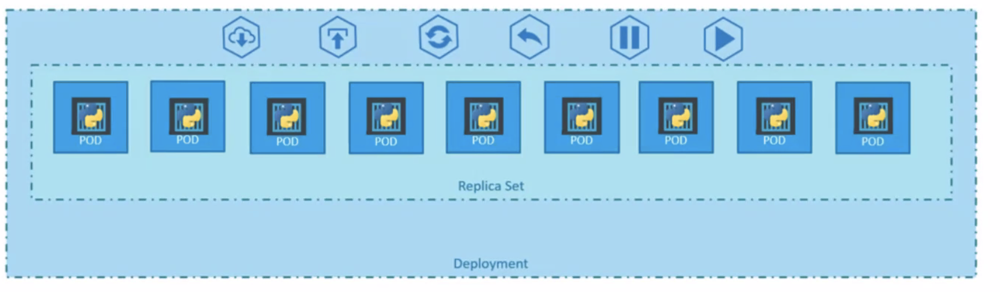

.. important:: **template** in YAML denotes POD specification.

deployment.yml::

    apiVersion: apps/v1
    kind: Deployment
    metadata:
      name: myapp-prod
      labels:
           app: myapp

    spec:
      replicas: 2
      template:
        metadata:
          name: myapp-pod
          labels:
            app: myapp
        spec:
          containers:
            - name: nginx
              image: nginx
      selector:
        matchLabels:
          app: myapp

Create deployment::

    [root@Master ~]# kubectl create -f deployment.yml
    deployment.apps/myapp-prod created

    [root@Master ~]# kubectl get all -o wide
    NAME                             READY   STATUS    RESTARTS   AGE   IP           NODE      NOMINATED NODE   READINESS GATES
    pod/myapp-prod-b478cc546-d6zfq   1/1     Running   0          9s    10.244.1.9   worker2   <none>           <none>
    pod/myapp-prod-b478cc546-dj42b   1/1     Running   0          9s    10.244.2.8   worker1   <none>           <none>

    NAME                 TYPE        CLUSTER-IP   EXTERNAL-IP   PORT(S)   AGE   SELECTOR
    service/kubernetes   ClusterIP   10.96.0.1    <none>        443/TCP   20h   <none>

    NAME                         READY   UP-TO-DATE   AVAILABLE   AGE   CONTAINERS   IMAGES   SELECTOR
    deployment.apps/myapp-prod   2/2     2            2           9s    nginx        nginx    app=myapp

    NAME                                   DESIRED   CURRENT   READY   AGE   CONTAINERS   IMAGES   SELECTOR
    replicaset.apps/myapp-prod-b478cc546   2         2         2       9s    nginx        nginx    app=myapp,pod-template-hash=b478cc546
    [root@Master ~]# 

Scale deployment (can use `replace` or `apply`)::

    [root@Master ~]# cat deployment.yml | grep replicas
    replicas: 20

    [root@Master ~]# kubectl replace  -f deployment.yml
    deployment.apps/myapp-prod replaced
    [root@Master ~]# kubectl get all -o wide
    NAME                             READY   STATUS              RESTARTS   AGE     IP           NODE      NOMINATED NODE   READINESS GATES
    pod/myapp-prod-b478cc546-6r8vk   0/1     ContainerCreating   0          4s      <none>       worker2   <none>           <none>
    pod/myapp-prod-b478cc546-94wg4   0/1     ContainerCreating   0          4s      <none>       worker1   <none>           <none>
    pod/myapp-prod-b478cc546-9g48d   0/1     ContainerCreating   0          4s      <none>       worker2   <none>           <none>
    pod/myapp-prod-b478cc546-bvz2f   0/1     ContainerCreating   0          4s      <none>       worker2   <none>           <none>
    pod/myapp-prod-b478cc546-clf2t   0/1     ContainerCreating   0          4s      <none>       worker1   <none>           <none>
    pod/myapp-prod-b478cc546-d6zfq   1/1     Running             0          2m14s   10.244.1.9   worker2   <none>           <none>
    pod/myapp-prod-b478cc546-dj42b   1/1     Running             0          2m14s   10.244.2.8   worker1   <none>           <none>
    pod/myapp-prod-b478cc546-dwr8b   0/1     ContainerCreating   0          4s      <none>       worker1   <none>           <none>
    pod/myapp-prod-b478cc546-fhdgk   0/1     ContainerCreating   0          4s      <none>       worker1   <none>           <none>
    pod/myapp-prod-b478cc546-fndk6   0/1     ContainerCreating   0          4s      <none>       worker2   <none>           <none>
    pod/myapp-prod-b478cc546-hrg9c   0/1     ContainerCreating   0          4s      <none>       worker2   <none>           <none>
    pod/myapp-prod-b478cc546-ht87t   0/1     ContainerCreating   0          4s      <none>       worker1   <none>           <none>
    pod/myapp-prod-b478cc546-jg8fl   0/1     ContainerCreating   0          4s      <none>       worker2   <none>           <none>
    pod/myapp-prod-b478cc546-mlh5h   0/1     ContainerCreating   0          4s      <none>       worker1   <none>           <none>
    pod/myapp-prod-b478cc546-sgcf9   0/1     ContainerCreating   0          4s      <none>       worker1   <none>           <none>
    pod/myapp-prod-b478cc546-sn2sf   0/1     ContainerCreating   0          4s      <none>       worker1   <none>           <none>
    pod/myapp-prod-b478cc546-stp5j   0/1     ContainerCreating   0          4s      <none>       worker2   <none>           <none>
    pod/myapp-prod-b478cc546-tjkb4   0/1     ContainerCreating   0          4s      <none>       worker2   <none>           <none>
    pod/myapp-prod-b478cc546-tzs8l   0/1     ContainerCreating   0          4s      <none>       worker1   <none>           <none>
    pod/myapp-prod-b478cc546-w4qxz   0/1     ContainerCreating   0          4s      <none>       worker2   <none>           <none>

    NAME                 TYPE        CLUSTER-IP   EXTERNAL-IP   PORT(S)   AGE   SELECTOR
    service/kubernetes   ClusterIP   10.96.0.1    <none>        443/TCP   20h   <none>

    NAME                         READY   UP-TO-DATE   AVAILABLE   AGE     CONTAINERS   IMAGES   SELECTOR
    deployment.apps/myapp-prod   2/20    20           2           2m14s   nginx        nginx    app=myapp

    NAME                                   DESIRED   CURRENT   READY   AGE     CONTAINERS   IMAGES   SELECTOR
    replicaset.apps/myapp-prod-b478cc546   20        20        2       2m14s   nginx        nginx    app=myapp,pod-template-hash=b478cc546

We can edit the yaml and apply the changes in one go as well. J

Just edit the replicas to 2 and see::

    [root@Master ~]# kubectl edit deployment.apps/myapp-prod
    deployment.apps/myapp-prod edited

    [root@Master ~]# kubectl get all -o wide
    NAME                             READY   STATUS    RESTARTS   AGE     IP           NODE      NOMINATED NODE   READINESS GATES
    pod/myapp-prod-b478cc546-d6zfq   1/1     Running   0          5m10s   10.244.1.9   worker2   <none>           <none>
    pod/myapp-prod-b478cc546-dj42b   1/1     Running   0          5m10s   10.244.2.8   worker1   <none>           <none>

    NAME                 TYPE        CLUSTER-IP   EXTERNAL-IP   PORT(S)   AGE   SELECTOR
    service/kubernetes   ClusterIP   10.96.0.1    <none>        443/TCP   21h   <none>

    NAME                         READY   UP-TO-DATE   AVAILABLE   AGE     CONTAINERS   IMAGES   SELECTOR
    deployment.apps/myapp-prod   2/2     2            2           5m10s   nginx        nginx    app=myapp

    NAME                                   DESIRED   CURRENT   READY   AGE     CONTAINERS   IMAGES   SELECTOR
    replicaset.apps/myapp-prod-b478cc546   2         2         2       5m10s   nginx        nginx    app=myapp,pod-template-hash=b478cc546
    [root@Master ~]# 

.. important:: YAML for Replica set and deployment, there is not much different. That's why they deprecated replica set.

HorizontalPodAutoScaler
^^^^^^^^^^^^^^^^^^^^^^^^

To automate scaling, there is an object. HorizontalPodAutoScaler

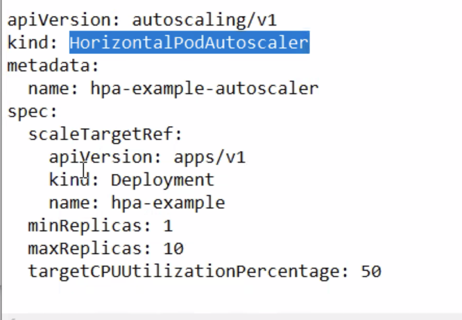

Manually scheduling
====================

Suppose we want to place a pod on a particular node, we need **filtering and ranking mechanism**.

.. important:: Default ranking mechanism (**load balanced with session_affinity=YES**) is enough. However, sometimes you need manual filtering as business demands.

There are many filtering options:

Filter 1. The nodeName 
-----------------------

You request the pod to come up on a particular node. In this case you have taken the decision not the scheduler. ETCD will do the binding to the key value pair

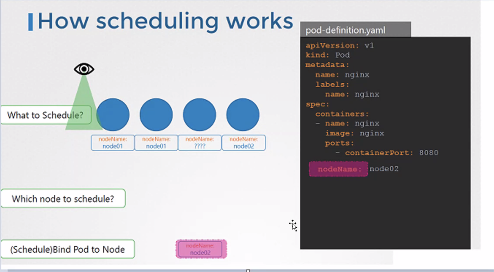

What if the node is not available or name got changed? - it will go to PENDING status.

Imagine that scheduler is not working. You can directly say to the controller that place this pod on this host.

Practicals
^^^^^^^^^^^

Delete all deployments::

    [root@Master ~]# kubectl delete  -f deployment.yml
    deployment.apps "myapp-prod" deleted

    [root@Master ~]# kubectl get all -o wide
    NAME                 TYPE        CLUSTER-IP   EXTERNAL-IP   PORT(S)   AGE   SELECTOR
    service/kubernetes   ClusterIP   10.96.0.1    <none>        443/TCP   21h   <none>
    [root@Master ~]# 

[root@Master ~]# cat nodenamepod.yml

.. code-block:: 
   :emphasize-lines: 11

    apiVersion: v1
    kind: Pod
    metadata:
      name: myapp-prod
      labels:
           app: myapp
    spec:
      containers:
          - name: nginx-container
            image: nginx
      nodeName: worker2

Create pod::

    [root@Master ~]# kubectl create -f nodenamepod.yml 
    pod/myapp-prod created

See it came on worker2 as filtered.

.. code-block:: 
   :emphasize-lines: 3

    [root@Master ~]# kubectl get all -o wide
    NAME             READY   STATUS              RESTARTS   AGE   IP       NODE      NOMINATED NODE   READINESS GATES
    pod/myapp-prod   0/1     ContainerCreating   0          4s    <none>   worker2   <none>           <none>

    NAME                 TYPE        CLUSTER-IP   EXTERNAL-IP   PORT(S)   AGE   SELECTOR
    service/kubernetes   ClusterIP   10.96.0.1    <none>        443/TCP   21h   <none>

Suppose you want to place the pod on another node. This is not possible. The etcd binding is persistent and you can't change it to another node. This is the disadvantage of this filter.

Let check changing the node::

    [root@Master ~]# grep nodeName nodenamepod.yml 
    nodeName: worker1

    [root@Master ~]# kubectl apply -f nodenamepod.yml 
    Warning: resource pods/myapp-prod is missing the kubectl.kubernetes.io/last-applied-configuration annotation which is required by kubectl apply. kubectl apply should only be used on resources created declaratively by either kubectl create --save-config or kubectl apply. The missing annotation will be patched automatically.
    The Pod "myapp-prod" is invalid: spec: Forbidden: pod updates may not change fields other than `spec.containers[*].image`, `spec.initContainers[*].image`, `spec.activeDeadlineSeconds` or `spec.tolerations` (only additions to existing tolerations)
      core.PodSpec{
      	... // 9 identical fields
      	ServiceAccountName:           "default",
      	AutomountServiceAccountToken: nil,
    - 	NodeName:                     "worker1",
    + 	NodeName:                     "worker2",
      	SecurityContext:              &{},
      	ImagePullSecrets:             nil,
      	... // 16 identical fields
      }

Filter 2. Taints and Tolerations
---------------------------------

If you want to restrict certain pod entering into a node, you can Taint that node.

But the pods which are tolerant to the taint can land up in the node.

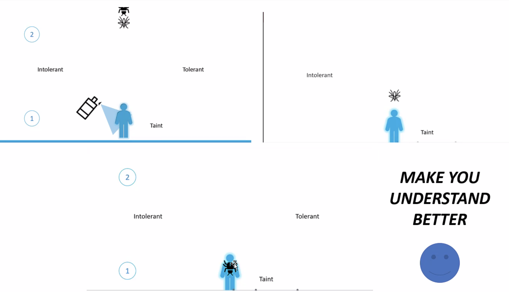

.. important:: Taints are for Nodes, Tolerations are for Pods.

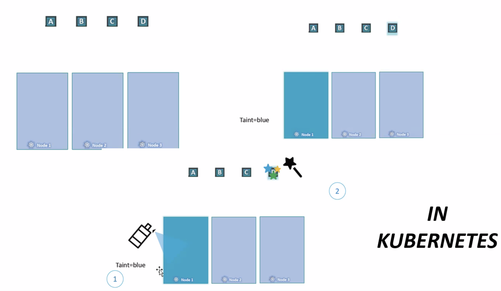

Taint a Node

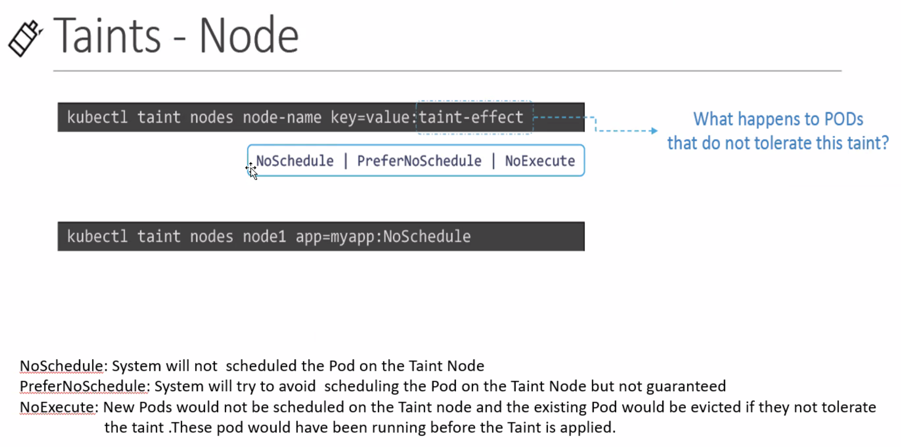

Taints & Tolerations are only meant to restrict.

Practicals
^^^^^^^^^^^^

No deployments running::

    [root@Master ~]# kubectl get all -o wide
    NAME                 TYPE        CLUSTER-IP   EXTERNAL-IP   PORT(S)   AGE   SELECTOR
    service/kubernetes   ClusterIP   10.96.0.1    <none>        443/TCP   21h   <none>

deployment.yml::

    apiVersion: apps/v1
    kind: Deployment
    metadata:
      name: myapp-prod
      labels:
           app: myapp

    spec:
      replicas: 2
      template:
        metadata:
          name: myapp-pod
          labels:
            app: myapp
        spec:
          containers:
            - name: nginx
              image: nginx
      selector:
        matchLabels:
          app: myapp

Create a deployment of 2 replicas::

    deployment.apps/myapp-prod created
    [root@Master ~]# kubectl get all -o wide

    NAME                             READY   STATUS              RESTARTS   AGE   IP       NODE      NOMINATED NODE   READINESS GATES
    pod/myapp-prod-b478cc546-hz44l   0/1     ContainerCreating   0          3s    <none>   worker1   <none>           <none>
    pod/myapp-prod-b478cc546-pm5jc   0/1     ContainerCreating   0          3s    <none>   worker2   <none>           <none>

    NAME                 TYPE        CLUSTER-IP   EXTERNAL-IP   PORT(S)   AGE   SELECTOR
    service/kubernetes   ClusterIP   10.96.0.1    <none>        443/TCP   21h   <none>

    NAME                         READY   UP-TO-DATE   AVAILABLE   AGE   CONTAINERS   IMAGES   SELECTOR
    deployment.apps/myapp-prod   0/2     2            0           3s    nginx        nginx    app=myapp

    NAME                                   DESIRED   CURRENT   READY   AGE   CONTAINERS   IMAGES   SELECTOR
    replicaset.apps/myapp-prod-b478cc546   2         2         0       3s    nginx        nginx    app=myapp,pod-template-hash=b478cc546
    [root@Master ~]# 

Taint worker1::

    [root@Master ~]# kubectl taint node worker1 app=myapp:NoSchedule
    node/worker1 tainted

    [root@Master ~]# kubectl describe node worker1 | grep -i taints
    Taints:             app=myapp:NoSchedule

::

    [root@Master ~]# kubectl get all -o wide
    NAME                             READY   STATUS    RESTARTS   AGE     IP            NODE      NOMINATED NODE   READINESS GATES
    pod/myapp-prod-b478cc546-hz44l   1/1     Running   0          2m56s   10.244.2.19   worker1   <none>           <none>
    pod/myapp-prod-b478cc546-pm5jc   1/1     Running   0          2m56s   10.244.1.21   worker2   <none>           <none>

    NAME                 TYPE        CLUSTER-IP   EXTERNAL-IP   PORT(S)   AGE   SELECTOR
    service/kubernetes   ClusterIP   10.96.0.1    <none>        443/TCP   21h   <none>

    NAME                         READY   UP-TO-DATE   AVAILABLE   AGE     CONTAINERS   IMAGES   SELECTOR
    deployment.apps/myapp-prod   2/2     2            2           2m56s   nginx        nginx    app=myapp

    NAME                                   DESIRED   CURRENT   READY   AGE     CONTAINERS   IMAGES   SELECTOR
    replicaset.apps/myapp-prod-b478cc546   2         2         2       2m56s   nginx        nginx    app=myapp,pod-template-hash=b478cc546
    [root@Master ~]# 

Now scale to 8 replicas::

    [root@Master ~]# grep replicas deployment.yml 
      replicas: 8

    [root@Master ~]# kubectl replace -f deployment.yml 
    deployment.apps/myapp-prod replaced

See all came on worker2.

.. code-block:: 
   :emphasize-lines: 3-8

    [root@Master ~]# kubectl get all -o wide
    NAME                             READY   STATUS    RESTARTS   AGE     IP            NODE      NOMINATED NODE   READINESS GATES
    pod/myapp-prod-b478cc546-2fwrc   1/1     Running   0          79s     10.244.1.25   worker2   <none>           <none>
    pod/myapp-prod-b478cc546-6hdrb   1/1     Running   0          79s     10.244.1.22   worker2   <none>           <none>
    pod/myapp-prod-b478cc546-72cwt   1/1     Running   0          79s     10.244.1.24   worker2   <none>           <none>
    pod/myapp-prod-b478cc546-7m4lw   1/1     Running   0          79s     10.244.1.26   worker2   <none>           <none>
    pod/myapp-prod-b478cc546-gj46v   1/1     Running   0          79s     10.244.1.23   worker2   <none>           <none>
    pod/myapp-prod-b478cc546-hmxrk   1/1     Running   0          79s     10.244.1.27   worker2   <none>           <none>
    pod/myapp-prod-b478cc546-hz44l   1/1     Running   0          5m15s   10.244.2.19   worker1   <none>           <none>
    pod/myapp-prod-b478cc546-pm5jc   1/1     Running   0          5m15s   10.244.1.21   worker2   <none>           <none>

    NAME                 TYPE        CLUSTER-IP   EXTERNAL-IP   PORT(S)   AGE   SELECTOR
    service/kubernetes   ClusterIP   10.96.0.1    <none>        443/TCP   21h   <none>

    NAME                         READY   UP-TO-DATE   AVAILABLE   AGE     CONTAINERS   IMAGES   SELECTOR
    deployment.apps/myapp-prod   8/8     8            8           5m15s   nginx        nginx    app=myapp

    NAME                                   DESIRED   CURRENT   READY   AGE     CONTAINERS   IMAGES   SELECTOR
    replicaset.apps/myapp-prod-b478cc546   8         8         8       5m15s   nginx        nginx    app=myapp,pod-template-hash=b478cc546

To untaint, just need to put a `-` at the end of same command::

    [root@Master ~]# kubectl taint node worker1 app=myapp:NoSchedule-
    node/worker1 untainted
    
    [root@Master ~]# kubectl describe node worker1 | grep -i taints
    Taints:             <none>

Pods will stay there after un-tainting::

    [root@Master ~]# kubectl get all -o wide
    NAME                             READY   STATUS    RESTARTS   AGE     IP            NODE      NOMINATED NODE   READINESS GATES
    pod/myapp-prod-b478cc546-2fwrc   1/1     Running   0          4m40s   10.244.1.25   worker2   <none>           <none>
    pod/myapp-prod-b478cc546-6hdrb   1/1     Running   0          4m40s   10.244.1.22   worker2   <none>           <none>
    pod/myapp-prod-b478cc546-72cwt   1/1     Running   0          4m40s   10.244.1.24   worker2   <none>           <none>
    pod/myapp-prod-b478cc546-7m4lw   1/1     Running   0          4m40s   10.244.1.26   worker2   <none>           <none>
    pod/myapp-prod-b478cc546-gj46v   1/1     Running   0          4m40s   10.244.1.23   worker2   <none>           <none>
    pod/myapp-prod-b478cc546-hmxrk   1/1     Running   0          4m40s   10.244.1.27   worker2   <none>           <none>
    pod/myapp-prod-b478cc546-hz44l   1/1     Running   0          8m36s   10.244.2.19   worker1   <none>           <none>
    pod/myapp-prod-b478cc546-pm5jc   1/1     Running   0          8m36s   10.244.1.21   worker2   <none>           <none>

    NAME                 TYPE        CLUSTER-IP   EXTERNAL-IP   PORT(S)   AGE   SELECTOR
    service/kubernetes   ClusterIP   10.96.0.1    <none>        443/TCP   21h   <none>

    NAME                         READY   UP-TO-DATE   AVAILABLE   AGE     CONTAINERS   IMAGES   SELECTOR
    deployment.apps/myapp-prod   8/8     8            8           8m36s   nginx        nginx    app=myapp

    NAME                                   DESIRED   CURRENT   READY   AGE     CONTAINERS   IMAGES   SELECTOR
    replicaset.apps/myapp-prod-b478cc546   8         8         8       8m36s   nginx        nginx    app=myapp,pod-template-hash=b478cc546

Now taint worker2 with NoExecute::

    [root@Master ~]# kubectl taint node worker2 app=myapp:NoExecute 
    node/worker2 tainted
    [root@Master ~]# kubectl describe node worker2 | grep -i taints
    Taints:             app=myapp:NoExecute
    [root@Master ~]# kubectl describe node worker1 | grep -i taints
    Taints:             <none>

You will see all the pods on worker2 will be evicted and place it on worker1 as soon as you taint it with NoExecute.

.. code-block:: 
   :emphasize-lines: 3-10

    [root@Master ~]# kubectl get all -o wide
    NAME                             READY   STATUS              RESTARTS   AGE   IP            NODE      NOMINATED NODE   READINESS GATES
    pod/myapp-prod-b478cc546-2npd5   1/1     Running             0          16s   10.244.2.20   worker1   <none>           <none>
    pod/myapp-prod-b478cc546-2rwxk   0/1     ContainerCreating   0          16s   <none>        worker1   <none>           <none>
    pod/myapp-prod-b478cc546-d65rk   0/1     ContainerCreating   0          16s   <none>        worker1   <none>           <none>
    pod/myapp-prod-b478cc546-ftscx   0/1     ContainerCreating   0          16s   <none>        worker1   <none>           <none>
    pod/myapp-prod-b478cc546-hz44l   1/1     Running             0          10m   10.244.2.19   worker1   <none>           <none>
    pod/myapp-prod-b478cc546-n4jr9   1/1     Running             0          16s   10.244.2.22   worker1   <none>           <none>
    pod/myapp-prod-b478cc546-pgbwx   1/1     Running             0          16s   10.244.2.21   worker1   <none>           <none>
    pod/myapp-prod-b478cc546-v69qm   0/1     ContainerCreating   0          16s   <none>        worker1   <none>           <none>

    NAME                 TYPE        CLUSTER-IP   EXTERNAL-IP   PORT(S)   AGE   SELECTOR
    service/kubernetes   ClusterIP   10.96.0.1    <none>        443/TCP   21h   <none>

    NAME                         READY   UP-TO-DATE   AVAILABLE   AGE   CONTAINERS   IMAGES   SELECTOR
    deployment.apps/myapp-prod   4/8     8            4           10m   nginx        nginx    app=myapp

    NAME                                   DESIRED   CURRENT   READY   AGE   CONTAINERS   IMAGES   SELECTOR
    replicaset.apps/myapp-prod-b478cc546   8         8         4       10m   nginx        nginx    app=myapp,pod-template-hash=b478cc546

New pods will also don't come on worker2::

    [root@Master ~]# grep replicas deployment.yml 
      replicas: 12 
    [root@Master ~]# kubectl replace -f deployment.yml 
    deployment.apps/myapp-prod replaced
    [root@Master ~]# kubectl get all -o wide
    NAME                             READY   STATUS              RESTARTS   AGE     IP            NODE      NOMINATED NODE   READINESS GATES
    pod/myapp-prod-b478cc546-2npd5   1/1     Running             0          2m53s   10.244.2.20   worker1   <none>           <none>
    pod/myapp-prod-b478cc546-2rwxk   1/1     Running             0          2m53s   10.244.2.23   worker1   <none>           <none>
    pod/myapp-prod-b478cc546-67xhk   0/1     ContainerCreating   0          3s      <none>        worker1   <none>           <none>
    pod/myapp-prod-b478cc546-d65rk   1/1     Running             0          2m53s   10.244.2.24   worker1   <none>           <none>
    pod/myapp-prod-b478cc546-ftscx   1/1     Running             0          2m53s   10.244.2.25   worker1   <none>           <none>
    pod/myapp-prod-b478cc546-hz44l   1/1     Running             0          13m     10.244.2.19   worker1   <none>           <none>
    pod/myapp-prod-b478cc546-j4xjl   0/1     ContainerCreating   0          3s      <none>        worker1   <none>           <none>
    pod/myapp-prod-b478cc546-n4jr9   1/1     Running             0          2m53s   10.244.2.22   worker1   <none>           <none>
    pod/myapp-prod-b478cc546-pgbwx   1/1     Running             0          2m53s   10.244.2.21   worker1   <none>           <none>
    pod/myapp-prod-b478cc546-rzphg   0/1     ContainerCreating   0          3s      <none>        worker1   <none>           <none>
    pod/myapp-prod-b478cc546-v69qm   1/1     Running             0          2m53s   10.244.2.26   worker1   <none>           <none>
    pod/myapp-prod-b478cc546-wc67f   0/1     ContainerCreating   0          3s      <none>        worker1   <none>           <none>

    NAME                 TYPE        CLUSTER-IP   EXTERNAL-IP   PORT(S)   AGE   SELECTOR
    service/kubernetes   ClusterIP   10.96.0.1    <none>        443/TCP   21h   <none>

    NAME                         READY   UP-TO-DATE   AVAILABLE   AGE   CONTAINERS   IMAGES   SELECTOR
    deployment.apps/myapp-prod   8/12    12           8           13m   nginx        nginx    app=myapp

    NAME                                   DESIRED   CURRENT   READY   AGE   CONTAINERS   IMAGES   SELECTOR
    replicaset.apps/myapp-prod-b478cc546   12        12        8       13m   nginx        nginx    app=myapp,pod-template-hash=b478cc546
    [root@Master ~]# 

Untaint worker2::

    [root@Master ~]# kubectl taint node worker2 app=myapp:NoExecute- 
    node/worker2 untainted
    [root@Master ~]# kubectl describe node worker2 | grep -i taints
    Taints:             <none>

Now imagine what would have they done to Manager? They have tainted the Manager. By default, NoSchedule is the taint applied.

So, we can make our manager work by untaint master, but that is not a recommended option.

.. important:: 

    See the default taint in master.

    [root@Master ~]# kubectl describe node master | grep -i taints
    Taints:             node-role.kubernetes.io/master:NoSchedule

Untaint master (not recommended)::

    [root@Master ~]# kubectl taint node master node-role.kubernetes.io/master:NoSchedule-
    node/master untainted

scale to 16::

    [root@Master ~]# grep replicas deployment.yml 
      replicas: 16 

    [root@Master ~]# kubectl replace -f deployment.yml 
    deployment.apps/myapp-prod replaced

See pods created on master as well.

.. code-block:: 
   :emphasize-lines: 8

    [root@Master ~]# kubectl get all -o wide
    NAME                             READY   STATUS              RESTARTS   AGE   IP            NODE      NOMINATED NODE   READINESS GATES
    pod/myapp-prod-b478cc546-2npd5   1/1     Running             0          31m   10.244.2.20   worker1   <none>           <none>
    pod/myapp-prod-b478cc546-2rwxk   1/1     Running             0          31m   10.244.2.23   worker1   <none>           <none>
    pod/myapp-prod-b478cc546-5d8nk   0/1     ContainerCreating   0          15s   <none>        worker2   <none>           <none>
    pod/myapp-prod-b478cc546-67xhk   1/1     Running             0          29m   10.244.2.29   worker1   <none>           <none>
    pod/myapp-prod-b478cc546-7m66h   1/1     Running             0          15s   10.244.1.29   worker2   <none>           <none>
    pod/myapp-prod-b478cc546-cpm59   1/1     Running             0          15s   10.244.0.3    master    <none>           <none>
    pod/myapp-prod-b478cc546-d65rk   1/1     Running             0          31m   10.244.2.24   worker1   <none>           <none>
    pod/myapp-prod-b478cc546-ftscx   1/1     Running             0          31m   10.244.2.25   worker1   <none>           <none>
    pod/myapp-prod-b478cc546-hz44l   1/1     Running             0          42m   10.244.2.19   worker1   <none>           <none>
    pod/myapp-prod-b478cc546-j4xjl   1/1     Running             0          29m   10.244.2.28   worker1   <none>           <none>
    pod/myapp-prod-b478cc546-n4jr9   1/1     Running             0          31m   10.244.2.22   worker1   <none>           <none>
    pod/myapp-prod-b478cc546-pgbwx   1/1     Running             0          31m   10.244.2.21   worker1   <none>           <none>
    pod/myapp-prod-b478cc546-rzphg   1/1     Running             0          29m   10.244.2.30   worker1   <none>           <none>
    pod/myapp-prod-b478cc546-sqmfv   1/1     Running             0          15s   10.244.1.28   worker2   <none>           <none>
    pod/myapp-prod-b478cc546-v69qm   1/1     Running             0          31m   10.244.2.26   worker1   <none>           <none>
    pod/myapp-prod-b478cc546-wc67f   1/1     Running             0          29m   10.244.2.27   worker1   <none>           <none>

    NAME                 TYPE        CLUSTER-IP   EXTERNAL-IP   PORT(S)   AGE   SELECTOR
    service/kubernetes   ClusterIP   10.96.0.1    <none>        443/TCP   21h   <none>

    NAME                         READY   UP-TO-DATE   AVAILABLE   AGE   CONTAINERS   IMAGES   SELECTOR
    deployment.apps/myapp-prod   15/16   16           15          42m   nginx        nginx    app=myapp

    NAME                                   DESIRED   CURRENT   READY   AGE   CONTAINERS   IMAGES   SELECTOR
    replicaset.apps/myapp-prod-b478cc546   16        16        15      42m   nginx        nginx    app=myapp,pod-template-hash=b478cc546

Tolerations
^^^^^^^^^^^^

Taint manager back, taint worker1 with NoSchedule::

    [root@Master ~]# kubectl taint node master node-role.kubernetes.io/master:NoSchedule
    node/master tainted
    
    [root@Master ~]# kubectl taint node worker1 app=myapp:NoSchedule
    node/worker1 tainted

    [root@Master ~]# kubectl delete -f deployment.yml 
    deployment.apps "myapp-prod" deleted

    [root@Master ~]# kubectl get all -o wide
    NAME                 TYPE        CLUSTER-IP   EXTERNAL-IP   PORT(S)   AGE   SELECTOR
    service/kubernetes   ClusterIP   10.96.0.1    <none>        443/TCP   22h   <none>

    [root@Master ~]# kubectl describe node worker1 | grep -i taints
    Taints:             app=myapp:NoSchedule

.. code-block:: 
   :emphasize-lines: 19-23

    apiVersion: apps/v1
    kind: Deployment
    metadata:
      name: myapp-prod
      labels:
           app: myapp

    spec:
      replicas: 2
      template:
        metadata:
          name: myapp-pod
          labels:
            app: myapp
        spec:
          containers:
            - name: nginx
              image: nginx:1.7.1
          tolerations:
          - key: "app"
            operator: "Equal"
            value: "myapp"
            effect: "NoSchedule"
      selector:
        matchLabels:
          app: myapp

Create pod::

    [root@Master ~]# kubectl create -f tolerationdep.yml 
    deployment.apps/myapp-prod created

::

    [root@Master ~]# kubectl get all -o wide
    NAME                             READY   STATUS              RESTARTS   AGE   IP            NODE      NOMINATED NODE   READINESS GATES
    pod/myapp-prod-58f665cbd-bjxgt   0/1     ContainerCreating   0          1s    <none>        worker1   <none>           <none>
    pod/myapp-prod-58f665cbd-jvknj   1/1     Running             0          1s    10.244.1.46   worker2   <none>           <none>

    NAME                 TYPE        CLUSTER-IP   EXTERNAL-IP   PORT(S)   AGE   SELECTOR
    service/kubernetes   ClusterIP   10.96.0.1    <none>        443/TCP   22h   <none>

    NAME                         READY   UP-TO-DATE   AVAILABLE   AGE   CONTAINERS   IMAGES        SELECTOR
    deployment.apps/myapp-prod   1/2     2            1           1s    nginx        nginx:1.7.1   app=myapp

    NAME                                   DESIRED   CURRENT   READY   AGE   CONTAINERS   IMAGES        SELECTOR
    replicaset.apps/myapp-prod-58f665cbd   2         2         1       1s    nginx        nginx:1.7.1   app=myapp,pod-template-hash=58f665cbd

::

    [root@Master ~]# kubectl delete -f tolerationdep.yml 
    deployment.apps "myapp-prod" deleted
    [root@Master ~]# kubectl taint node worker1 app=myapp:NoSchedule-
    node/worker1 untainted

Filter 3. Node Selector
------------------------

I wanted to place a pod only on couple of nodes. nodeName and Taints& Tolerations won't work. THere comes Node-Selectors.

Based on the labels provided.

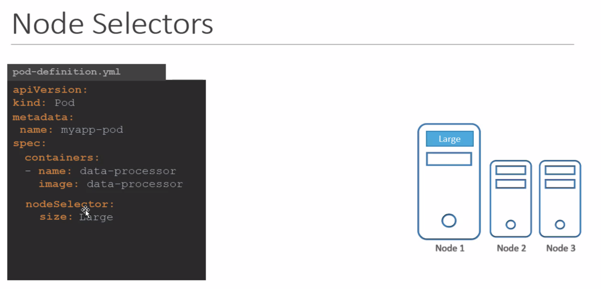

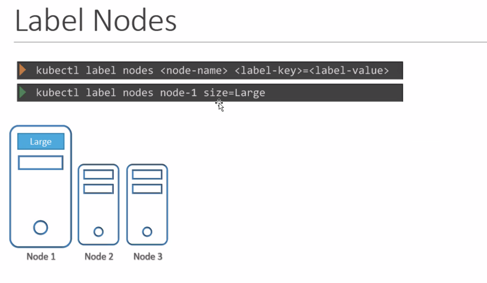

.. important:: nodeName specific to a node. node Selector specific couple of nodes based on the labels provide.

I have a high processing pod, I need a high processing node. 

if both has same size, then default ranking algorithm will apply.

Disadvantage: Using node selector, you can add multiple labels, you can't select multiple label. You can't do `large o small` or complex options `not large`

Practicals
^^^^^^^^^^^

::

    [root@Master ~]# kubectl label nodes worker1 size=large
    node/worker1 labeled

::

    [root@Master ~]# kubectl get nodes --show-labels
    NAME      STATUS   ROLES                  AGE   VERSION   LABELS
    master    Ready    control-plane,master   22h   v1.21.9   beta.kubernetes.io/arch=amd64,beta.kubernetes.io/os=linux,kubernetes.io/arch=amd64,kubernetes.io/hostname=master,kubernetes.io/os=linux,node-role.kubernetes.io/control-plane=,node-role.kubernetes.io/master=,node.kubernetes.io/exclude-from-external-load-balancers=
    worker1   Ready    <none>                 22h   v1.21.9   beta.kubernetes.io/arch=amd64,beta.kubernetes.io/os=linux,kubernetes.io/arch=amd64,kubernetes.io/hostname=worker1,kubernetes.io/os=linux,size=large
    worker2   Ready    <none>                 22h   v1.21.9   beta.kubernetes.io/arch=amd64,beta.kubernetes.io/os=linux,kubernetes.io/arch=amd64,kubernetes.io/hostname=worker2,kubernetes.io/os=linux

::

    [root@Master ~]# kubectl label nodes worker1 disk=ssd
    node/worker1 labeled

    [root@Master ~]# kubectl get nodes --show-labels
    NAME      STATUS   ROLES                  AGE   VERSION   LABELS
    master    Ready    control-plane,master   22h   v1.21.9   beta.kubernetes.io/arch=amd64,beta.kubernetes.io/os=linux,kubernetes.io/arch=amd64,kubernetes.io/hostname=master,kubernetes.io/os=linux,node-role.kubernetes.io/control-plane=,node-role.kubernetes.io/master=,node.kubernetes.io/exclude-from-external-load-balancers=
    worker1   Ready    <none>                 22h   v1.21.9   beta.kubernetes.io/arch=amd64,beta.kubernetes.io/os=linux,disk=ssd,kubernetes.io/arch=amd64,kubernetes.io/hostname=worker1,kubernetes.io/os=linux,size=large
    worker2   Ready    <none>                 22h   v1.21.9   beta.kubernetes.io/arch=amd64,beta.kubernetes.io/os=linux,kubernetes.io/arch=amd64,kubernetes.io/hostname=worker2,kubernetes.io/os=linux

nodeselectorpod.yml::

    apiVersion: v1
    kind: Pod
    metadata:
      name: myapp-prod
      labels:
           app: myapp
    spec:
      containers:
          - name: nginx-container
            image: nginx
      nodeSelector:
          size: large

Can see the labels in describe as well::

    [root@Master ~]# kubectl describe node worker1
    Name:               worker1
    Roles:              <none>
    Labels:             beta.kubernetes.io/arch=amd64
                        beta.kubernetes.io/os=linux
                        disk=ssd
                        kubernetes.io/arch=amd64
                        kubernetes.io/hostname=worker1
                        kubernetes.io/os=linux
                        size=large

See the pod came on worker1 with size=large::

    [root@Master ~]# kubectl create -f nodeselectorpod.yml
    pod/myapp-prod created
    [root@Master ~]# kubectl get all -o wide
    NAME             READY   STATUS    RESTARTS   AGE   IP            NODE      NOMINATED NODE   READINESS GATES
    pod/myapp-prod   1/1     Running   0          19s   10.244.2.32   worker1   <none>           <none>

    NAME                 TYPE        CLUSTER-IP   EXTERNAL-IP   PORT(S)   AGE   SELECTOR
    service/kubernetes   ClusterIP   10.96.0.1    <none>        443/TCP   22h   <none>

Filter 4. Node affinity
-------------------------

Widely used. Can handle complex option.

Imagine 2 nodes, one labelled as small and one as large.

There are different types of node affinity.

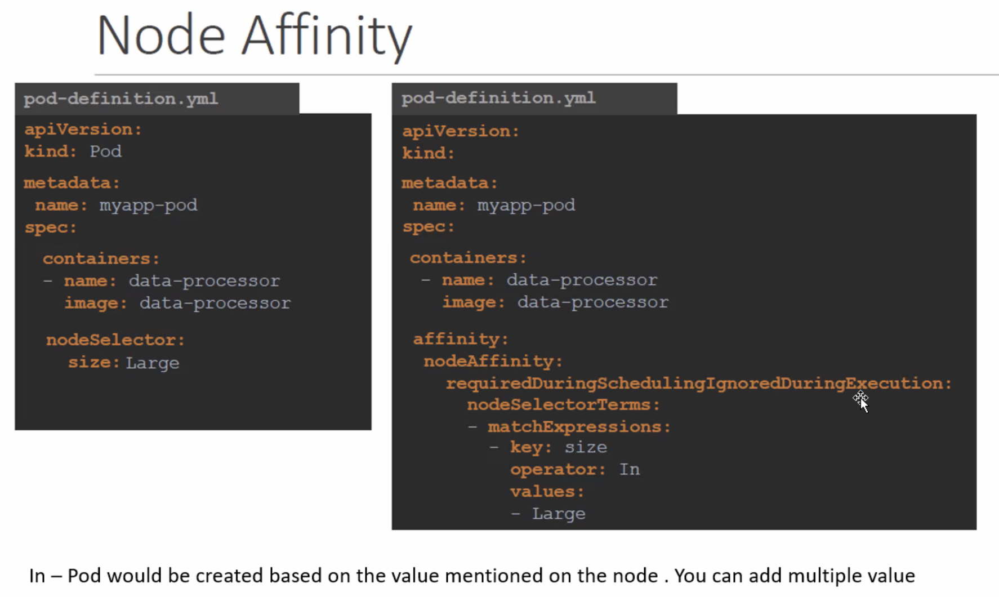

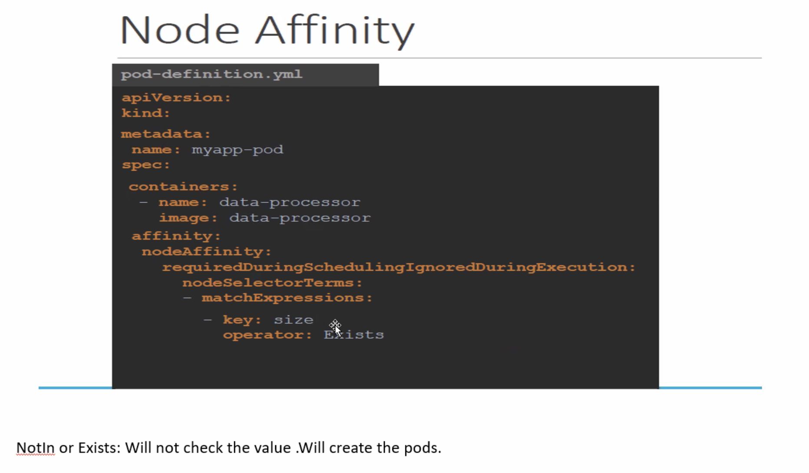

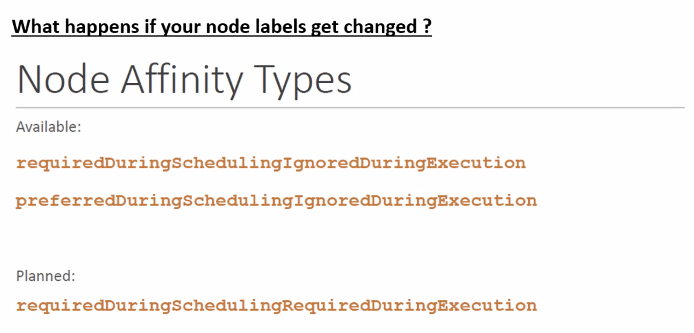

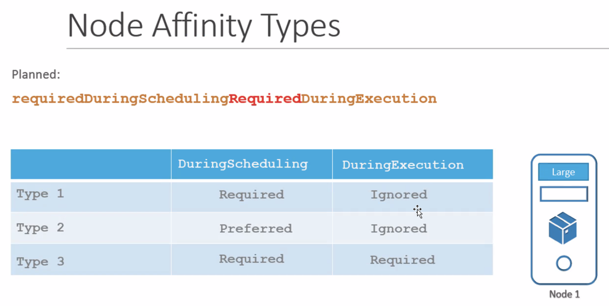

We need to use both taint and tolerations as well as affinity to make all the pods come on all the nodes.

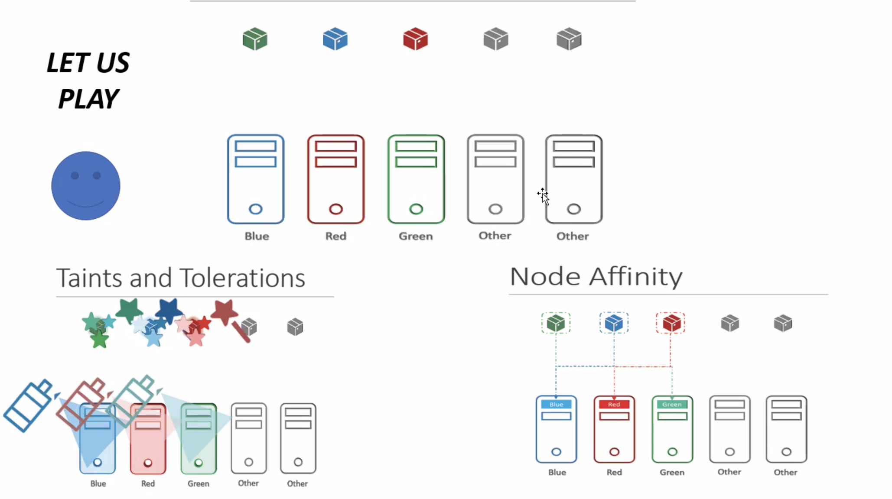

Usecase
----------

Cost is the trigger. If cost doesn't matter.

- Imagine that you have 5 node, 3 from amazon and 2 from azure. We don't want to 
- SAS & FC drives are there. SAS luns will be given to a high processing nodes. FC drivers will be placed on login and other light weight apps.

Daemon Sets
-------------

Daemon sets are not filters. They are infra based objects. 

**Equivalent to `global mode` in swarm. Always one (only one) replica will be maintained.**

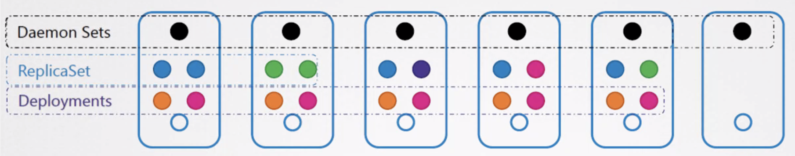

- For tier applications, we don't use daemon sets as there will be more users and requests.
- For monitoring solutions, we use daemon sets.

.. important:: Flannel is a daemon set, that's why when we installed on master, it also installed on worker1 and worker2

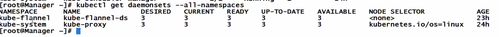

Not much difference with replicasets. You can't provide replica count in daemonset.

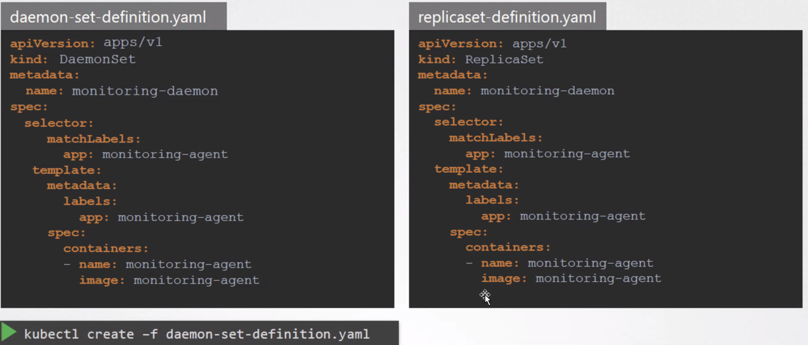

Prior to the version 1.12, it will create one replica on all nodes. From version 1.12, filter rules are applicable.

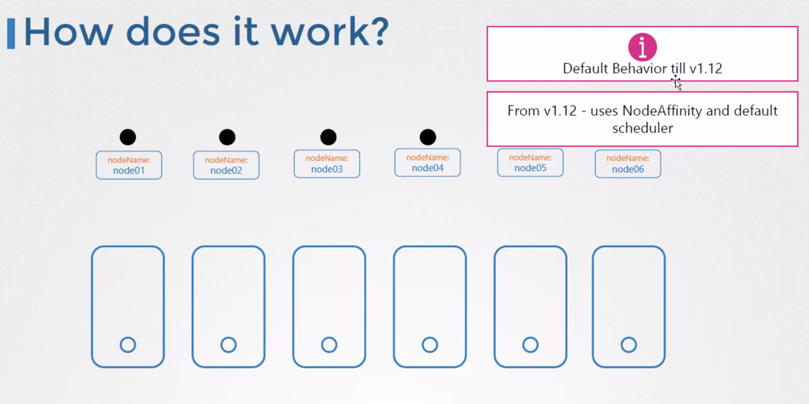

We are in vesion 1.20 and that's why it created 2 replicas.

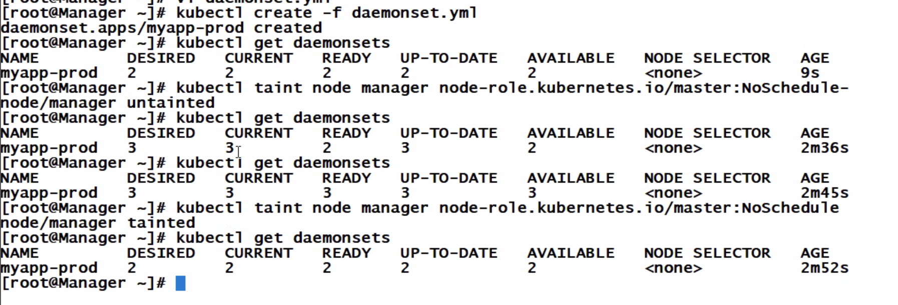

Then why flannel and proxy created on all all nodes then? Manager has taint in the initialization. In flannel and proxy they must have set the **tolerations limits**

In flannel yaml, you can see::

    tolerations:
      - operator: Exists
        effect: NoSchedule

**Flannel pods are tolerant to any nodes tainted with NoSchedule**

Networking (Service object)
==============================

Now we have done with infra objects. How am I going to access the application now? I can't ask the end user to get inside the container. 

User is always in the outside world and he has to access it from anywhere.

For this, **Expose that port** just as in the case of Swarm. Service object does this.

Pre-requisites
---------------

Before you initialize kubernetes, you need to make sure they are able to connect each other using hostname. Then only they can join the nodes using token. This doesn't need overlay driver. They have to be in the same VLAN.

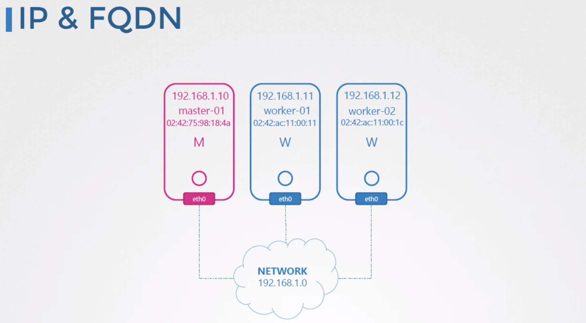

You need to aware of reserved ports for Kubernetes (by IEEE)

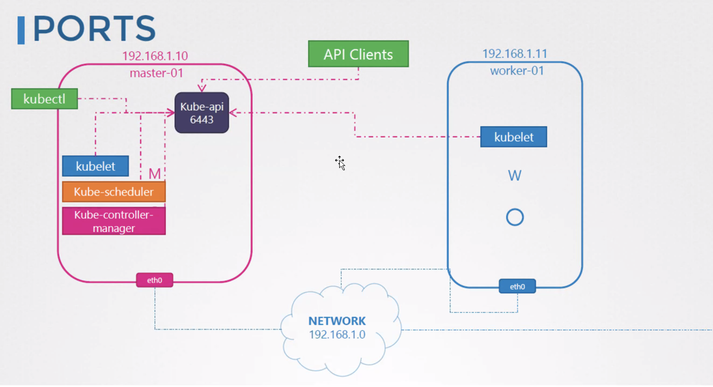

`Kubernetes Reserved Ports: <https://kubernetes.io/docs/reference/ports-and-protocols/>`_

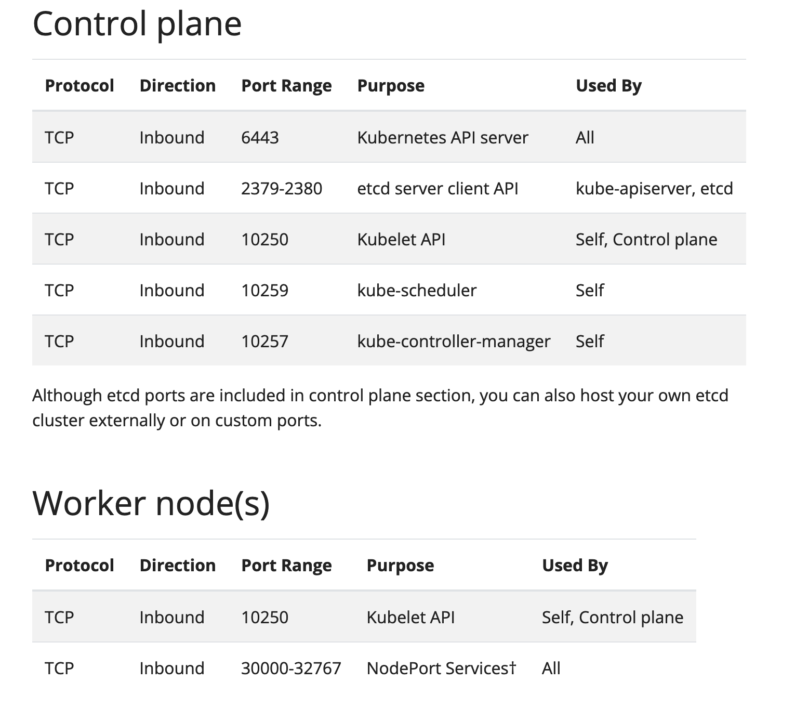

The port may change in future, always refer official doc ::

    [root@Master ~]# netstat -plnt
    Active Internet connections (only servers)
    Proto Recv-Q Send-Q Local Address           Foreign Address         State       PID/Program name    
    tcp        0      0 127.0.0.1:10257         0.0.0.0:*               LISTEN      4674/kube-controlle 
    tcp        0      0 127.0.0.1:10259         0.0.0.0:*               LISTEN      4725/kube-scheduler 
    tcp        0      0 0.0.0.0:22              0.0.0.0:*               LISTEN      902/sshd            
    tcp        0      0 127.0.0.1:25            0.0.0.0:*               LISTEN      1457/master         
    tcp        0      0 127.0.0.1:10248         0.0.0.0:*               LISTEN      896/kubelet         
    tcp        0      0 127.0.0.1:10249         0.0.0.0:*               LISTEN      6893/kube-proxy     
    tcp        0      0 192.168.64.3:2379       0.0.0.0:*               LISTEN      4607/etcd           
    tcp        0      0 127.0.0.1:2379          0.0.0.0:*               LISTEN      4607/etcd           
    tcp        0      0 192.168.64.3:2380       0.0.0.0:*               LISTEN      4607/etcd           
    tcp        0      0 127.0.0.1:2381          0.0.0.0:*               LISTEN      4607/etcd           
    tcp        0      0 127.0.0.1:43725         0.0.0.0:*               LISTEN      896/kubelet         
    tcp6       0      0 :::10256                :::*                    LISTEN      6893/kube-proxy     
    tcp6       0      0 :::22                   :::*                    LISTEN      902/sshd            
    tcp6       0      0 ::1:25                  :::*                    LISTEN      1457/master         
    tcp6       0      0 :::10250                :::*                    LISTEN      896/kubelet         
    tcp6       0      0 :::6443                 :::*                    LISTEN      4477/kube-apiserver 
    [root@Master ~]# 

Frequently used commands.

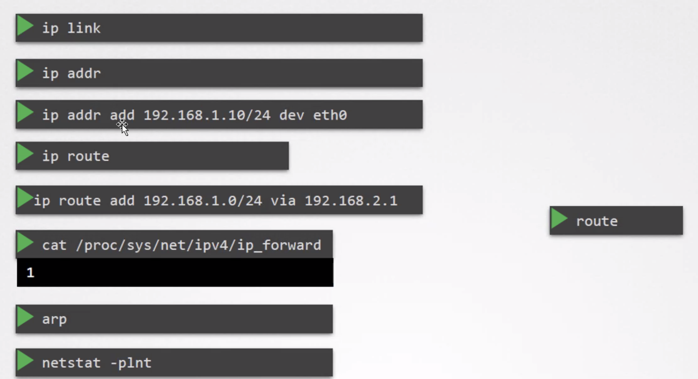

Namespace
----------

- Namespace is nothing but a group of components. 
- Basic unix kernels you can see many namespaces. Network namespace, process namespace, filesystem namespace, memory namespace etc.
- **Except network namespace, all other namespaces are combined into a single entity inbuilt to the container.**

Overlay driver uses a general namespace for filesystem, process and memory called cgroupfs.

::

    [root@Master ~]# docker info| grep  cgroup
     Cgroup Driver: cgroupfs

- Network namespace is separate.i.e. group of network component. The router, ip, firewall and all network components constitutes a network namespace.
- By default, at the time of installation, you're getting a filesystem, memory, etc. Along with you are gettting an IP. from where it is getting? Without inbuilt network namespace.

- Consider network namespace as a house. Imagine tv, sofa, table etc are network components. we are making use of them. Same way, you have interfaces, ips, ports, routes, firewall rules etc. Who is going to make use of this? the Objects (pods, replica sets, deployment, etc). Persons are the object, house is the namespace.
- **So, every object should fall under a network namespaces.** The object have to come from a namespace.
- For an application, it is recommended that all objects should be from same namespace. So that they are tightly coupled.
- If you are in different namespaces, you need to use FQDN (fully qualified domain name).

When initializing kubernetes, 5 namespaces are created::

    [root@Master ~]# kubectl get namespaces
    NAME              STATUS   AGE
    default           Active   24h
    kube-flannel      Active   23h
    kube-node-lease   Active   24h
    kube-public       Active   24h
    kube-system       Active   24h

**default**: Default namespace for application pods.

::

    [root@Master ~]# kubectl get pod --all-namespaces
    NAMESPACE      NAME                             READY   STATUS    RESTARTS   AGE
    default        myapp-prod                       1/1     Running   0          103m
    kube-flannel   kube-flannel-ds-4xlcv            1/1     Running   1          23h
    kube-flannel   kube-flannel-ds-jn2xm            1/1     Running   0          113m
    kube-flannel   kube-flannel-ds-qfdzs            1/1     Running   0          132m
    kube-system    coredns-558bd4d5db-7ftj2         1/1     Running   0          159m
    kube-system    coredns-558bd4d5db-q9gzb         1/1     Running   0          124m
    kube-system    etcd-master                      1/1     Running   1          24h
    kube-system    kube-apiserver-master            1/1     Running   1          24h
    kube-system    kube-controller-manager-master   1/1     Running   2          24h
    kube-system    kube-proxy-8wp42                 1/1     Running   1          24h
    kube-system    kube-proxy-9tb7n                 1/1     Running   1          24h
    kube-system    kube-proxy-jnbc9                 1/1     Running   1          24h
    kube-system    kube-scheduler-master            1/1     Running   2          24h

    [root@Master ~]# kubectl get pods -n default 
    NAME         READY   STATUS    RESTARTS   AGE
    myapp-prod   1/1     Running   0          104m

**kube-system**: Reserved for the management components. To manage your kubernetes cluster. coredns, apiserver, controller, proxy and scheduler are in this namespace.

**kube-public**: Reserved for the resources that are available to public users (Examples: any 3rd party storage drivers). 

::
    
    [root@Master ~]# 
    [root@Master ~]# kubectl describe namespace kube-public
    Name:         kube-public
    Labels:       kubernetes.io/metadata.name=kube-public
    Annotations:  <none>
    Status:       Active

    No resource quota.

    No LimitRange resource.

Note that Kubernetes earlier used this but later to save time, kubernetes told flannel prefer their own custom.

**kube-node-lease**: Light-weight resource which improves the performance of the node's heartbeats as the cluster scales.

Earlier, when we add node, it took much time to get it added.

They made a separate namespace to improve this. Whenever we add a node in the cluster, the flannel and proxy etc. are in this namespace at that time and we can easily do the token things and communication with api-server.

You can see these resources like flannel, proxy , api-server etc are in this namespace for that milliseconds of time. Then they will move to different different namespace.

Namespace Isolation
^^^^^^^^^^^^^^^^^^^^^
- Everything in a single kubernetes cluster but isolated by namespaces.
- Authentication and authorization can be managed in namespaces.
- Add all production objects and resources in production namespace. Add all dev object in development environment. Objects in dev can't access prod objects.

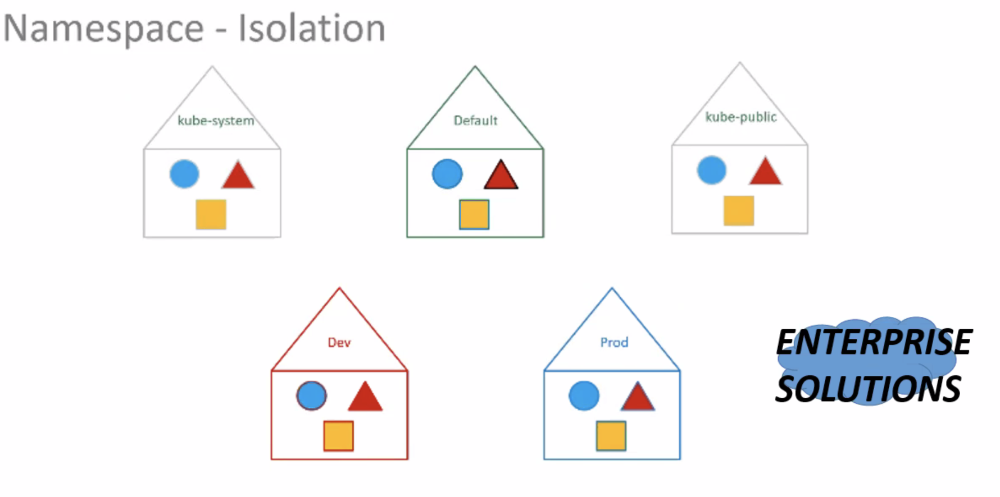

You can't segment or assign a node to a namespace. You can assign resources to a namespace. like assign max 40% resources to development. If it exceeds, object creations will fail. 

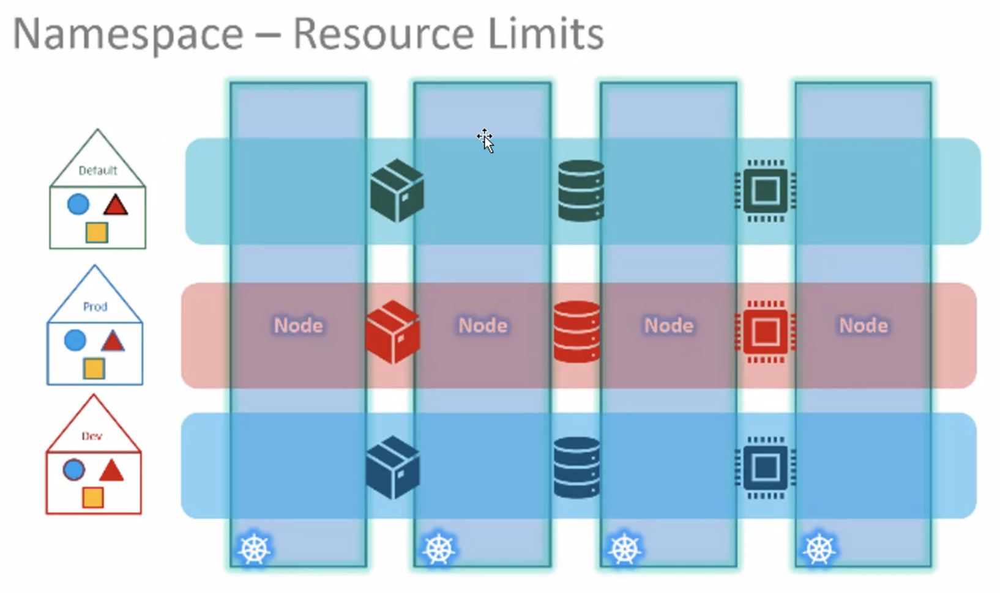

You need to use FQDN to communicate across namespaces if authorized.

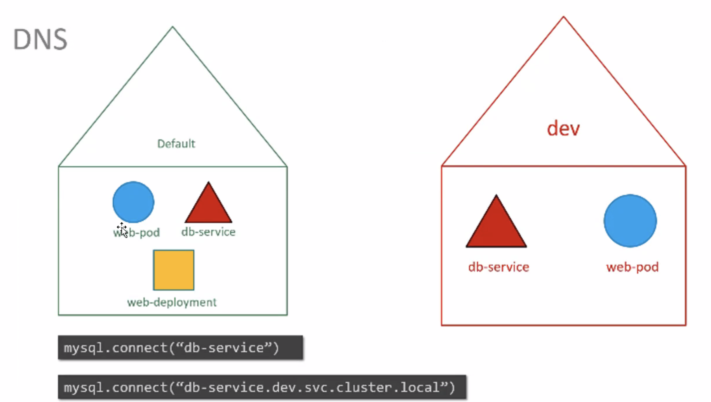

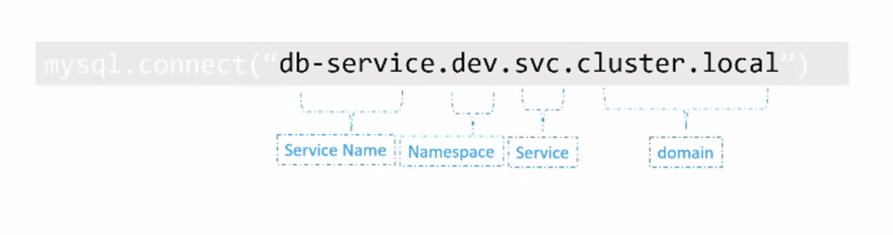

Create custom namespaces 
^^^^^^^^^^^^^^^^^^^^^^^^^

You can create namespaces either in the imperative way and declarative way.

::

    [root@Master ~]# kubectl create namespace dev
    namespace/dev created
    [root@Master ~]# kubectl describe  namespace dev
    Name:         dev
    Labels:       kubernetes.io/metadata.name=dev
    Annotations:  <none>
    Status:       Active

    No resource quota.

    No LimitRange resource.

Create a namespace in using yaml::

    apiVersion: v1
    kind: Namespace
    metadata:
        name: prod

.. code-block:: 
   :emphasize-lines: 11

    [root@Master ~]# kubectl create -f namespace.yml
    namespace/prod created
    [root@Master ~]# kubectl get namespaces
    NAME              STATUS   AGE
    default           Active   39h
    dev               Active   14h
    kube-flannel      Active   38h
    kube-node-lease   Active   39h
    kube-public       Active   39h
    kube-system       Active   39h
    prod              Active   7s

    [root@Master ~]# kubectl get pods -n prod
    No resources found in prod namespace.

Assign a object to a namespace. assign at the time of creation. Otherwise it will be difficult, similar to changing house.

add it to metadata.

Assign::

    [root@Master ~]# cat podns.yml 
    apiVersion: v1
    kind: Pod
    metadata:
      name: myapp-prodns
      namespace: prod
      labels:
           app: myappprod
    spec:
      containers:
          - name: nginx-container-podns
            image: nginx

::

    [root@Master ~]# kubectl create -f podns.yml 
    pod/myapp-prodns created

    [root@Master ~]# kubectl get pod
    NAME         READY   STATUS    RESTARTS   AGE
    myapp-prod   1/1     Running   1          17h
    [root@Master ~]# kubectl get pod -n prod
    NAME           READY   STATUS    RESTARTS   AGE
    myapp-prodns   1/1     Running   0          19s

    [root@Master ~]# kubectl get pod --all-namespaces
    NAMESPACE      NAME                             READY   STATUS    RESTARTS   AGE
    default        myapp-prod                       1/1     Running   1          17h
    kube-flannel   kube-flannel-ds-4xlcv            1/1     Running   2          39h
    kube-flannel   kube-flannel-ds-jn2xm            1/1     Running   1          17h
    kube-flannel   kube-flannel-ds-qfdzs            1/1     Running   2          17h
    kube-system    coredns-558bd4d5db-7ftj2         1/1     Running   1          18h
    kube-system    coredns-558bd4d5db-q9gzb         1/1     Running   1          17h
    kube-system    etcd-master                      1/1     Running   2          39h
    kube-system    kube-apiserver-master            1/1     Running   2          39h
    kube-system    kube-controller-manager-master   1/1     Running   4          39h
    kube-system    kube-proxy-8wp42                 1/1     Running   2          39h
    kube-system    kube-proxy-9tb7n                 1/1     Running   2          39h
    kube-system    kube-proxy-jnbc9                 1/1     Running   2          39h
    kube-system    kube-scheduler-master            1/1     Running   4          39h
    prod           myapp-prodns                     1/1     Running   0          13m
    [root@Master ~]# 

To make prod as the dafault namespace. That means, when I do `get pods`, it should show the objects in dev, not the default one.

::

    [root@Master ~]# kubectl get pods
    NAME         READY   STATUS    RESTARTS   AGE
    myapp-prod   1/1     Running   1          16h

    [root@Master ~]# kubectl config set-context $(kubectl config current-context) --namespace=prod
    Context "kubernetes-admin@kubernetes" modified.

    [root@Master ~]# kubectl get pod -n prod
    NAME           READY   STATUS    RESTARTS   AGE
    myapp-prodns   1/1     Running   0          14m

    [root@Master ~]# kubectl get pods -n default
    NAME         READY   STATUS    RESTARTS   AGE
    myapp-prod   1/1     Running   1          17h

See the config changed.

.. code-block:: 
   :emphasize-lines: 9-14

    [root@Master ~]# kubectl config view
    apiVersion: v1
    clusters:
    - cluster:
        certificate-authority-data: DATA+OMITTED
        server: https://192.168.64.3:6443
      name: kubernetes
    contexts:
    - context:
        cluster: kubernetes
        namespace: prod
        user: kubernetes-admin
      name: kubernetes-admin@kubernetes
    current-context: kubernetes-admin@kubernetes
    kind: Config
    preferences: {}
    users:
    - name: kubernetes-admin
      user:
        client-certificate-data: REDACTED
        client-key-data: REDACTED
