=======
Day 05
=======

::

    [root@Master ~]# kubectl get all -o wide
    NAME                 TYPE        CLUSTER-IP   EXTERNAL-IP   PORT(S)   AGE   SELECTOR
    service/kubernetes   ClusterIP   10.96.0.1    <none>        443/TCP   41h   <none>
    [root@Master ~]# 

- One node cannot be a part of multiple cluster. Since it maintains the identity.

Service objects
=================

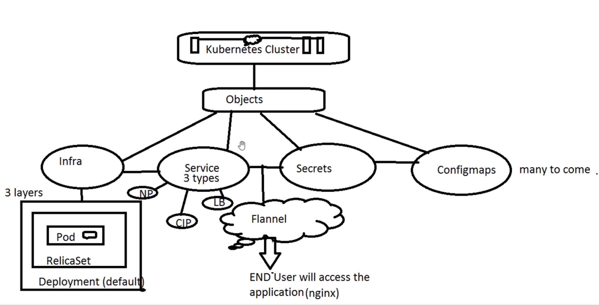

- Service object defines the network accessibility layer of kubernetes.
- Using port binding mechanism.
- We need to communicate to the application from outside world.
- We need POD to POD communication. Like front-end pod need to communicate to back-end pod.
- For 3rd party applications to communicate with objects.

You have to define your service based upon the infra object.

There are 3 types of service object (not 3 layer like infra object). Today we use only 2. 1 is deprecated

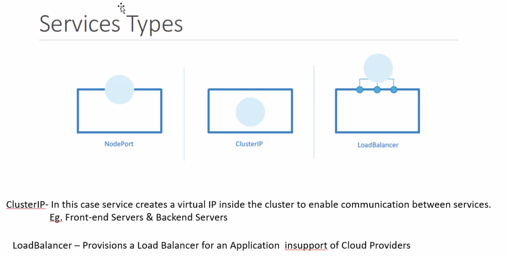

Type 1: NodePort service (for external communication)
-------------------------------------------------------

- whenever you need to make your application accessible from outside world, a NodePort service object is required.
- there are reserved port range.

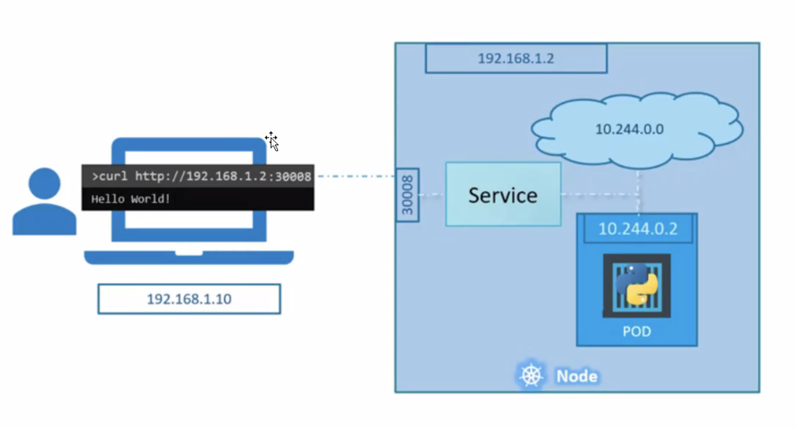

- to find the internal port of nginx (any docker image). `docker inspect nginx`
- it is possible for an application to have ports. 

For a single port to be exposed to outside world,

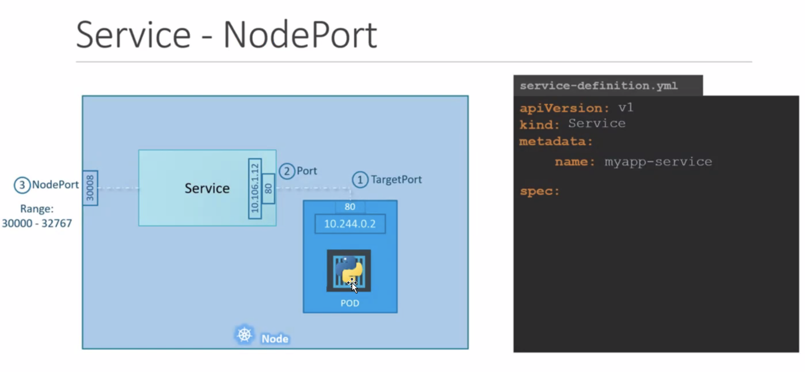

- **targetPort**: actual target port you inspected in the image (docker inspect nginx)
- **port (or service port)**: there are 14 replicas. actual target port where my application is seated across replicas for my flannel. Recommended way is use target port as service port.

  - Service port is bounded to the **Nodeport**.
  - In docker swarm, what did we do to expose? **--replicas 2 -p 8000:80 web nginx**. Since this is an inbuilt solution. Ingress already knows which replica it has to go. Ingress already have reserved a cluster IP and this has a port which is equivalent to service port. Kubernetes doesn't know which overlay driver it will use. It just defined the rule and this rule includes the service port.
  - Port 80 is reserved for nginx application on all 14 replicas. How do flannel knows the same application running on all replicas? All this 14 ports will bound to the single port called service port. Flannel reserve a IP for this.
  - **Mandatory**. if targetPort is not given, flannel will assume that this service port is the actual port.

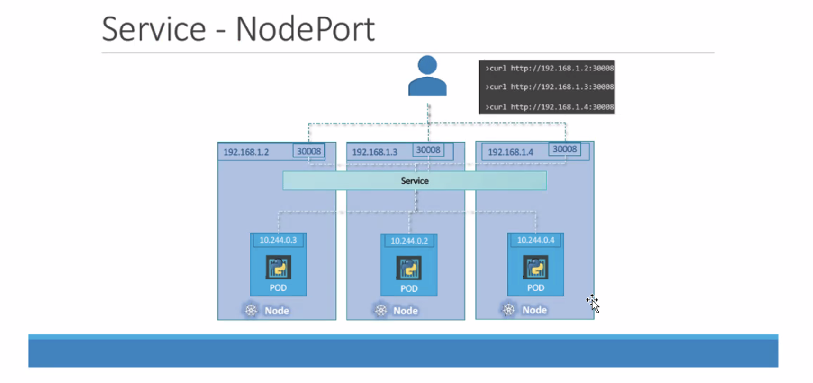

- still we haven't binded the port to the object. There comes key-value mapping using **selector**.
- Labels are used for **port-binding**. See *myapp* label is being used to select infra object for a service object.

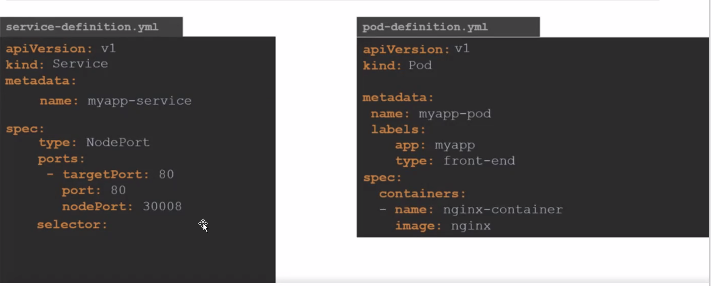

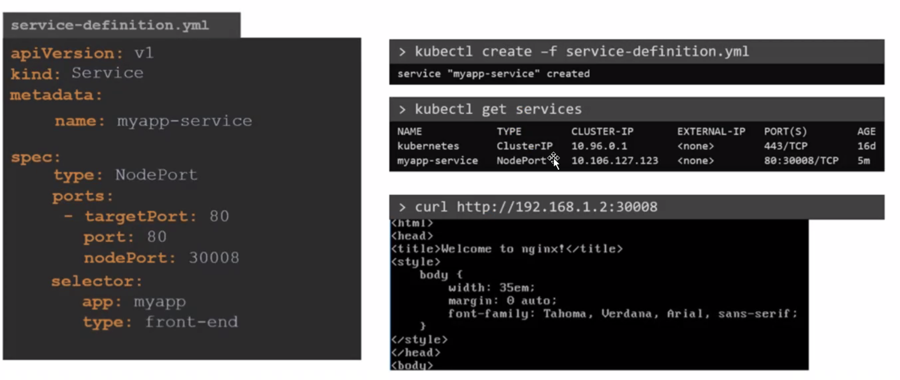

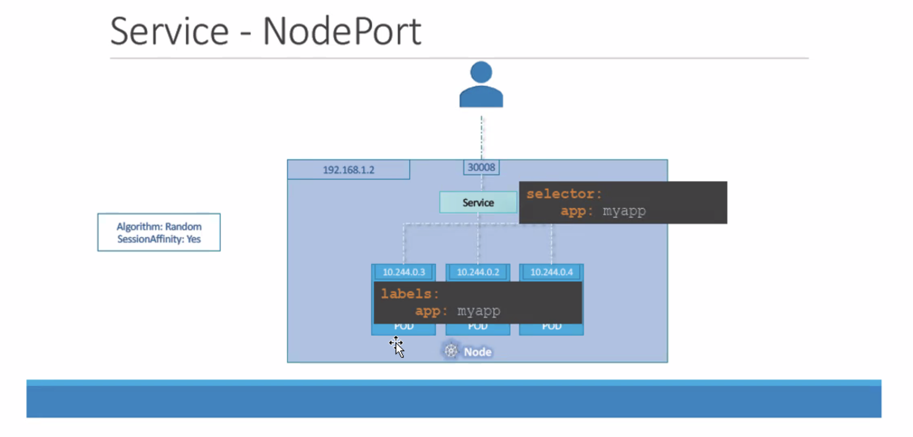

Similar to docker swarm ingress, flannel also maintains a routing mesh.

.. image:: images/day05/flannel_mesh.png
  :width: 600
  :align: center

Practicals
^^^^^^^^^^^^^

To make our deployment `myapp` (infra object) accessible to the outside world, we need a NodePort network accessibility layer service object. 

[root@Master ~]# cat service-nodeport.yml 

.. code-block:: 
   :emphasize-lines: 6

    apiVersion: v1
    kind: Service
    metadata:
      name: appservice
    spec:
      type : NodePort
      ports:
        - port: 80
          targetPort: 80
          nodePort: 30000
      selector:
        app: myapp

::

    [root@Master ~]# kubectl create -f service-nodeport.yml 
    service/appservice created

See the **appservice** and selectors **app: myapp** applied. i.e. see how service is bounded to infra object.

.. code-block:: 
   :emphasize-lines: 19, 23

    [root@Master ~]# kubectl get all -o wide
    NAME                             READY   STATUS    RESTARTS   AGE     IP            NODE      NOMINATED NODE   READINESS GATES
    pod/myapp-prod-b478cc546-42fmp   1/1     Running   0          3h43m   10.244.1.53   worker2   <none>           <none>
    pod/myapp-prod-b478cc546-594f9   1/1     Running   0          3h43m   10.244.2.35   worker1   <none>           <none>
    pod/myapp-prod-b478cc546-68tmv   1/1     Running   0          3h43m   10.244.2.39   worker1   <none>           <none>
    pod/myapp-prod-b478cc546-8ccmp   1/1     Running   0          3h43m   10.244.1.57   worker2   <none>           <none>
    pod/myapp-prod-b478cc546-8frpk   1/1     Running   0          3h43m   10.244.2.38   worker1   <none>           <none>
    pod/myapp-prod-b478cc546-dzg4c   1/1     Running   0          3h43m   10.244.1.51   worker2   <none>           <none>
    pod/myapp-prod-b478cc546-khw28   1/1     Running   0          3h43m   10.244.2.40   worker1   <none>           <none>
    pod/myapp-prod-b478cc546-mf24z   1/1     Running   0          3h43m   10.244.1.54   worker2   <none>           <none>
    pod/myapp-prod-b478cc546-mfctv   1/1     Running   0          3h43m   10.244.1.56   worker2   <none>           <none>
    pod/myapp-prod-b478cc546-p85kv   1/1     Running   0          3h43m   10.244.2.36   worker1   <none>           <none>
    pod/myapp-prod-b478cc546-rm8z5   1/1     Running   0          3h43m   10.244.1.52   worker2   <none>           <none>
    pod/myapp-prod-b478cc546-svqld   1/1     Running   0          3h43m   10.244.1.55   worker2   <none>           <none>
    pod/myapp-prod-b478cc546-zdpn4   1/1     Running   0          3h43m   10.244.2.37   worker1   <none>           <none>
    pod/myapp-prod-b478cc546-zx8l4   1/1     Running   0          3h43m   10.244.2.34   worker1   <none>           <none>

    NAME                 TYPE        CLUSTER-IP    EXTERNAL-IP   PORT(S)        AGE   SELECTOR
    service/appservice   NodePort    10.99.110.0   <none>        80:30000/TCP   18s   app=myapp
    service/kubernetes   ClusterIP   10.96.0.1     <none>        443/TCP        45h   <none>

    NAME                         READY   UP-TO-DATE   AVAILABLE   AGE     CONTAINERS   IMAGES   SELECTOR
    deployment.apps/myapp-prod   14/14   14           14          3h43m   nginx        nginx    app=myapp

    NAME                                   DESIRED   CURRENT   READY   AGE     CONTAINERS   IMAGES   SELECTOR
    replicaset.apps/myapp-prod-b478cc546   14        14        14      3h43m   nginx        nginx    app=myapp,pod-template-hash=b478cc546

Any overlay driver you use, there are reserved cluster ips. `10.99.110.0` is such a flannel ip reserved.

Provide any IP of any node with nodeport service ip to access the nginx application:

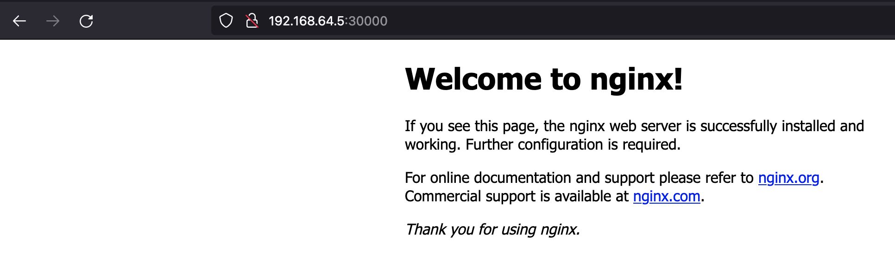

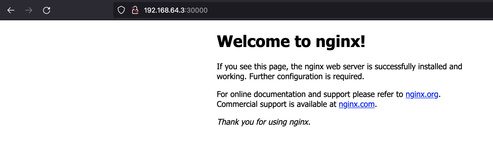

::

    [root@Master ~]# kubectl delete -f service-nodeport.yml 
    service "appservice" deleted

Type 2. Cluster IP (for internal communication)
--------------------------------------------------

- Every time we need not use application accessible from outside world. Example database and back-end.
- Default service type.
- To provide internal communication.

Imagine this is a microservice. 

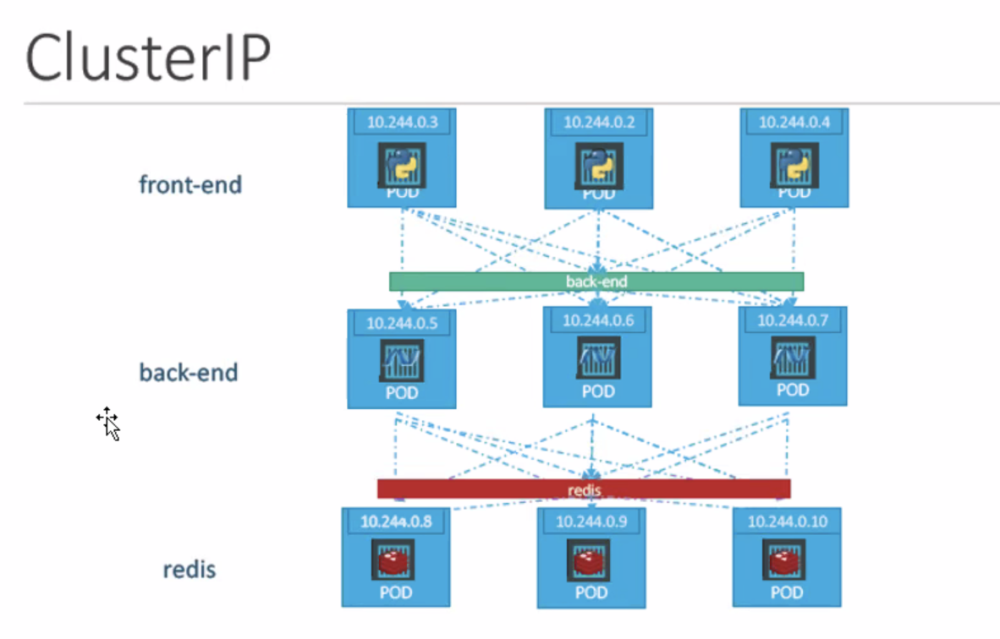

- For any applications, We need infra object and service objects.
- **Front-end**: need a deployment with some replicas. We need external communication. So we nodeport service object.
- **Back-end**: need a deployment with some replicas. We need internal communication only. So we create cluster ip service object.
- front-end depends on back-end. So, I will take my back-end key-value mappings as an environment variable on my infra object.

Type here is not mandatory.

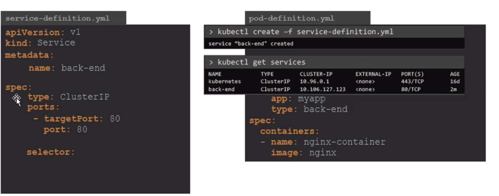

Type 3: Load balancer service (not in use)
--------------------------------------------

- When you have instances from cloud. Cloud provider will have a load balancer already. To load balance the replicas internally we use this service.
- We don't use this nowadays because **today node-port and cluster ip services comes with load balancing**.

Practicals (WordPress)
=======================

Let's try to create a wordpress app with backend database.

::

    [root@Master ~]# kubectl get all -o wide
    NAME                 TYPE        CLUSTER-IP   EXTERNAL-IP   PORT(S)   AGE   SELECTOR
    service/kubernetes   ClusterIP   10.96.0.1    <none>        443/TCP   45h   <none>

.. important:: Maintaining one yaml file for each object is a header. Instead you can have all objects in one yaml separated by **---**.

Back end: wordpress-db
-----------------------

Let's define infra and service objects in single yaml separated by **---**.

- We didn't give name. Instead gave label and it will automatically use it as name.
- DB is listening on 3306. Port has given a alias name.
- To start DB, we need env variable. Giving password is not recommended. it should be encrypted. I have encrypted this pass word as **environmental object** called **Secret**.

.. important:: Since this is a database, no need to expose to the outside world. This need a **cluster ip** service. This is not specified in yaml as it is default.

[root@Master ~]# cat wordpress-db.yml

.. code-block:: 
   :emphasize-lines: 1, 3, 13, 14, 20, 21, 31

    ---
    apiVersion: apps/v1
    kind: Deployment
    metadata:
      name: wordpress-db
    spec:
      replicas: 1
      selector:
        matchLabels:
          app: wordpress
      template:
        metadata:
          labels:
            app: wordpress
        spec:
          containers:
          - name: mysql
            image: mysql:5.7
            ports:
            - name: mysql-port
              containerPort: 3306
            env:
              - name: MYSQL_ROOT_PASSWORD
                valueFrom:
                  secretKeyRef:
                    name: wordpress-secrets
                    key: db-password

    ---
    apiVersion: v1
    kind: Service
    metadata:
      name: wordpressdb-service
    spec:
      ports:
      - port: 3306
      selector:
        app: wordpress

Create deployment for wordpress-db application::

    [root@Master ~]# kubectl create -f wordpress-db.yml 
    deployment.apps/wordpress-db created
    service/wordpressdb-service created

**CreateContainerConfigError!!**

.. code-block:: 
   :emphasize-lines: 3

    [root@Master ~]# kubectl get all -o wide
    NAME                                READY   STATUS                       RESTARTS   AGE   IP            NODE      NOMINATED NODE   READINESS GATES
    pod/wordpress-db-8674976c9c-h4vdg   0/1     CreateContainerConfigError   0          39s   10.244.2.41   worker1   <none>           <none>

    NAME                          TYPE        CLUSTER-IP    EXTERNAL-IP   PORT(S)    AGE   SELECTOR
    service/kubernetes            ClusterIP   10.96.0.1     <none>        443/TCP    45h   <none>
    service/wordpressdb-service   ClusterIP   10.99.86.46   <none>        3306/TCP   39s   app=wordpress

    NAME                           READY   UP-TO-DATE   AVAILABLE   AGE   CONTAINERS   IMAGES      SELECTOR
    deployment.apps/wordpress-db   0/1     1            0           39s   mysql        mysql:5.7   app=wordpress

    NAME                                      DESIRED   CURRENT   READY   AGE   CONTAINERS   IMAGES      SELECTOR
    replicaset.apps/wordpress-db-8674976c9c   1         1         0       39s   mysql        mysql:5.7   app=wordpress,pod-template-hash=8674976c9c

To see the logs::

    [root@Master ~]# kubectl logs pod/wordpress-db-8674976c9c-h4vdg
    Error from server (BadRequest): container "mysql" in pod "wordpress-db-8674976c9c-h4vdg" is waiting to start: CreateContainerConfigError

The reason is there is **no secret object** created. We specified a secret object but we haven't created it.

wordpress-secret.yml::

    apiVersion: v1
    kind: Secret
    metadata:
      name: wordpress-secrets
    type: Opaque
    data:
      db-password: cGFzc3dvcmQ=

create Secret environment object::

    [root@Master ~]# kubectl create -f wordpress-secret.yml 
    secret/wordpress-secrets created
    [root@Master ~]# kubectl get all -o wide
    NAME                                READY   STATUS    RESTARTS   AGE     IP            NODE      NOMINATED NODE   READINESS GATES
    pod/wordpress-db-8674976c9c-h4vdg   1/1     Running   0          3m32s   10.244.2.41   worker1   <none>           <none>

    NAME                          TYPE        CLUSTER-IP    EXTERNAL-IP   PORT(S)    AGE     SELECTOR
    service/kubernetes            ClusterIP   10.96.0.1     <none>        443/TCP    46h     <none>
    service/wordpressdb-service   ClusterIP   10.99.86.46   <none>        3306/TCP   3m32s   app=wordpress

    NAME                           READY   UP-TO-DATE   AVAILABLE   AGE     CONTAINERS   IMAGES      SELECTOR
    deployment.apps/wordpress-db   1/1     1            1           3m32s   mysql        mysql:5.7   app=wordpress

    NAME                                      DESIRED   CURRENT   READY   AGE     CONTAINERS   IMAGES      SELECTOR
    replicaset.apps/wordpress-db-8674976c9c   1         1         1       3m32s   mysql        mysql:5.7   app=wordpress,pod-template-hash=8674976c9c

**Database is ready. Create front-end now.**

Front-end: wordpress-app
--------------------------

Let's create our front-end with wordpress image. Since it is a front-end, it requires a **NodePort** service to expose it to the outside world.

- See the use of alias for http-port.
- see the service type **type: NodePort**.

wordpress-app.yml.

.. code-block:: 
   :emphasize-lines: 3, 7, 20, 34, 41, 45

    ---
    apiVersion: apps/v1
    kind: Deployment
    metadata:
      name: wordpress-app
    spec:
      replicas: 2
      selector:
        matchLabels:
          app: wordpress
      template:
        metadata:
          labels:
            app: wordpress
        spec:
          containers:
          - name: wordpress
            image: wordpress:4-php7.0
            ports:
            - name: http-port
              containerPort: 80
            env:
              - name: WORDPRESS_DB_PASSWORD
                valueFrom:
                  secretKeyRef:
                    name: wordpress-secrets
                    key: db-password
              - name: WORDPRESS_DB_HOST
                value: wordpressdb-service

    ---

    apiVersion: v1
    kind: Service
    metadata:
      name: wordpress-service
    spec:
      ports:
      - port: 80
        nodePort: 31001
        targetPort: http-port
        protocol: TCP
      selector:
        app: wordpress
      type: NodePort

Create the 2 replicas::

    [root@Master ~]# kubectl create -f wordpress-app.yml 
    deployment.apps/wordpress-app created
    service/wordpress-service created

.. code-block:: 
   :emphasize-lines: 9, 10

    [root@Master ~]# kubectl get all -o wide
    NAME                                 READY   STATUS              RESTARTS   AGE     IP            NODE      NOMINATED NODE   READINESS GATES
    pod/wordpress-app-8645fb5675-jbtrw   0/1     ContainerCreating   0          6s      <none>        worker1   <none>           <none>
    pod/wordpress-app-8645fb5675-q4d2j   0/1     ContainerCreating   0          6s      <none>        worker2   <none>           <none>
    pod/wordpress-db-8674976c9c-h4vdg    1/1     Running             0          5m42s   10.244.2.41   worker1   <none>           <none>

    NAME                          TYPE        CLUSTER-IP       EXTERNAL-IP   PORT(S)        AGE     SELECTOR
    service/kubernetes            ClusterIP   10.96.0.1        <none>        443/TCP        46h     <none>
    service/wordpress-service     NodePort    10.108.140.228   <none>        80:31001/TCP   6s      app=wordpress
    service/wordpressdb-service   ClusterIP   10.99.86.46      <none>        3306/TCP       5m42s   app=wordpress

    NAME                            READY   UP-TO-DATE   AVAILABLE   AGE     CONTAINERS   IMAGES               SELECTOR
    deployment.apps/wordpress-app   0/2     2            0           6s      wordpress    wordpress:4-php7.0   app=wordpress
    deployment.apps/wordpress-db    1/1     1            1           5m42s   mysql        mysql:5.7            app=wordpress

    NAME                                       DESIRED   CURRENT   READY   AGE     CONTAINERS   IMAGES               SELECTOR
    replicaset.apps/wordpress-app-8645fb5675   2         2         0       6s      wordpress    wordpress:4-php7.0   app=wordpress,pod-template-hash=8645fb5675
    replicaset.apps/wordpress-db-8674976c9c    1         1         1       5m42s   mysql        mysql:5.7            app=wordpress,pod-template-hash=8674976c9c

Application is not working even after we created infra and service objects. why?? - **IP Shortage**

.. important:: 2 years back, IEEE sent notice to companies as they reserve IPv4 but not using it. there is IPv4 shortage. So in Kubernetes, in this application, why flannel reserve 2 IPs? see clusterip and node-port ip.

Since you're using one application, bind to make it as one IP for both the service.

Give `ClusterIP: None`

[root@Master ~]# tail -5 wordpress-db.yml::

    ports:
    - port: 3306
    selector:
      app: wordpress
    clusterIP: None

::

    [root@Master ~]# kubectl delete -f wordpress-db.yml 
    deployment.apps "wordpress-db" deleted
    service "wordpressdb-service" deleted

    [root@Master ~]# kubectl delete -f wordpress-app.yml 
    deployment.apps "wordpress-app" deleted
    service "wordpress-service" deleted

    [root@Master ~]# kubectl create -f wordpress-db.yml 
    deployment.apps/wordpress-db created
    service/wordpressdb-service created

    [root@Master ~]# kubectl create -f wordpress-app.yml 
    deployment.apps/wordpress-app created
    service/wordpress-service created

See ClusterIP as None

.. code-block:: 
   :emphasize-lines: 9, 10

    [root@Master ~]# kubectl get all -o wide
    NAME                                 READY   STATUS    RESTARTS   AGE   IP            NODE      NOMINATED NODE   READINESS GATES
    pod/wordpress-app-8645fb5675-hkdfz   1/1     Running   0          11s   10.244.2.44   worker1   <none>           <none>
    pod/wordpress-app-8645fb5675-pmvwg   1/1     Running   0          11s   10.244.1.59   worker2   <none>           <none>
    pod/wordpress-db-8674976c9c-7qbwc    1/1     Running   0          14s   10.244.2.43   worker1   <none>           <none>

    NAME                          TYPE        CLUSTER-IP       EXTERNAL-IP   PORT(S)        AGE   SELECTOR
    service/kubernetes            ClusterIP   10.96.0.1        <none>        443/TCP        46h   <none>
    service/wordpress-service     NodePort    10.108.205.122   <none>        80:31001/TCP   11s   app=wordpress
    service/wordpressdb-service   ClusterIP   None             <none>        3306/TCP       14s   app=wordpress

    NAME                            READY   UP-TO-DATE   AVAILABLE   AGE   CONTAINERS   IMAGES               SELECTOR
    deployment.apps/wordpress-app   2/2     2            2           11s   wordpress    wordpress:4-php7.0   app=wordpress
    deployment.apps/wordpress-db    1/1     1            1           14s   mysql        mysql:5.7            app=wordpress

    NAME                                       DESIRED   CURRENT   READY   AGE   CONTAINERS   IMAGES               SELECTOR
    replicaset.apps/wordpress-app-8645fb5675   2         2         2       11s   wordpress    wordpress:4-php7.0   app=wordpress,pod-template-hash=8645fb5675
    replicaset.apps/wordpress-db-8674976c9c    1         1         1       14s   mysql        mysql:5.7            app=wordpress,pod-template-hash=8674976c9c

Now refresh browser

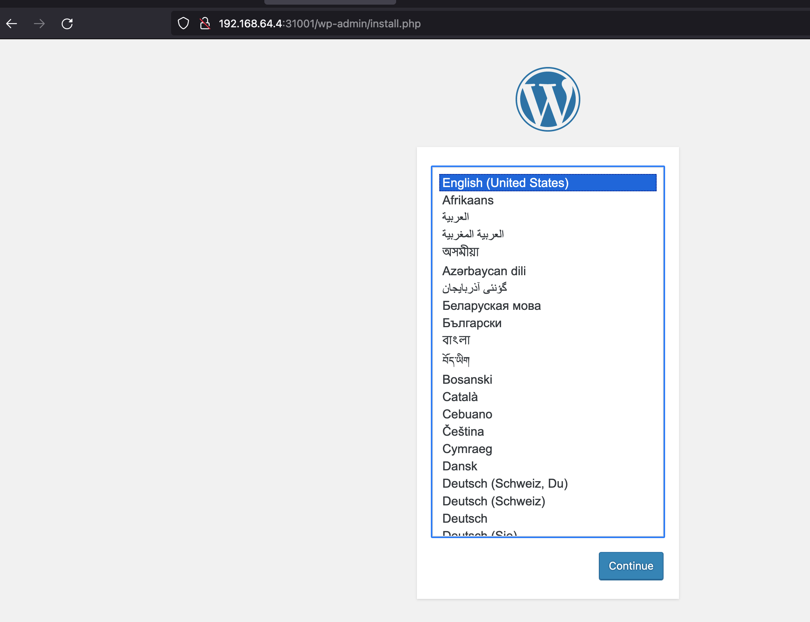

::
    
    # kubectl delete -f wordpress-app.yml
    # kubectl delete -f wordpress-db.yml

    [root@Master ~]# kubectl get all -o wide
    NAME                 TYPE        CLUSTER-IP   EXTERNAL-IP   PORT(S)   AGE   SELECTOR
    service/kubernetes   ClusterIP   10.96.0.1    <none>        443/TCP   46h   <none>

Kubernetes Storage
====================

- How to make my application data persistent in nature?
- Even storage solutions in kubernetes are not predefined. Any drivers can provide the storage solutions.
- **CRI: Docker, CNI: Flannel CSI: ?**
- Distributed filesystem is preferred.
- CEPH (very famous by redhat), Cinder, Oracle C3, Amazon EBS.

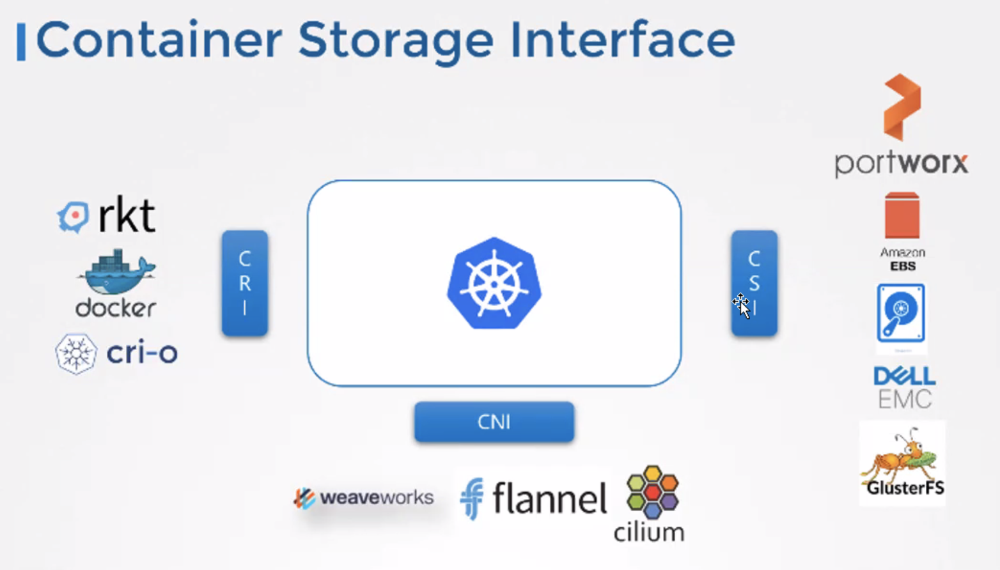

There are 2 methods to make your data persistent in pods:

I. **Container mechanism**
   
- when you define infra object, you can define storage inside the infra object or container. 
- Not centrally managed. It can't be given to another infra object.

II. **CSI Template mechanism defined by kubernetes**

- To **manage storage centrally**, you need to go for this.

.. important:: CRI, CNI and CSI are not kubernetes specific. These are defined by IEEE. So, CSI says every solution should use a RPC call, should create a volume and lots of other rules.

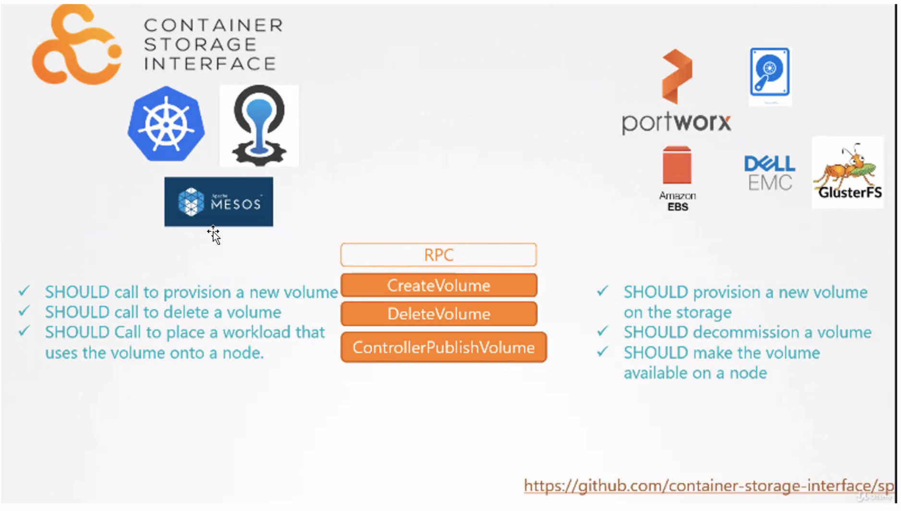

Container mechanism
--------------------

Container we use is docker. So, we need to see how to make data persistent in nature.

We have already covered storage mounts and volume mounts.

In Kubernetes we need to use distributed filesystem and recommended filesystem is NFS.

You know the data which is loaded inside the POD is transient. This is true for kubernetes as well.

See how you are creating the volume and mounting the volume.

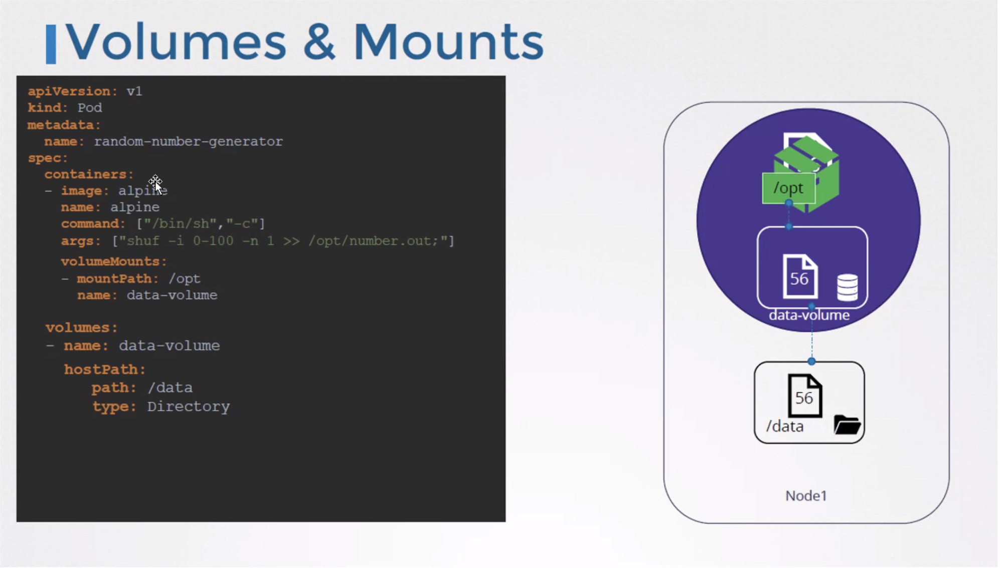

Ok. Which node you created the volume? local paths are not at all recommended as integrity cannot be maintained.

**You should not use local filesystem in any orchestration. Always use distributed filesystem (Amazon S3, EBS, ZFS, NFS, CEPH)**

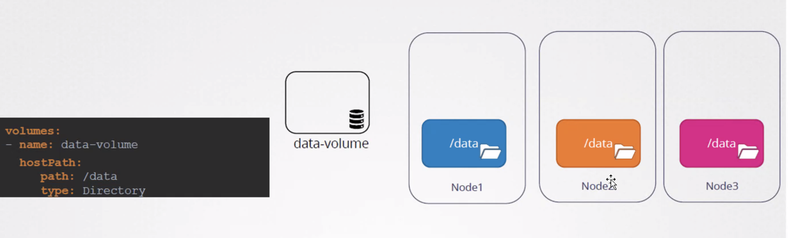

So the path should be the path from any distributed filesystem. 

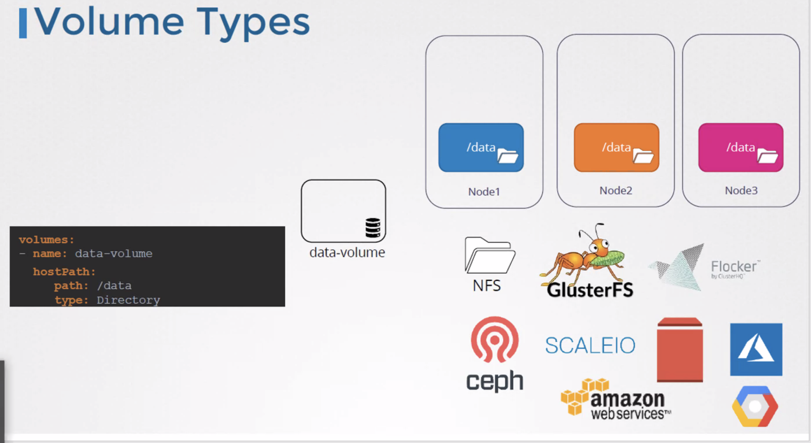

`Everything about kubernetes storage volumes: <https://kubernetes.io/docs/concepts/storage/volumes/>`_

Install NFS
^^^^^^^^^^^^^

`NFS storage driver <https://github.com/kubernetes/examples/tree/master/staging/volumes/nfs>`_

What is the work of NFS?

- **Share it on one server and any client can mount it.**
- Share the volume on **master** and let **worker1** and **worker2**.
- Install NFS package on all nodes.

::

    [root@Master ~]# yum install nfs-utils -y
    [root@worker1 ~]# yum install nfs-utils -y
    [root@worker2 ~]# yum install nfs-utils -y

Enable and start (on all nodes)::

    [root@Master ~]# systemctl enable nfs-server
    Created symlink from /etc/systemd/system/multi-user.target.wants/nfs-server.service to /usr/lib/systemd/system/nfs-server.service.
    [root@Master ~]# ^enable^start
    systemctl start nfs-server

- Decide which one you want to make as master. Let's go for the naming convention. Let master be the master.

::
    
    [root@Master ~]# mkdir /data
    [root@Master ~]# cd /data/
    [root@Master data]# 
    [root@Master data]# touch abc efg hij pqr 

.. important:: To share any thing on unix. Add it to the **/etc/export** file.

::

    [root@Master ~]# cat /etc/exports
    /data	*(rw,no_root_squash)

    [root@Master ~]# exportfs
    [root@Master ~]# exportfs -a
    [root@Master ~]# exportfs
    /data         	<world>

- From workers, see what all are available to mount

::

    [root@worker1 ~]# showmount -e master
    Export list for master:
    /data *

    [root@worker2 ~]# showmount -e master
    Export list for master:
    /data *

- Who will mount this? How I have to make the volume available to my pods.

Get the master IP::

    [root@Master ~]# cat /etc/hosts
    127.0.0.1   localhost localhost.localdomain localhost4 localhost4.localdomain4
    ::1         localhost localhost.localdomain localhost6 localhost6.localdomain6
    192.168.64.3 Master
    192.168.64.5 worker1
    192.168.64.4 worker2

[root@Master ~]# vi container-mechanism.yml

.. code-block:: 
   :emphasize-lines: 2, 14-16

    apiVersion: v1
    kind: Pod
    metadata:
      name: test-pd
    spec:
      containers:
      - image: nginx
        name: test-container
        volumeMounts:
        - mountPath: /usr/share/nginx/html
          name: nfs-volume
      volumes:
      - name: nfs-volume
        nfs:
          server: 192.168.64.3 
          path: "/data"

Create POD::

    [root@Master ~]# kubectl create -f container-mechanism.yml 
    pod/test-pd created
    [root@Master ~]# kubectl get all -o wide
    NAME          READY   STATUS    RESTARTS   AGE   IP            NODE      NOMINATED NODE   READINESS GATES
    pod/test-pd   1/1     Running   0          10s   10.244.2.45   worker1   <none>           <none>

    NAME                 TYPE        CLUSTER-IP   EXTERNAL-IP   PORT(S)   AGE   SELECTOR
    service/kubernetes   ClusterIP   10.96.0.1    <none>        443/TCP   46h   <none>

- df -h

.. code-block:: 
   :emphasize-lines: 9

    [root@Master ~]# kubectl exec -it pod/test-pd sh
    # df -h
    Filesystem                      Size  Used Avail Use% Mounted on
    overlay                          17G  4.9G   12G  29% /
    tmpfs                            64M     0   64M   0% /dev
    tmpfs                           1.9G     0  1.9G   0% /sys/fs/cgroup
    /dev/mapper/centos_master-root   17G  4.9G   12G  29% /etc/hosts
    shm                              64M     0   64M   0% /dev/shm
    192.168.64.3:/data               17G  6.4G   11G  38% /usr/share/nginx/html
    tmpfs                           1.9G   12K  1.9G   1% /run/secrets/kubernetes.io/serviceaccount
    tmpfs                           1.9G     0  1.9G   0% /proc/acpi
    tmpfs                           1.9G     0  1.9G   0% /proc/scsi
    tmpfs                           1.9G     0  1.9G   0% /sys/firmware

    # cd /usr/share/nginx/html
    # ls
    abc  efg  hij  pqr
    # 
    # touch xyz

CSI mechanism
--------------

What if the same NFS is required for another infra object?

So, Kubernetes recommends CSI mechanism.

**Use kubernetes storage objects, PV and PVC(persistent volume claims)**

Persistent volume and persistent volume claims (PV & PVC)
^^^^^^^^^^^^^^^^^^^^^^^^^^^^^^^^^^^^^^^^^^^^^^^^^^^^^^^^^^

- Actual storage (from NFS, Amazon etc) is not directly given on pods.
- Custer admins or devops people carves the actual volumes (from NFS, Amazon etc)  as N number of small luns (example: 5 * 1GB luns) are called persistent volumes.
- Developers have to claim the volume by the size, labels. The claimed volumes are called **PVC**.
- Carved volumes are called PV.
- Claimed volumes are called PVC and PVC are taken to the PODs.

How to create persistent volume

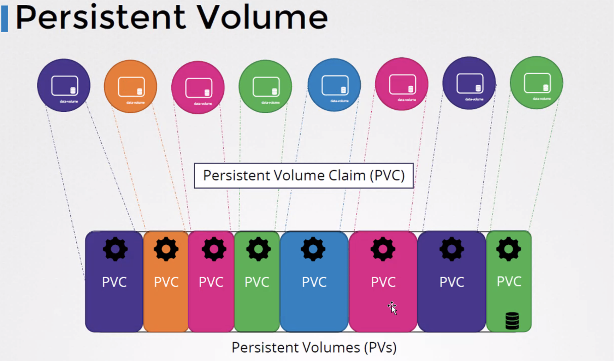

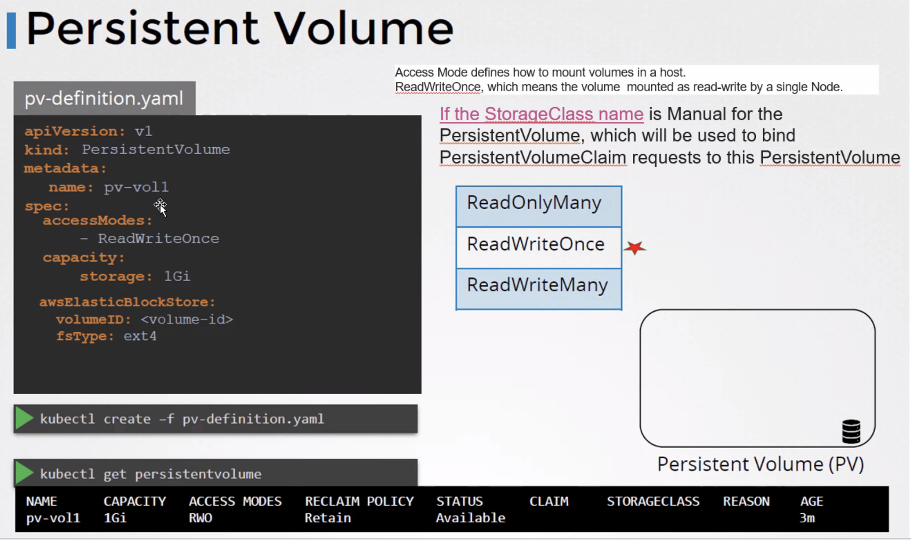

.. important::
    - **Block storage**: For keeping all Dynamic data. 
    - **Object Storage**: For keeping all Static data. 

.. important:: 
    - You cannot have multiples PVCs in a PV. **ONE PV, ONE PVC**
    - PVs capacity should be **equal or more** than your claim
    - If you claim for 70Gig PVC, first it will look for equal sized lun. If not available, it will give a higher PV. If nothing is available PVC will be pending state.

Suppose you want a PV of a particular vendor, for example from amazon and there are multiple luns available for the claimed size, you can use labels and selectors.

[root@Master ~]# cat pv.yml

.. code-block:: 
   :emphasize-lines: 2, 7, 9

    apiVersion: v1
    kind: PersistentVolume
    metadata:
      name: nfspv
    spec:
      capacity:
        storage: 1Gi
      accessModes:
        - ReadWriteMany
      nfs:
        server: 192.168.64.3
        path: "/data"

Create PV::

    [root@Master ~]# kubectl create -f pv.yml 
    persistentvolume/nfspv created

    [root@Master ~]# kubectl get pv
    NAME    CAPACITY   ACCESS MODES   RECLAIM POLICY   STATUS      CLAIM   STORAGECLASS   REASON   AGE
    nfspv   1Gi        RWX            Retain           Available                                   34s

[root@Master ~]# cat pvc.yml

.. code-block:: 
   :emphasize-lines: 2, 7, 10

    apiVersion: v1
    kind: PersistentVolumeClaim
    metadata:
      name: nfsclaim
    spec:
      accessModes:
        - ReadWriteMany
      resources:
        requests:
          storage: 500Mi

Create PVC::

    [root@Master ~]# kubectl create -f pvc.yml 
    persistentvolumeclaim/nfsclaim created
    [root@Master ~]# kubectl get pvc

    NAME       STATUS   VOLUME   CAPACITY   ACCESS MODES   STORAGECLASS   AGE
    nfsclaim   Bound    nfspv    1Gi        RWX                           8s

**See it got 1Gi even though we claimed for 500Mi**

See the PV is now bound to nfsclaim in default namespace::

    [root@Master ~]# kubectl get pv
    NAME    CAPACITY   ACCESS MODES   RECLAIM POLICY   STATUS   CLAIM              STORAGECLASS   REASON   AGE
    nfspv   1Gi        RWX            Retain           Bound    default/nfsclaim                           3m46s

[root@Master ~]# cat nfsdep.yml

.. code-block:: 
   :emphasize-lines: 2, 9, 20, 21, 24, 25

    apiVersion: apps/v1
    kind: Deployment
    metadata:
      name: myapp-prod
      labels:
           app: myapp

    spec:
      replicas: 3
      template:
        metadata:
          name: myapp-pod
          labels:
            app: myapp
        spec:
          containers:
          - name: nginx
            image: nginx
            volumeMounts:
            - name: nfs
              mountPath: "/usr/share/nginx/html"
          volumes:
          - name: nfs
            persistentVolumeClaim:
              claimName: nfsclaim

      selector:
        matchLabels:
          app: myapp

::

    [root@Master ~]# kubectl create -f nfsdep.yml 
    deployment.apps/myapp-prod created

::

    [root@Master ~]# kubectl get all -o wide
    NAME                              READY   STATUS    RESTARTS   AGE   IP            NODE      NOMINATED NODE   READINESS GATES
    pod/myapp-prod-5f9cf669cb-c6lnt   1/1     Running   0          55s   10.244.2.47   worker1   <none>           <none>
    pod/myapp-prod-5f9cf669cb-rc4nm   1/1     Running   0          55s   10.244.1.60   worker2   <none>           <none>
    pod/myapp-prod-5f9cf669cb-x2jpk   1/1     Running   0          55s   10.244.2.48   worker1   <none>           <none>

    NAME                 TYPE        CLUSTER-IP   EXTERNAL-IP   PORT(S)   AGE   SELECTOR
    service/kubernetes   ClusterIP   10.96.0.1    <none>        443/TCP   46h   <none>

    NAME                         READY   UP-TO-DATE   AVAILABLE   AGE   CONTAINERS   IMAGES   SELECTOR
    deployment.apps/myapp-prod   3/3     3            3           55s   nginx        nginx    app=myapp

    NAME                                    DESIRED   CURRENT   READY   AGE   CONTAINERS   IMAGES   SELECTOR
    replicaset.apps/myapp-prod-5f9cf669cb   3         3         3       55s   nginx        nginx    app=myapp,pod-template-hash=5f9cf669cb

See workers::

    [root@worker1 ~]# df -h | grep "192.168.64.3"
    192.168.64.3:/data               17G  6.4G   11G  38% /var/lib/kubelet/pods/0087734e-379b-4e93-aeab-a12b040d7f75/volumes/kubernetes.io~nfs/nfspv

    [root@worker2 ~]# df -h | grep "192.168.64.3"
    192.168.64.3:/data               17G  6.4G   11G  38% /var/lib/kubelet/pods/ecec2ed1-50e5-42e9-83f9-5ba64632b87a/volumes/kubernetes.io~nfs/nfspv

Get into the pod::

    [root@Master ~]# kubectl exec myapp-prod-5f9cf669cb-rc4nm -it sh
    kubectl exec [POD] [COMMAND] is DEPRECATED and will be removed in a future version. Use kubectl exec [POD] -- [COMMAND] instead.
    # 
    # df -h
    Filesystem                      Size  Used Avail Use% Mounted on
    overlay                          17G  4.4G   13G  27% /
    tmpfs                            64M     0   64M   0% /dev
    tmpfs                           1.9G     0  1.9G   0% /sys/fs/cgroup
    /dev/mapper/centos_master-root   17G  4.4G   13G  27% /etc/hosts
    shm                              64M     0   64M   0% /dev/shm
    192.168.64.3:/data               17G  6.4G   11G  38% /usr/share/nginx/html
    tmpfs                           1.9G   12K  1.9G   1% /run/secrets/kubernetes.io/serviceaccount
    tmpfs                           1.9G     0  1.9G   0% /proc/acpi
    tmpfs                           1.9G     0  1.9G   0% /proc/scsi
    tmpfs                           1.9G     0  1.9G   0% /sys/firmware

    # cd /usr/share/nginx/html
    # ls
    abc  efg  hij  pqr  xyz

If you delete the PV when the deployment is running, then it will not allow. In Older times, if you delete the lun, pod will corrupt.

::

    [root@Master ~]# kubectl get pv
    NAME    CAPACITY   ACCESS MODES   RECLAIM POLICY   STATUS   CLAIM              STORAGECLASS   REASON   AGE
    nfspv   1Gi        RWX            Retain           Bound    default/nfsclaim                           10m
    [root@Master ~]# kubectl get pvc
    NAME       STATUS   VOLUME   CAPACITY   ACCESS MODES   STORAGECLASS   AGE
    nfsclaim   Bound    nfspv    1Gi        RWX                           9m11s

This **will hang** till timeout or till we delete the pod::

    [root@Master ~]# kubectl delete pvc nfsclaim
    persistentvolumeclaim "nfsclaim" deleted

You can do all the storage operations even after delete command (another shell)::

    [root@Master ~]# kubectl exec myapp-prod-5f9cf669cb-rc4nm -it sh
    kubectl exec [POD] [COMMAND] is DEPRECATED and will be removed in a future version. Use kubectl exec [POD] -- [COMMAND] instead.
    # df -h
    Filesystem                      Size  Used Avail Use% Mounted on
    overlay                          17G  4.4G   13G  27% /
    tmpfs                            64M     0   64M   0% /dev
    tmpfs                           1.9G     0  1.9G   0% /sys/fs/cgroup
    /dev/mapper/centos_master-root   17G  4.4G   13G  27% /etc/hosts
    shm                              64M     0   64M   0% /dev/shm
    192.168.64.3:/data               17G  6.4G   11G  38% /usr/share/nginx/html
    tmpfs                           1.9G   12K  1.9G   1% /run/secrets/kubernetes.io/serviceaccount
    tmpfs                           1.9G     0  1.9G   0% /proc/acpi
    tmpfs                           1.9G     0  1.9G   0% /proc/scsi
    tmpfs                           1.9G     0  1.9G   0% /sys/firmware
    # cd /usr/share/nginx/html
    # ls
    abc  efg  hij  pqr  xyz
    # touch DDD
    # ls
    DDD  abc  efg  hij  pqr  xyz
    # 

::

    [root@Master ~]# kubectl delete -f nfsdep.yml 
    deployment.apps "myapp-prod" deleted
    [root@Master ~]# 

You can see the delete pvc completed as we deleted the deployment in another shell::

    [root@Master ~]# kubectl delete pvc nfsclaim
    persistentvolumeclaim "nfsclaim" deleted
    [root@Master ~]# 

If PV is not available for the capacity, it will go to pending state. as soon as you create a pv, it will get bind.

::

    [root@Master ~]# kubectl create -f pvc.yml 
    persistentvolumeclaim/nfsclaim created
    [root@Master ~]# kubectl get pvc
    NAME       STATUS    VOLUME   CAPACITY   ACCESS MODES   STORAGECLASS   AGE
    nfsclaim   Pending                                                     2s

    [root@Master ~]# kubectl create -f pv.yml 
    persistentvolume/nfspv created

    [root@Master ~]# kubectl get pvc
    NAME       STATUS   VOLUME   CAPACITY   ACCESS MODES   STORAGECLASS   AGE
    nfsclaim   Bound    nfspv    1Gi        RWX                           2m23s

Reclaim Policies
^^^^^^^^^^^^^^^^^

When you delete a PVC.

**Retain**: PVC will be deleted. PV and it's data will stay. This PV can't be bound to any other PVC even in the same PVC. Status will become **Release**. Usecase: Tier applications. This is the default way.

Then how will you get the data? First you have to say the reason why it is deleted. Then the admin will recreate the pv. 

You can see the status **Released** when we deleted the pvc::

    [root@Master ~]# kubectl get pv
    NAME    CAPACITY   ACCESS MODES   RECLAIM POLICY   STATUS     CLAIM              STORAGECLASS   REASON   AGE
    nfspv   1Gi        RWX            Retain           Released   default/nfsclaim                           27m

Delete PV::

    [root@Master ~]# kubectl get pv
    NAME    CAPACITY   ACCESS MODES   RECLAIM POLICY   STATUS     CLAIM              STORAGECLASS   REASON   AGE
    nfspv   1Gi        RWX            Retain           Released   default/nfsclaim                           80m
    [root@Master ~]# kubectl delete pv nfspv
    persistentvolume "nfspv" deleted

The data is persistent::

    [root@Master ~]# cd /data/
    [root@Master data]# ls
    abc  DDD  efg  hij  pqr  xyz

**Delete**: PVC, PV, and data will be deleted. Usecase: temporary data like login data, customer subscription ended.

**Recycle**: PVC will be deleted. PV will not be deleted. Data inside will be erased and will be reused by other PVCs. Usecase: monitoring.

Application Lifecycle Management
==================================

- Application Lifecycle Management means 2 things:

  - Enhancements of application (upgrade)
  - Setting the environmental variable.
- Kubernetes itself has a versioning control. So, the rollout is making the upgrade more Powerful.
- **We know that deployment's main role is upgrade the application**
- There are 2 strategies: Rolling and Recreate.
- The default upgrade strategy is **Rolling Upgrage**. One after the other.
- **Recreate**: there will be a downtime.
- In both cases, newer replica sets will be created with **new revision id**.
- You can rollback the upgrade in any time using **rollout undo**.

.. important:: Unlike any other orchestrators, only in kubernetes you can rollback to any older version.

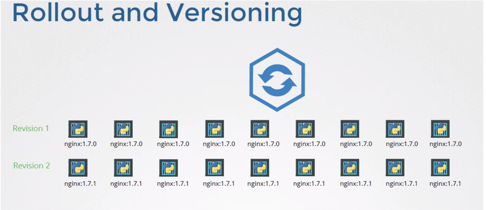

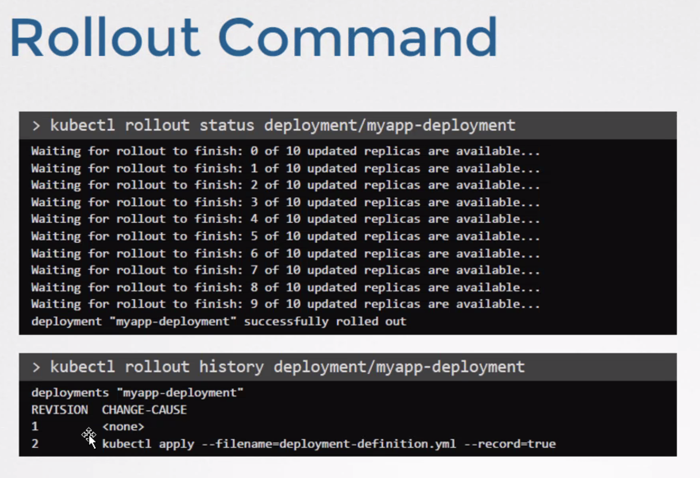

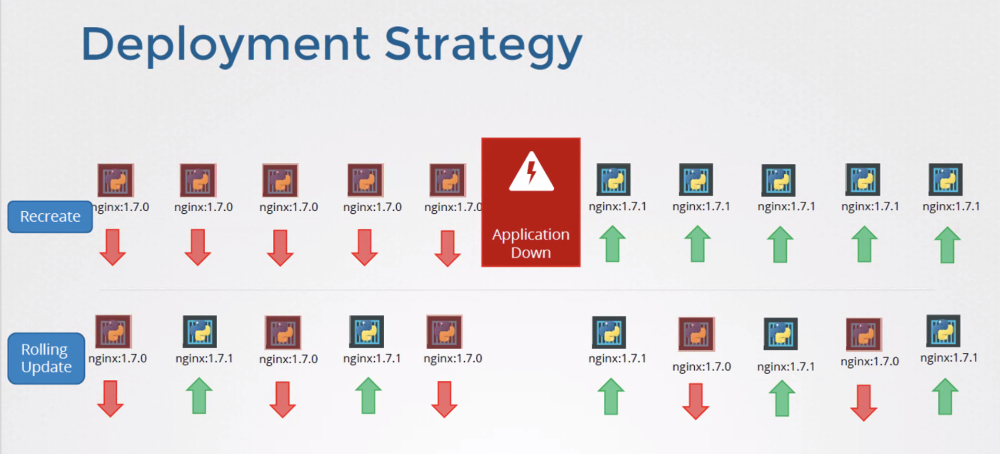

- You need a new image for upgrade.

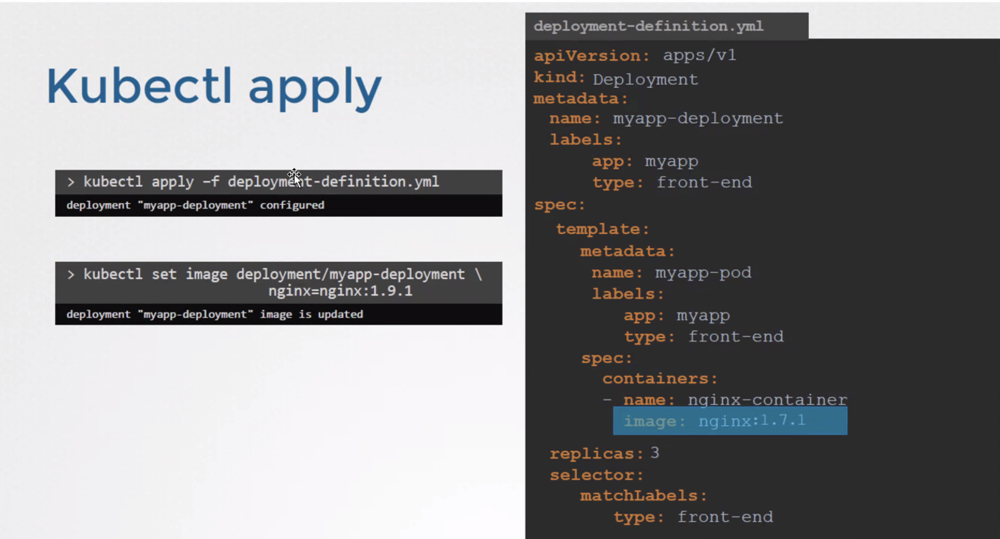

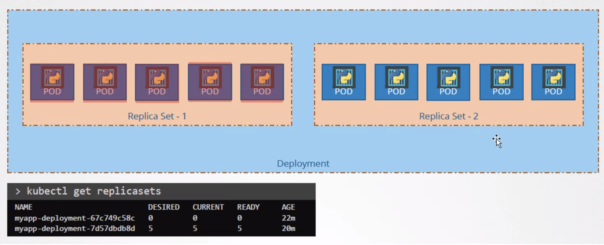

Rolling Upgrade
----------------

::
    
    [root@Master ~]# kubectl get pods -o wide
    No resources found in default namespace.

First install a specific version of nginx.

[root@Master ~]# cat deployment.yml

.. code-block:: 
   :emphasize-lines: 18

    apiVersion: apps/v1
    kind: Deployment
    metadata:
      name: myapp-prod
      labels:
           app: myapp

    spec:
      replicas: 15
      template:
        metadata:
          name: myapp-pod
          labels:
            app: myapp
        spec:
          containers:
            - name: nginx
              image: nginx:1.7.1
      selector:
        matchLabels:
          app: myapp

Create deployment::
    
    [root@Master ~]# kubectl create -f deployment.yml 
    deployment.apps/myapp-prod created

To make this accessible to outside world, we need a nodeport service. note the selector binds the nodeport with our app.

.. code-block:: 
   :emphasize-lines: 12

    apiVersion: v1
    kind: Service
    metadata:
      name: appservice
    spec:
      type : NodePort
      ports:
        - port: 80
          targetPort: 80
          nodePort: 30000
      selector:
        app: myapp

You can find the app accessible now.

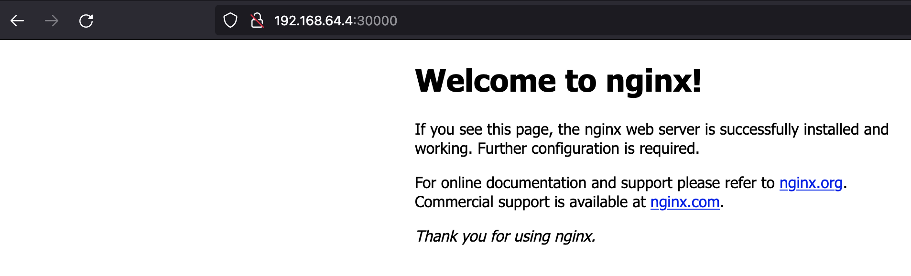

::

    [root@Master ~]# kubectl get all -o wide
    NAME                             READY   STATUS    RESTARTS   AGE   IP            NODE      NOMINATED NODE   READINESS GATES
    pod/myapp-prod-b874d4f79-2kms2   1/1     Running   0          12m   10.244.2.53   worker1   <none>           <none>
    pod/myapp-prod-b874d4f79-5ndt5   1/1     Running   0          12m   10.244.2.51   worker1   <none>           <none>
    pod/myapp-prod-b874d4f79-6ldjv   1/1     Running   0          12m   10.244.1.63   worker2   <none>           <none>
    pod/myapp-prod-b874d4f79-8qcks   1/1     Running   0          12m   10.244.2.56   worker1   <none>           <none>
    pod/myapp-prod-b874d4f79-bcj2f   1/1     Running   0          12m   10.244.2.52   worker1   <none>           <none>
    pod/myapp-prod-b874d4f79-fltmr   1/1     Running   0          12m   10.244.2.49   worker1   <none>           <none>
    pod/myapp-prod-b874d4f79-h9cf6   1/1     Running   0          12m   10.244.1.64   worker2   <none>           <none>
    pod/myapp-prod-b874d4f79-jqcxt   1/1     Running   0          12m   10.244.1.67   worker2   <none>           <none>
    pod/myapp-prod-b874d4f79-k49fd   1/1     Running   0          12m   10.244.1.62   worker2   <none>           <none>
    pod/myapp-prod-b874d4f79-kddcx   1/1     Running   0          12m   10.244.1.68   worker2   <none>           <none>
    pod/myapp-prod-b874d4f79-kj8ss   1/1     Running   0          12m   10.244.1.65   worker2   <none>           <none>
    pod/myapp-prod-b874d4f79-lkdsw   1/1     Running   0          12m   10.244.2.54   worker1   <none>           <none>
    pod/myapp-prod-b874d4f79-pqwb8   1/1     Running   0          12m   10.244.1.66   worker2   <none>           <none>
    pod/myapp-prod-b874d4f79-r5t9m   1/1     Running   0          12m   10.244.2.50   worker1   <none>           <none>
    pod/myapp-prod-b874d4f79-zvz5t   1/1     Running   0          12m   10.244.2.55   worker1   <none>           <none>

    NAME                 TYPE        CLUSTER-IP      EXTERNAL-IP   PORT(S)        AGE     SELECTOR
    service/appservice   NodePort    10.101.105.73   <none>        80:30000/TCP   5m18s   app=myapp
    service/kubernetes   ClusterIP   10.96.0.1       <none>        443/TCP        2d17h   <none>

    NAME                         READY   UP-TO-DATE   AVAILABLE   AGE   CONTAINERS   IMAGES        SELECTOR
    deployment.apps/myapp-prod   15/15   15           15          12m   nginx        nginx:1.7.1   app=myapp

    NAME                                   DESIRED   CURRENT   READY   AGE   CONTAINERS   IMAGES        SELECTOR
    replicaset.apps/myapp-prod-b874d4f79   15        15        15      12m   nginx        nginx:1.7.1   app=myapp,pod-template-hash=b874d4f79
    [root@Master ~]# 

Describe deployment and you can see the default rolling updrage.

.. important:: **25% max unavailable, 25% max surge**: As soon as 25% of the applications upgraded, users will be directed to use the new version.

.. code-block:: 
   :emphasize-lines: 9, 11

    [root@Master ~]# kubectl describe deployment.apps/myapp-prod
    Name:                   myapp-prod
    Namespace:              default
    CreationTimestamp:      Sat, 10 Sep 2022 10:37:39 +0530
    Labels:                 app=myapp
    Annotations:            deployment.kubernetes.io/revision: 1
    Selector:               app=myapp
    Replicas:               15 desired | 15 updated | 15 total | 15 available | 0 unavailable
    StrategyType:           RollingUpdate
    MinReadySeconds:        0
    RollingUpdateStrategy:  25% max unavailable, 25% max surge
    Pod Template:
      Labels:  app=myapp
      Containers:
       nginx:
        Image:        nginx:1.7.1
        Port:         <none>
        Host Port:    <none>
        Environment:  <none>
        Mounts:       <none>
      Volumes:        <none>
    Conditions:
      Type           Status  Reason
      ----           ------  ------
      Available      True    MinimumReplicasAvailable
      Progressing    True    NewReplicaSetAvailable
    OldReplicaSets:  <none>
    NewReplicaSet:   myapp-prod-b874d4f79 (15/15 replicas created)
    Events:
      Type    Reason             Age   From                   Message
      ----    ------             ----  ----                   -------
      Normal  ScalingReplicaSet  13m   deployment-controller  Scaled up replica set myapp-prod-b874d4f79 to 15
    [root@Master ~]# 

Let's upgrade to 1.9.1::

    spec:
      containers:
        - name: nginx
          image: nginx:1.9.1

::

    [root@Master ~]# kubectl apply -f deployment.yml 
    Warning: resource deployments/myapp-prod is missing the kubectl.kubernetes.io/last-applied-configuration annotation which is required by kubectl apply. kubectl apply should only be used on resources created declaratively by either kubectl create --save-config or kubectl apply. The missing annotation will be patched automatically.
    deployment.apps/myapp-prod configured

See the progress, see the last 2 lines...

.. code-block:: 
   :emphasize-lines: 29, 32, 33

    [root@Master ~]# kubectl get all -o wide
    NAME                              READY   STATUS              RESTARTS   AGE   IP            NODE      NOMINATED NODE   READINESS GATES
    pod/myapp-prod-56bd85ff8f-2f8pz   0/1     ContainerCreating   0          16s   <none>        worker1   <none>           <none>
    pod/myapp-prod-56bd85ff8f-97svq   0/1     ContainerCreating   0          16s   <none>        worker1   <none>           <none>
    pod/myapp-prod-56bd85ff8f-99b7m   0/1     ContainerCreating   0          16s   <none>        worker2   <none>           <none>
    pod/myapp-prod-56bd85ff8f-bfjzk   0/1     ContainerCreating   0          16s   <none>        worker2   <none>           <none>
    pod/myapp-prod-56bd85ff8f-c87kl   0/1     ContainerCreating   0          16s   <none>        worker2   <none>           <none>
    pod/myapp-prod-56bd85ff8f-hxs8f   0/1     ContainerCreating   0          16s   <none>        worker1   <none>           <none>
    pod/myapp-prod-56bd85ff8f-mdrdg   0/1     ContainerCreating   0          16s   <none>        worker2   <none>           <none>
    pod/myapp-prod-b874d4f79-2kms2    1/1     Running             0          19m   10.244.2.53   worker1   <none>           <none>
    pod/myapp-prod-b874d4f79-5ndt5    1/1     Running             0          19m   10.244.2.51   worker1   <none>           <none>
    pod/myapp-prod-b874d4f79-6ldjv    1/1     Running             0          19m   10.244.1.63   worker2   <none>           <none>
    pod/myapp-prod-b874d4f79-bcj2f    1/1     Running             0          19m   10.244.2.52   worker1   <none>           <none>
    pod/myapp-prod-b874d4f79-fltmr    1/1     Running             0          19m   10.244.2.49   worker1   <none>           <none>
    pod/myapp-prod-b874d4f79-h9cf6    1/1     Running             0          19m   10.244.1.64   worker2   <none>           <none>
    pod/myapp-prod-b874d4f79-jqcxt    1/1     Running             0          19m   10.244.1.67   worker2   <none>           <none>
    pod/myapp-prod-b874d4f79-k49fd    1/1     Running             0          19m   10.244.1.62   worker2   <none>           <none>
    pod/myapp-prod-b874d4f79-kddcx    1/1     Running             0          19m   10.244.1.68   worker2   <none>           <none>
    pod/myapp-prod-b874d4f79-kj8ss    1/1     Running             0          19m   10.244.1.65   worker2   <none>           <none>
    pod/myapp-prod-b874d4f79-pqwb8    1/1     Running             0          19m   10.244.1.66   worker2   <none>           <none>
    pod/myapp-prod-b874d4f79-r5t9m    1/1     Running             0          19m   10.244.2.50   worker1   <none>           <none>

    NAME                 TYPE        CLUSTER-IP      EXTERNAL-IP   PORT(S)        AGE     SELECTOR
    service/appservice   NodePort    10.101.105.73   <none>        80:30000/TCP   12m     app=myapp
    service/kubernetes   ClusterIP   10.96.0.1       <none>        443/TCP        2d17h   <none>

    NAME                         READY   UP-TO-DATE   AVAILABLE   AGE   CONTAINERS   IMAGES        SELECTOR
    deployment.apps/myapp-prod   12/15   7            12          19m   nginx        nginx:1.9.1   app=myapp

    NAME                                    DESIRED   CURRENT   READY   AGE   CONTAINERS   IMAGES        SELECTOR
    replicaset.apps/myapp-prod-56bd85ff8f   7         7         0       16s   nginx        nginx:1.9.1   app=myapp,pod-template-hash=56bd85ff8f
    replicaset.apps/myapp-prod-b874d4f79    12        12        12      19m   nginx        nginx:1.7.1   app=myapp,pod-template-hash=b874d4f79

Note that throughout this time, you can acccess the nginx application seamlessly.

All done

.. code-block:: 
   :emphasize-lines: 24, 27, 28

    [root@Master ~]# kubectl get all -o wide
    NAME                              READY   STATUS    RESTARTS   AGE   IP            NODE      NOMINATED NODE   READINESS GATES
    pod/myapp-prod-56bd85ff8f-2f8pz   1/1     Running   0          43s   10.244.2.57   worker1   <none>           <none>
    pod/myapp-prod-56bd85ff8f-97svq   1/1     Running   0          43s   10.244.2.58   worker1   <none>           <none>
    pod/myapp-prod-56bd85ff8f-99b7m   1/1     Running   0          43s   10.244.1.71   worker2   <none>           <none>
    pod/myapp-prod-56bd85ff8f-9hvr9   1/1     Running   0          23s   10.244.2.60   worker1   <none>           <none>
    pod/myapp-prod-56bd85ff8f-bfjzk   1/1     Running   0          43s   10.244.1.70   worker2   <none>           <none>
    pod/myapp-prod-56bd85ff8f-c87kl   1/1     Running   0          43s   10.244.1.69   worker2   <none>           <none>
    pod/myapp-prod-56bd85ff8f-ddhmg   1/1     Running   0          17s   10.244.1.75   worker2   <none>           <none>
    pod/myapp-prod-56bd85ff8f-hxs8f   1/1     Running   0          43s   10.244.2.59   worker1   <none>           <none>
    pod/myapp-prod-56bd85ff8f-lw6tk   1/1     Running   0          21s   10.244.1.73   worker2   <none>           <none>
    pod/myapp-prod-56bd85ff8f-mdrdg   1/1     Running   0          43s   10.244.1.72   worker2   <none>           <none>
    pod/myapp-prod-56bd85ff8f-n87pb   1/1     Running   0          16s   10.244.2.64   worker1   <none>           <none>
    pod/myapp-prod-56bd85ff8f-nk28p   1/1     Running   0          19s   10.244.1.74   worker2   <none>           <none>
    pod/myapp-prod-56bd85ff8f-v22rm   1/1     Running   0          18s   10.244.2.63   worker1   <none>           <none>
    pod/myapp-prod-56bd85ff8f-vxjhk   1/1     Running   0          22s   10.244.2.61   worker1   <none>           <none>
    pod/myapp-prod-56bd85ff8f-x55zz   1/1     Running   0          20s   10.244.2.62   worker1   <none>           <none>

    NAME                 TYPE        CLUSTER-IP      EXTERNAL-IP   PORT(S)        AGE     SELECTOR
    service/appservice   NodePort    10.101.105.73   <none>        80:30000/TCP   12m     app=myapp
    service/kubernetes   ClusterIP   10.96.0.1       <none>        443/TCP        2d17h   <none>

    NAME                         READY   UP-TO-DATE   AVAILABLE   AGE   CONTAINERS   IMAGES        SELECTOR
    deployment.apps/myapp-prod   15/15   15           15          19m   nginx        nginx:1.9.1   app=myapp

    NAME                                    DESIRED   CURRENT   READY   AGE   CONTAINERS   IMAGES        SELECTOR
    replicaset.apps/myapp-prod-56bd85ff8f   15        15        15      43s   nginx        nginx:1.9.1   app=myapp,pod-template-hash=56bd85ff8f
    replicaset.apps/myapp-prod-b874d4f79    0         0         0       19m   nginx        nginx:1.7.1   app=myapp,pod-template-hash=b874d4f79

To see status of rollout::

    [root@Master ~]# kubectl rollout status deployment.apps/myapp-prod
    deployment "myapp-prod" successfully rolled out

To see the version history::

    [root@Master ~]# kubectl rollout history deployment.apps/myapp-prod
    deployment.apps/myapp-prod 
    REVISION  CHANGE-CAUSE
    1         <none>
    2         <none>

To know which replica sets having these revision::

    [root@Master ~]# kubectl describe replicaset.apps/myapp-prod-56bd85ff8f | grep -i revision
                    deployment.kubernetes.io/revision: 2
    [root@Master ~]# kubectl describe replicaset.apps/myapp-prod-b874d4f79 | grep -i revision
                    deployment.kubernetes.io/revision: 1

To Rollback::

    [root@Master ~]# kubectl rollout undo  deployment.apps/myapp-prod
    deployment.apps/myapp-prod rolled back

::

    [root@Master ~]# kubectl get all -o wide
    NAME                              READY   STATUS              RESTARTS   AGE     IP            NODE      NOMINATED NODE   READINESS GATES
    pod/myapp-prod-56bd85ff8f-2f8pz   1/1     Running             0          9m47s   10.244.2.57   worker1   <none>           <none>
    pod/myapp-prod-56bd85ff8f-97svq   1/1     Terminating         0          9m47s   10.244.2.58   worker1   <none>           <none>
    pod/myapp-prod-56bd85ff8f-99b7m   0/1     Terminating         0          9m47s   10.244.1.71   worker2   <none>           <none>
    pod/myapp-prod-56bd85ff8f-9hvr9   1/1     Running             0          9m27s   10.244.2.60   worker1   <none>           <none>
    pod/myapp-prod-56bd85ff8f-bfjzk   1/1     Terminating         0          9m47s   10.244.1.70   worker2   <none>           <none>
    pod/myapp-prod-56bd85ff8f-c87kl   1/1     Running             0          9m47s   10.244.1.69   worker2   <none>           <none>
    pod/myapp-prod-56bd85ff8f-ddhmg   1/1     Terminating         0          9m21s   10.244.1.75   worker2   <none>           <none>
    pod/myapp-prod-56bd85ff8f-hxs8f   0/1     Terminating         0          9m47s   10.244.2.59   worker1   <none>           <none>
    pod/myapp-prod-56bd85ff8f-lw6tk   1/1     Running             0          9m25s   10.244.1.73   worker2   <none>           <none>
    pod/myapp-prod-56bd85ff8f-mdrdg   1/1     Terminating         0          9m47s   10.244.1.72   worker2   <none>           <none>
    pod/myapp-prod-56bd85ff8f-n87pb   0/1     Terminating         0          9m20s   10.244.2.64   worker1   <none>           <none>
    pod/myapp-prod-56bd85ff8f-nk28p   1/1     Terminating         0          9m23s   10.244.1.74   worker2   <none>           <none>
    pod/myapp-prod-56bd85ff8f-v22rm   0/1     Terminating         0          9m22s   10.244.2.63   worker1   <none>           <none>
    pod/myapp-prod-56bd85ff8f-vxjhk   1/1     Running             0          9m26s   10.244.2.61   worker1   <none>           <none>
    pod/myapp-prod-56bd85ff8f-x55zz   1/1     Terminating         0          9m24s   10.244.2.62   worker1   <none>           <none>
    pod/myapp-prod-b874d4f79-59clk    1/1     Running             0          5s      10.244.2.66   worker1   <none>           <none>
    pod/myapp-prod-b874d4f79-9256r    0/1     Pending             0          1s      <none>        worker2   <none>           <none>
    pod/myapp-prod-b874d4f79-djpj8    1/1     Running             0          5s      10.244.1.77   worker2   <none>           <none>
    pod/myapp-prod-b874d4f79-f68zq    0/1     ContainerCreating   0          3s      <none>        worker2   <none>           <none>
    pod/myapp-prod-b874d4f79-jdktf    0/1     Pending             0          2s      <none>        worker2   <none>           <none>
    pod/myapp-prod-b874d4f79-jtzdg    0/1     Pending             0          2s      <none>        worker1   <none>           <none>
    pod/myapp-prod-b874d4f79-r82n9    1/1     Running             0          5s      10.244.2.67   worker1   <none>           <none>
    pod/myapp-prod-b874d4f79-swpk5    0/1     Pending             0          2s      <none>        worker1   <none>           <none>
    pod/myapp-prod-b874d4f79-t5ppt    0/1     ContainerCreating   0          3s      <none>        worker1   <none>           <none>
    pod/myapp-prod-b874d4f79-tkw8t    1/1     Running             0          5s      10.244.1.79   worker2   <none>           <none>
    pod/myapp-prod-b874d4f79-v2mk8    1/1     Running             0          5s      10.244.2.65   worker1   <none>           <none>
    pod/myapp-prod-b874d4f79-wttdc    1/1     Running             0          5s      10.244.1.78   worker2   <none>           <none>
    pod/myapp-prod-b874d4f79-xg4vx    1/1     Running             0          5s      10.244.1.76   worker2   <none>           <none>

    NAME                 TYPE        CLUSTER-IP      EXTERNAL-IP   PORT(S)        AGE     SELECTOR
    service/appservice   NodePort    10.101.105.73   <none>        80:30000/TCP   21m     app=myapp
    service/kubernetes   ClusterIP   10.96.0.1       <none>        443/TCP        2d17h   <none>

    NAME                         READY   UP-TO-DATE   AVAILABLE   AGE   CONTAINERS   IMAGES        SELECTOR
    deployment.apps/myapp-prod   12/15   13           12          28m   nginx        nginx:1.7.1   app=myapp

    NAME                                    DESIRED   CURRENT   READY   AGE     CONTAINERS   IMAGES        SELECTOR
    replicaset.apps/myapp-prod-56bd85ff8f   5         5         5       9m47s   nginx        nginx:1.9.1   app=myapp,pod-template-hash=56bd85ff8f
    replicaset.apps/myapp-prod-b874d4f79    14        14        7       28m     nginx        nginx:1.7.1   app=myapp,pod-template-hash=b874d4f79

Rollback completed::

    [root@Master ~]# kubectl get all -o wide
    . . .
    NAME                                    DESIRED   CURRENT   READY   AGE   CONTAINERS   IMAGES        SELECTOR
    replicaset.apps/myapp-prod-56bd85ff8f   0         0         0       10m   nginx        nginx:1.9.1   app=myapp,pod-template-hash=56bd85ff8f
    replicaset.apps/myapp-prod-b874d4f79    15        15        15      29m   nginx        nginx:1.7.1   app=myapp,pod-template-hash=b874d4f79

See history::

    [root@Master ~]# kubectl rollout history deployment.apps/myapp-prod
    deployment.apps/myapp-prod 
    REVISION  CHANGE-CAUSE
    2         <none>
    3         <none>

::

    [root@Master ~]#  kubectl describe replicaset.apps/myapp-prod-b874d4f79 | grep -i revision
                deployment.kubernetes.io/revision: 3
                deployment.kubernetes.io/revision-history: 1

Upgrade to the latest::

    spec:
      containers:
        - name: nginx
          image: nginx:latest

::

    [root@Master ~]# kubectl apply -f rollingupgrade.yml 
    deployment.apps/myapp-prod configured

::

    [root@Master ~]# kubectl get all -o wide
    NAME                              READY   STATUS              RESTARTS   AGE     IP            NODE      NOMINATED NODE   READINESS GATES
    pod/myapp-prod-7c66755f59-4d9z9   1/1     Running             0          6s      10.244.1.85   worker2   <none>           <none>
    pod/myapp-prod-7c66755f59-d6n4l   0/1     ContainerCreating   0          6s      <none>        worker1   <none>           <none>
    pod/myapp-prod-7c66755f59-dj4hw   0/1     ContainerCreating   0          3s      <none>        worker2   <none>           <none>
    pod/myapp-prod-7c66755f59-dlwmm   1/1     Running             0          6s      10.244.2.73   worker1   <none>           <none>
    pod/myapp-prod-7c66755f59-f7c44   1/1     Running             0          6s      10.244.1.84   worker2   <none>           <none>
    pod/myapp-prod-7c66755f59-fxnfq   0/1     ContainerCreating   0          3s      <none>        worker2   <none>           <none>
    pod/myapp-prod-7c66755f59-fzmgr   0/1     ContainerCreating   0          3s      <none>        worker2   <none>           <none>
    pod/myapp-prod-7c66755f59-kx278   0/1     ContainerCreating   0          3s      <none>        worker1   <none>           <none>
    pod/myapp-prod-7c66755f59-sj84g   1/1     Running             0          6s      10.244.2.74   worker1   <none>           <none>
    pod/myapp-prod-7c66755f59-t7jqr   1/1     Running             0          6s      10.244.2.72   worker1   <none>           <none>
    pod/myapp-prod-7c66755f59-vxmlr   0/1     ContainerCreating   0          3s      <none>        worker1   <none>           <none>
    pod/myapp-prod-7c66755f59-wzz2r   1/1     Running             0          6s      10.244.1.86   worker2   <none>           <none>
    pod/myapp-prod-7c66755f59-zh7x6   0/1     ContainerCreating   0          3s      <none>        worker1   <none>           <none>
    pod/myapp-prod-b874d4f79-59clk    1/1     Running             0          4m26s   10.244.2.66   worker1   <none>           <none>
    pod/myapp-prod-b874d4f79-djpj8    1/1     Terminating         0          4m26s   10.244.1.77   worker2   <none>           <none>
    pod/myapp-prod-b874d4f79-f68zq    1/1     Terminating         0          4m24s   10.244.1.80   worker2   <none>           <none>
    pod/myapp-prod-b874d4f79-jdktf    1/1     Terminating         0          4m23s   10.244.1.81   worker2   <none>           <none>
    pod/myapp-prod-b874d4f79-jtzdg    1/1     Terminating         0          4m23s   10.244.2.69   worker1   <none>           <none>
    pod/myapp-prod-b874d4f79-r82n9    1/1     Running             0          4m26s   10.244.2.67   worker1   <none>           <none>
    pod/myapp-prod-b874d4f79-swpk5    1/1     Terminating         0          4m23s   10.244.2.70   worker1   <none>           <none>
    pod/myapp-prod-b874d4f79-t5ppt    1/1     Terminating         0          4m24s   10.244.2.68   worker1   <none>           <none>
    pod/myapp-prod-b874d4f79-tkw8t    1/1     Running             0          4m26s   10.244.1.79   worker2   <none>           <none>
    pod/myapp-prod-b874d4f79-v2mk8    1/1     Running             0          4m26s   10.244.2.65   worker1   <none>           <none>
    pod/myapp-prod-b874d4f79-vrd8w    0/1     Terminating         0          4m21s   10.244.1.83   worker2   <none>           <none>
    pod/myapp-prod-b874d4f79-wttdc    1/1     Running             0          4m26s   10.244.1.78   worker2   <none>           <none>
    pod/myapp-prod-b874d4f79-xg4vx    1/1     Running             0          4m26s   10.244.1.76   worker2   <none>           <none>

    NAME                 TYPE        CLUSTER-IP      EXTERNAL-IP   PORT(S)        AGE     SELECTOR
    service/appservice   NodePort    10.101.105.73   <none>        80:30000/TCP   26m     app=myapp
    service/kubernetes   ClusterIP   10.96.0.1       <none>        443/TCP        2d17h   <none>

    NAME                         READY   UP-TO-DATE   AVAILABLE   AGE   CONTAINERS   IMAGES         SELECTOR
    deployment.apps/myapp-prod   12/15   13           12          33m   nginx        nginx:latest   app=myapp

    NAME                                    DESIRED   CURRENT   READY   AGE   CONTAINERS   IMAGES         SELECTOR
    replicaset.apps/myapp-prod-56bd85ff8f   0         0         0       14m   nginx        nginx:1.9.1    app=myapp,pod-template-hash=56bd85ff8f
    replicaset.apps/myapp-prod-7c66755f59   13        13        6       6s    nginx        nginx:latest   app=myapp,pod-template-hash=7c66755f59
    replicaset.apps/myapp-prod-b874d4f79    6         6         6       33m   nginx        nginx:1.7.1    app=myapp,pod-template-hash=b874d4f79

Upgraded to the latest::

    . . .
    NAME                                    DESIRED   CURRENT   READY   AGE   CONTAINERS   IMAGES         SELECTOR
    replicaset.apps/myapp-prod-56bd85ff8f   0         0         0       14m   nginx        nginx:1.9.1    app=myapp,pod-template-hash=56bd85ff8f
    replicaset.apps/myapp-prod-7c66755f59   15        15        15      52s   nginx        nginx:latest   app=myapp,pod-template-hash=7c66755f59
    replicaset.apps/myapp-prod-b874d4f79    0         0         0       33m   nginx        nginx:1.7.1    app=myapp,pod-template-hash=b874d4f79

::

    [root@Master ~]# kubectl rollout status deployment.apps/myapp-prod
    deployment "myapp-prod" successfully rolled out

    [root@Master ~]# kubectl describe replicaset.apps/myapp-prod-7c66755f59 | grep -i revision
                deployment.kubernetes.io/revision: 4

::

    [root@Master ~]# kubectl rollout history deployment.apps/myapp-prod
    deployment.apps/myapp-prod 
    REVISION  CHANGE-CAUSE
    2         <none>
    3         <none>
    4         <none>

Rollback to a specific revision::

    [root@Master ~]# kubectl rollout undo  deployment.apps/myapp-prod --to-revision=2
    deployment.apps/myapp-prod rolled back

See it rolled back to 1.9.1::

    [root@Master ~]# kubectl get all -o wide
    ...

    NAME                                    DESIRED   CURRENT   READY   AGE     CONTAINERS   IMAGES         SELECTOR
    replicaset.apps/myapp-prod-56bd85ff8f   15        15        15      18m     nginx        nginx:1.9.1    app=myapp,pod-template-hash=56bd85ff8f
    replicaset.apps/myapp-prod-7c66755f59   0         0         0       3m59s   nginx        nginx:latest   app=myapp,pod-template-hash=7c66755f59
    replicaset.apps/myapp-prod-b874d4f79    0         0         0       37m     nginx        nginx:1.7.1    app=myapp,pod-template-hash=b874d4f79

::

    [root@Master ~]# kubectl describe replicaset.apps/myapp-prod-56bd85ff8f | grep -i revision
                deployment.kubernetes.io/revision: 5
                deployment.kubernetes.io/revision-history: 2

Setting environmental variable
-------------------------------

We can provide the env variable in the yaml itself. But what if I need to centrally manage it?

there are 2 environmental objects of kubernetes. These manages env variable in ASCII format.

1. **ConfigMap** - For ASCII
2. **Secrets** - For Encryption. If you want to hold things in encrypted format. By default every linux has base64. You can use md5, sha256, etc.

Now, we have **Vault**. This has the capability of storing both ASCII as well as Encrypted values. This is open source environmental object.

.. important:: latest versions of kubernetes secret object works like **vault**

Certifications
================

https://training.linuxfoundation.org

DCA (Basic Course): 13 multiple choice, 42 discrete option multiple choice questions in 90mins. Cost: $190

CKA: Certified Kubernetes Administrator: $395 . This is very tough to clear. This is a scenario based exam similar to Redhat. Only one retake. You can write from home.

Must attend this preliminary exam at killer.sh website. One exam will be free when you enroll.

CKAD: Similar to CKA but little advanced. Scenario based exam.