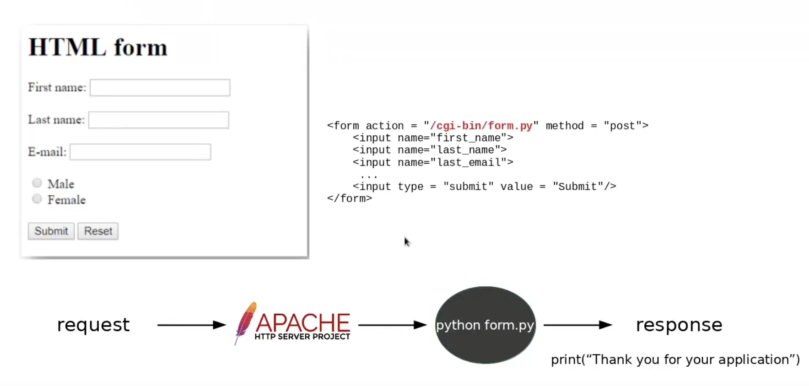
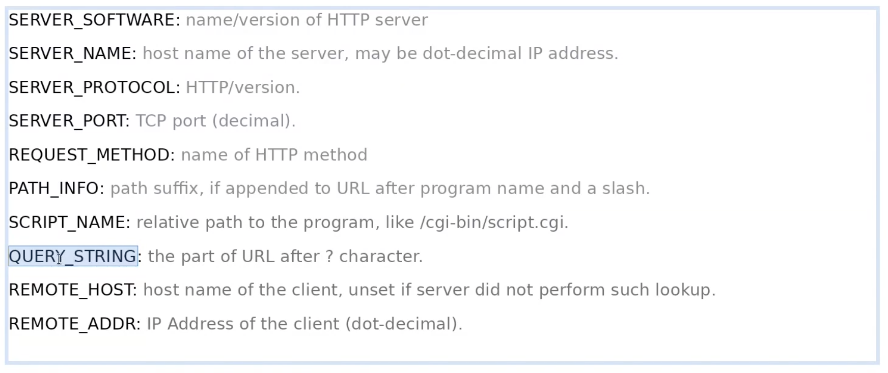
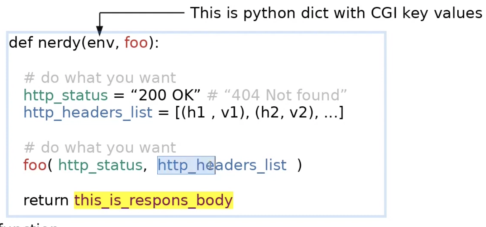
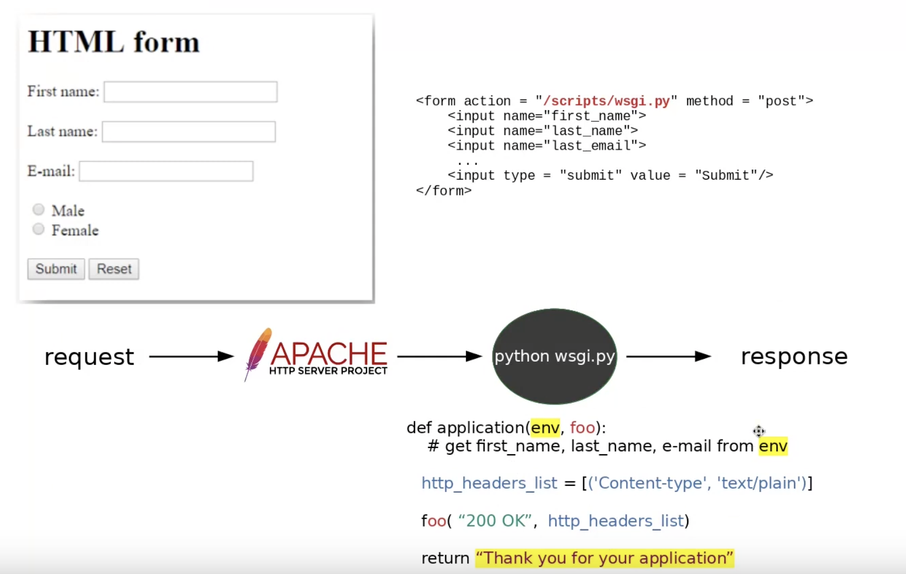
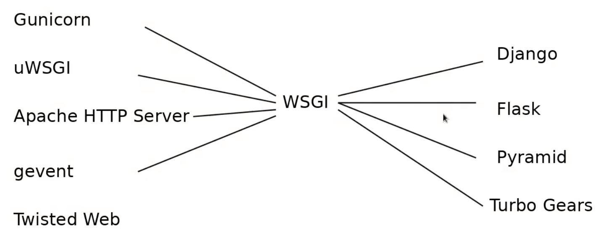

=========
Concepts
=========

WSGI (Web Server Gateway Interface)
====================================

What is a web server?
----------------------

In hardware terms, anything with a network connection could be a web server. Your laptop, raspberry pi, a smart phone, an IOT device or anything can serve as a web server.
So, it's not about hardware. Hardware is significant if you want to run heavy applications in a large scale.

Web server is a piece of **software** that **serves web content**. Any computer system with a network connection that runs this software is a web server. To serve web content, a web server **listens on a port for a request sent via a transport protocol and returns a response containing the requested resource**

**listens**

- once a web server starts up, it just sits there idle, waiting for incoming requests. If no request coming in, web server does nothing. Just like a customer care person Bob.

**on a port**

- So, what exactly the web server is listening to? The network port provided by the OS that the web server is running on. 
- We have 65535 ports that software running on the computer can communicate over. So, we can configure the web server to listen on one or many of those ports. 
- Just like calling the extension number of Bob (out of 65535 extensions out there). 
- By default, request will go to 80(HTTP) or 443(HTTPS). Just think of this as a language. Similar to Bob (who knows english sits at extension 80) and Adam (who knows spanish sits at extension 443).
- One single computer can have many web servers listening on different port. We just need to start the server on different different ports.

**for a request**: 

- *Web server speaks HTTP.* So, the request should come in HTTP language.
- Suppose we start a FTP server on port 8001 and we send a HTTP request from browser to this port. We will get INVALID RESPONSE. This is like calling a customer care who doesn't know french and you speak only french.

**sent via a transport protocol**

- HTTP is a application layer protocol. Even if Bob speaks english and Adam speaks French, both are voices and need a protocol to ensure delivery of theses voices. This is what TCP does. TCP understand voices here regardless of the language they speak.

**and returns a response**
**containing the requested resource**.
  
- the content returned by web server is not limited to web pages. It can be html, it can be a json, or if the requested resource is image, then returns an image. 
- from where server takes the content? 
- **static websites**: (resources from a directory on file system). content doesn't change.
- **dynamic website**: imagine you need to display a page based on who is logged in. the content is dynamic. In this case, save the data into a database and get it whenever required.

**HTTP**

- is just a TEXT. Has three components
- First line: GET - The request method, /project/hello.htm - the resource url, 1.1 - HTTP version.
- HTTP headers of key, value pairs.
- Optional Body
  

::

    GET /project/hello.htm HTTP/1.1
    User-Agent: Mozilla/4.0 (compatible; MSIE5.01; Windows NT)
    Host: www.tutorialspoint.com
    Accept-Language: en-us
    Accept-Encoding: gzip, deflate
    Connection: Keep-Alive

What is CGI (Common Gateway Interface)
---------------------------------------

Web or HTTP protocol is **static by design**. This means it can only return a static file from the web server. Http was designed to read resources like html, images, css etc. Back in 90s, HTML forms were new and HTTP didn't support it.

The solution was, the web server will process the request as usual but for some requests it will not send response blindly. Instead it will invoke an external script (for eg: a perl script) and let it process the request and return the response. 
Web server invoke external script foo.pl by **forking** and this **new process inherits environment variables**. Once web server receives requests, it process and creates environment variables and then do the forking and invoking perl script.
the script will read the user info from the environment variables and send the output.

In early 90s, dynamic web programming looked like this:

- developer created forms with action attributes. 
- user submit the form
- web server parses the request and detect that the request is designated to an external script. 
- Web server creates env variables describing that request.
- forks the external script
- return the response the external script returns.

Env variable names differ from web server to web server. The variables in Apache and Nginx were different. 

.. important:: **So, it is thought as a good idea to standardize the env variable regardless of web servers. This is how CGI was born**.

- CGI was born in 1997.
- **CGI is the standard for names and purpose for environment variables passed from web server to external script.**

What is WSGI 
-------------

By 2003, all webservers were operating with CGI scripts.

Python community extended the idea CGI further. **Instead of standardizing just the environment variable, python community standardized the way the script must be called**.

Any script to be called from web server must have a function as `func(<python dict of CGI envs>, <a function which must be called once from the function>)`

**Wsgi standard says this function (nerdy()) can be any callable**. i.e. any object with __call__ dunder.

- Web frames like django adhere to wsgi.
- **The purpose of WSGI is to standardize the way external scripts were executed on web servers.**
- WSGI can be easily integrated with any web server and flexible enough to execute any web framework with it.

So the form example above looks like this in wsgi:

WSGI vs uWSGI vs uwsgi 
^^^^^^^^^^^^^^^^^^^^^^^

- WSGI is a specification.
- uWSGI is a web server.  It's pretty common to pair Flask and uWSGI since they both talk WSGI.
- uwsgi is a binary protocol that the uWSGI server uses to talk to other servers like nginx.

Preforking
^^^^^^^^^^^

In the CGI section, we learned about forking new process for external script. This actually consume a lot of time. most of the time is wasted for loading the python script binary. Instead, a web server can do preforking by creating couple of workers while sitting idle. A worker is nothing but an in memory python interpreter.

- Preforking is the responsibility of a web server. 
- Apache web server can pre fork a WSGI application. i.e. **Apache web server can run a django application**.
- **NGINX can't prefork a WSGI application**. However NGINX can forward HTTP request to another web server which can pre-fork your WSGI application. Popular choices of this web server are **Gunicorn** or **uWSGI**.

i.e. **Hence, Gunicorn & uWSGI can be called as a minimal webservers**

Why can't nginx directly call my Flask application?
^^^^^^^^^^^^^^^^^^^^^^^^^^^^^^^^^^^^^^^^^^^^^^^^^^^^^

Because nginx doesn't support the WSGI spec. Technically nginx could implement the WSGI spec if they wanted, they just haven't.
uWSGI is a full fledged http server that can and does work well on its own.  If you need super high throughput for static content, then you have the option of sticking nginx in front of your uWSGI server. When you do, they will communicate over a low level protocol known as uwsgi.

Gunicorn vs uWSGI
^^^^^^^^^^^^^^^^^^

Both are Python WSGI HTTP Servers. Both work well on its own. however, using with NGINX is a popular choice in production. See pre-forking.

WSGI compatible web servers and web frameworks
^^^^^^^^^^^^^^^^^^^^^^^^^^^^^^^^^^^^^^^^^^^^^^^^

Again, note that **nginx doesn't support the WSGI spec**.%                                                                                                    