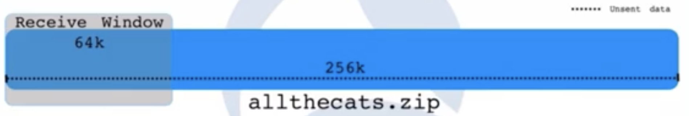

====================
Bench marking tools
====================

**Bandwidth**: The measurement of of the ability of an electronic communications device or system (such as a computer network) to send and receive information.

    - Total raw capacity.

**Troughput**: The amount of data that enters and goes through something (such as a machine or system)

    - What you're actually getting.

**i.e. You have 100Mega Bytes of bandwidth but you're getting only 20MB throughput**
 
**BDP (Bandwidth Delay Product)**: The amount of data TCP should have withing the transmission path at any time in order to fully utilize the available capacity.

**How much data we can actually send**? = Min(BDP, RECEIVE_WINDOW)

Suppose you have to send a zip file..

This zip file actually a byte stream.

2 factors need to consider here,

1. The amount of data the receiver says it can receive.

    - **RECEIVE WINDOW**: RWIN, RWND, SO_RCVBUF
    - Amount of free space in the receiver's socket buffer.
    - The application reads the data from the buffer to free space.
    - Advertized in every packet in the TCP header (in bytes).

    - The space allocated to window size is 16bit integer - 64k max.
    - Windows scaling allows up to 1G - RFC 1323.
    - It must be supported by both hosts.
    - So, in this case, we have a receive window of 64k.

    - and we have a scaling factor. in this case 8, i.e multiply by 256 or shifting 8 bits left.

    - i.e. the Advertized value is 3045 and we need to multiply 256 to get the actual window size.
    - 

2. The amount of data sender thinks it can send.

Iperf 
======

Iperf is an open source tool to measure maximum achievable bandwidth between servers/machines on IP networks (supports TCP, UDP, STCP, with IPV4 & IPV6)

- It is available for all platforms (linux, windows, mac etc).
- default port where iperf server listens to is 5201.
- https://confluence.oraclecorp.com/confluence/display/~anil.palakunnathu.kunnengeri@oracle.com/iperf

Install
---------

::

    yum install iperf3

Find the bandwidth between two systems 
---------------------------------------

On the server, start iperf using `-s`::

    $ iperf3 -s
    -----------------------------------------------------------
    Server listening on 5201
    -----------------------------------------------------------

From the client, send traffic (`-c`)::

    $ iperf3 -c 100.102.116.214
    Connecting to host 100.102.116.214, port 5201
    [  5] local 100.102.116.214 port 34344 connected to 100.102.116.214 port 5201
    [ ID] Interval           Transfer     Bitrate         Retr  Cwnd
    [  5]   0.00-1.00   sec  3.21 GBytes  27.6 Gbits/sec    0    959 KBytes       
    [  5]   1.00-2.00   sec  3.25 GBytes  27.9 Gbits/sec    0    959 KBytes       
    [  5]   2.00-3.00   sec  3.34 GBytes  28.7 Gbits/sec    0    959 KBytes       
    [  5]   3.00-4.00   sec  3.36 GBytes  28.9 Gbits/sec    0    959 KBytes       
    [  5]   4.00-5.00   sec  3.39 GBytes  29.1 Gbits/sec    0    959 KBytes       
    [  5]   5.00-6.00   sec  3.30 GBytes  28.4 Gbits/sec    0    959 KBytes       
    [  5]   6.00-7.00   sec  3.26 GBytes  28.0 Gbits/sec    0   1.06 MBytes       
    [  5]   7.00-8.00   sec  3.13 GBytes  26.9 Gbits/sec    0   1.06 MBytes       
    [  5]   8.00-9.00   sec  3.30 GBytes  28.3 Gbits/sec    0   1.06 MBytes       
    [  5]   9.00-10.00  sec  3.32 GBytes  28.5 Gbits/sec    0   1.06 MBytes       
    - - - - - - - - - - - - - - - - - - - - - - - - -
    [ ID] Interval           Transfer     Bitrate         Retr
    [  5]   0.00-10.00  sec  32.9 GBytes  28.2 Gbits/sec    0             sender
    [  5]   0.00-10.00  sec  32.9 GBytes  28.2 Gbits/sec                  receiver

    iperf Done.

Server side also, we can see the details now::

    $ iperf3 -s
    -----------------------------------------------------------
    Server listening on 5201
    -----------------------------------------------------------
    Accepted connection from 100.102.116.214, port 34342
    [  5] local 100.102.116.214 port 5201 connected to 100.102.116.214 port 34344
    [ ID] Interval           Transfer     Bitrate
    [  5]   0.00-1.00   sec  3.21 GBytes  27.6 Gbits/sec                  
    [  5]   1.00-2.00   sec  3.25 GBytes  27.9 Gbits/sec                  
    [  5]   2.00-3.00   sec  3.34 GBytes  28.7 Gbits/sec                  
    [  5]   3.00-4.00   sec  3.36 GBytes  28.9 Gbits/sec                  
    [  5]   4.00-5.00   sec  3.39 GBytes  29.1 Gbits/sec                  
    [  5]   5.00-6.00   sec  3.30 GBytes  28.4 Gbits/sec                  
    [  5]   6.00-7.00   sec  3.26 GBytes  28.0 Gbits/sec                  
    [  5]   7.00-8.00   sec  3.14 GBytes  26.9 Gbits/sec                  
    [  5]   8.00-9.00   sec  3.30 GBytes  28.3 Gbits/sec                  
    [  5]   9.00-10.00  sec  3.32 GBytes  28.5 Gbits/sec                  
    [  5]  10.00-10.00  sec   384 KBytes  19.2 Gbits/sec                  
    - - - - - - - - - - - - - - - - - - - - - - - - -
    [ ID] Interval           Transfer     Bitrate
    [  5]   0.00-10.00  sec  32.9 GBytes  28.2 Gbits/sec                  receiver
    -----------------------------------------------------------
    Server listening on 5201
    -----------------------------------------------------------

Once done, server will again listen at 5201.

- `$ iperf3 -c 10.1.15.6 -w 8192 -i 5 -t 30` - For 30 seconds, results in every 5 seconds window size 8192.

uperf
=======

installation
-------------

::

    yum install uperf

