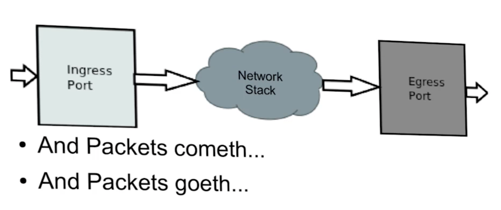
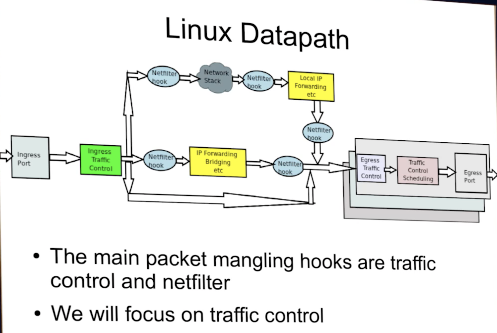
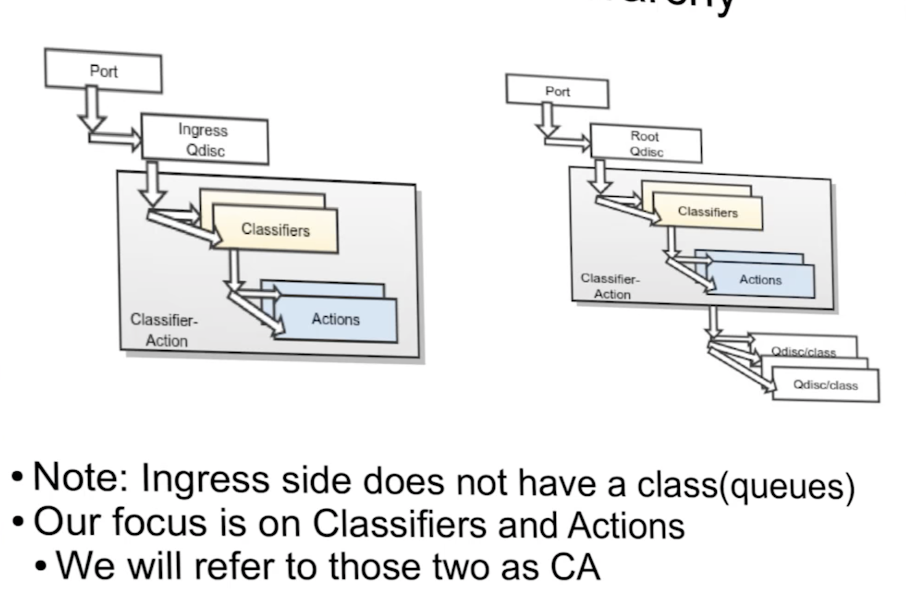

============================
Linux Traffic Control (tc)
============================

https://www.youtube.com/watch?v=cyeJYjZHv5M

Life of a packer starts with an ingress port and success defines when it goes through egress port.

Linux Data Path.

- Netfilter hook is the pre routing. Something will happen here before the forwarding function.
- Netfilter hooks are essentially callbacks or filters located in the strategic points in the datapath.

Traffic Control Hierarchy

Classifiers
==============

- Classifiers holds filters which segregate traffic. Built-in default classifier based on protocol.
- Examples of classifiers:

    - u32: used to build an efficient tree for packet lookup based on chunks of 32-bit packet blocks.
    - fw:
    - route: efficient with IP based route attribute.
    - rsvp:
    - basic:
    - bpf:
    - flow:
    - openflow:

- Each does something they are good at (Unix Philosophy)