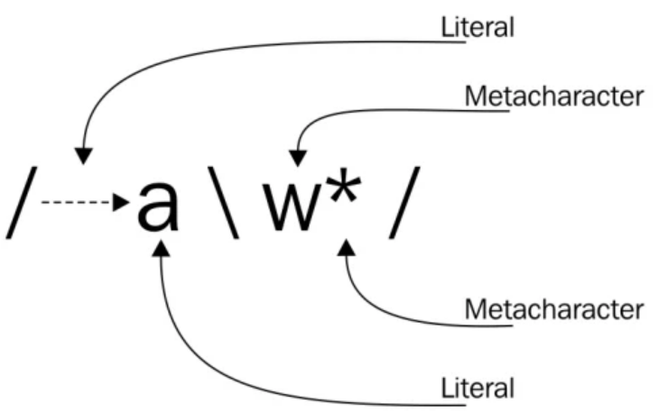
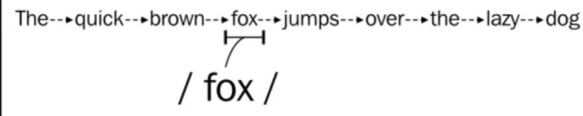
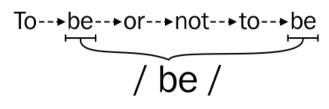
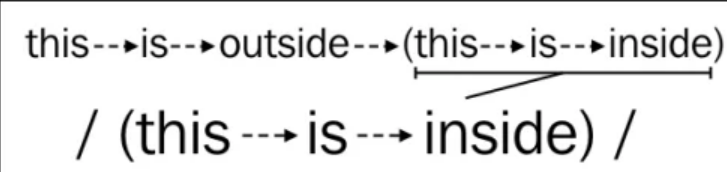
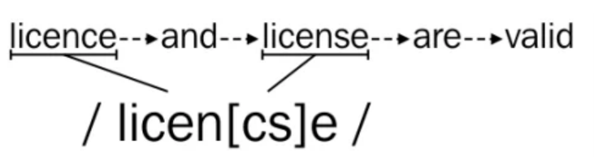

=======
Regex
=======

.. toctree::
   :maxdepth: 3
   :caption: Contents:

Reference: Mastering Python Regular Expressions (Felix Lopez, Victor Romero)

Introduction
=============

**Some people, when confronted with a problem, think "I know I will use regular expressions". Now they have two problems**

Usecase
---------

- Check if an input honors a given pattern.
- Extract specific details from a text.
- Replace specific portion of a text with some other text.
- Split larger to smaller pieces (split with comma, \n etc.)

Literals and Metacharacters
----------------------------

Literals are the simplest pattern matching regular expressions.

we can also obtain several results instead of just one, if we apply the regular expression /be/ to the following phrase To be, or not to be

    
if we apply the expression /(this is inside)/ to search the text this is outside (this is inside), we will find that the parentheses are not included in the result. This happens because parentheses are metacharacters and they have a special meaning.

Using the backslash method, we can convert the previous expression to /\(this is inside\)/ and apply it again to the same text to have the parentheses included in the result:

12 metacharacters that should be escaped
-----------------------------------------

- Backslash \
- Caret ^
- Dollar sign $
- Dot .
- Pipe symbol |
- Question mark ?
- Asterisk *
- Plus sign +
- Opening parenthesis (
- Closing parenthesis )
- Opening square bracket [
- The opening curly brace {

.. important::
  In some cases, the regular expression engines will do their best to understand if they should have a literal meaning even if they are not escaped; for example, the opening curly brace { will only be treated as a metacharacter if it's followed by a number to indicate a repetition

Character classes
------------------

To define a character that will match if **any of the defined characters** on the set is present

Predefined character classes:

- **.**: This element matches any character except newline \n.
- **\d**: This matches any decimal digit; this is equivalent to the class [0-9]
- **\D**: This matches any non-digit character; this is equivalent to the class [^0-9]
- **\s**: This matches any alphanumeric character; this is equivalent to the class `[a-zA-Z0-9_]`
- **\W**: This matches any non-alphanumeric character; this is equivalent to the class `[^a-zA-Z0-9_]`

Alternation
--------------

To match against a set of regular expressions using the pipe symbol `|`.

example: `/yes|no/`

Quantifiers
------------

- `{n,m}`: Between n and m times
- `?`: Optional (0 or 1 repetitions) = `{,1}`
- `*`: Zero or more times = `{0,}`
- `+`: One or more times = `{1,}`

Greedy and Non-greedy (reluctant)
----------------------------------

Suppose we have `English "Hello", Spanish "Hola".` We want to match `"Hello"` and `"Hola"`.

- By default `".+"` will match `"Hello", Spanish "Hola"` and this is called **Greedy** matching.
- A greedy quantifier will try to match as much as possible to have the biggest match result possible.

.. important:
  - A non-greedy behavior can be requested by adding an extra question mark to the quantifier.
  - ??, *? or +?.

Boundary Matchers
------------------

- `^`  - Matches at the begining of a line.
- `$`  - Matches at the end of a line.
- `\b` - Matches word boundary.
- `\B` - Matches the opposite of \b. Anything that is not a word boundary
- `\A` - Matches the beginning of the input
- `\Z` - Matches the end of the input

example:

- `/\bhello\b/` will match hello. `/hello/` will match `hello`, `othello`, `helloed` etc.

Python Regular Expressions
===========================

- Python provides **Perl-style** regular expressions (with some exceptions).
- Patterns and strings can be **Unicode** as well as **8-bit ASCII** strings.
- Need to import python regex module before using it (`import re`).
- We can compile and transform a pattern to **bytecode** using `re.compile()`.

Example::

  >>> import re
  >>> pattern = re.compile(r'\bHello\b')
  >>> pattern.match("Hello World")
  <re.Match object; span=(0, 5), match='Hello'>

- backslash

  - backslash is used to indicate metacharacter in regular expressions (\b, \d, \s, \w etc.)
  - backslash is also used to escape special characters (\[, \/, etc.)
  - So, to add a backslash in a pattern, you need to provide 4 backslashes `\\\\`. 
  
    - Before `re` sees the string, the python interpreter will recognise `\\` as `\` and `\\\\` as `\\`. 
	- Since regex uses "\" as escape character, it will take the "\" .

::

	>>> pattern = re.compile('\') # SyntaxError: unterminated string literal
	>>> pattern = re.compile('\\') # re.error: bad escape (end of pattern).
	>>> pattern = re.compile('\\\\') # SyntaxError: unterminated string literal
	>>> pattern = re.compile('\\\\')
	>>> pattern.match('\hello')
	<re.Match object; span=(0, 1), match='\\'>

- Python provides **Raw string notation** in which backslashes are treated as normal characters.

::

	>>> pattern = re.compile(r'\') # SyntaxError: unterminated string literal
	>>> pattern = re.compile(r'\\')
	>>> pattern.match('\') # SyntaxError: unterminated string literal
	>>> pattern.match(r'\') # SyntaxError: unterminated string literal
	>>> pattern.match(r'\\')
	<re.Match object; span=(0, 1), match='\\'>
	>>> pattern.match('\\')
	<re.Match object; span=(0, 1), match='\\'>

	>>> pattern = re.compile(r'\\\') # SyntaxError: unterminated string literal

- Use `u'<pattern>'` for Unicode strings. `ur'<pattern>'` for Unicode raw strings.

- There are 2 ways of matching patterns and executing the regex operations.

	- To reuse a pattern, better compile it and reuse it::

		pattern = re.compile(<regex>)
		pattern.match(<your string>)

	- directly perform the operation::

		re.match(<pattern>, <your string>)

- The `re` module caches the compiled pattern. You can use `re.purge()` to clear the cache.

Search methods
---------------

re.match
^^^^^^^^^

- Syntax: `re.match(string [, pos [, endpos]])`
- **pos** says where to start searching.
- Tries to match the pattern **only at the begining of the string**.

::

	>>> pat = re.compile(r'World')
	>>> pat.match('Hello World') # no match
	>>> pat.match('Hello World', 6)
	<re.Match object; span=(6, 11), match='World'>

.. important::
	- The **pos > 0** doesn't mean search starts at that index.

	::

		>>> pat = re.compile(r'^World')
		>>> pat.match('Hello World', 6) # no match

	- this problem is not there with `endpos`.::

		>>> pat = re.compile(r'Hello$')
		>>> pat.match('Hello World', 0, 6) # there is a match even though it uses `$`.
		<re.Match object; span=(0, 5), match='Hello'>

re.search
^^^^^^^^^^

- Syntax: `re.search(string [, pos [, endpos]])`
- Tries to match at **any location** of the string, not just the start.
- This method works like match of many languages including Perl.

	::

		>>> pat = re.compile(r'World')
		>>> pat.match('Hello World') # no match
		>>> pat.search('Hello World')
		<re.Match object; span=(6, 11), match='World'>

- `^` symbol matches at the beginning of each line with `re.MULTILINE` 

	::

		>>> pat = re.compile(r'^World', re.MULTILINE)
		>>> pat.search(r'Hello \n World')
		>>> pat.search('Hello \nWorld')
		<re.Match object; span=(7, 12), match='World'>

re.findall
^^^^^^^^^^^

- Returns a list with all non-overlapping occurrances of a pattern.

To return all words starting with H::

	>>> pat = re.compile(r'H\w+')
	>>> pat.findall('Hi Ken, How are you?')
	['Hi', 'How']

Empty matches are also a part of the list::

	>>> pat = re.compile(r'b*')
	>>> pat.findall('abbbcbd')
	['', 'bbb', '', 'b', '', '']

	- pos#0: it matches empty string.
	- pos#1: it greedily matches bbb and reaches at pos 4.
	- pos#4: it matches empty string.
	- pos#5: it matches b.
	- pos#6: matches empty string.
	- pos#7: there is a `$` and this matches empty string.

re.finditer
^^^^^^^^^^^^

- Same as findall() but returns an iterator instead of list.

::

	>>> pat = re.compile(r'\d+')
	>>> result = pat.finditer("Hi 2022, How was the 12 months?")
	>>> next(result)
	<re.Match object; span=(3, 7), match='2022'>
	>>> next(result)
	<re.Match object; span=(21, 23), match='12'>
	>>> next(result)
	Traceback (most recent call last):
	  File "<stdin>", line 1, in <module>
	StopIteration

Modify methods
---------------

split
-------

Split is more powerful if we can use regex in pattern::

	>>> pat = re.compile(r"\W")
	>>> pat.split("Beautiful is better than ugly")
	['Beautiful', 'is', 'better', 'than', 'ugly']

sub
-----

::

	>>> pat = re.compile(r"[0-9]+")
	>>> pat.sub("-", "order123 order323 order45 order2344")
	'order- order- order- order-'

Note that it replaces **leftmost non-overlapping** occurrances of the pattern.

::

	>>> re.sub('00', '-', 'order00000')
	'order--0'

Do standardization as follows using regex.

	- replace all numbers starting with `01` with `KL`.
	- replace all numbers starting with `10` with `DL`.
	- replace all numbers starting with `02` with `TN`.

We know that::

	>>> re.match(r'01|10|03', '1023243').group()
	'10'

::

	>>> def groupify(match_obj):
	...     if match_obj.group() == '01': return 'KL'
	...     elif match_obj.group() == '10': return 'DL'
	...     elif  match_obj.group() == '03': return 'TN'
	...     else: return 'NA'
	...
	>>> re.sub(r'01|10|03', groupify, '0312324')
	'TN12324'
	>>> re.sub(r'01|10|03', groupify, '1012324')
	'DL12324'
	>>> re.sub(r'01|10|03', groupify, '1112324')
	'1112324'			# no match, means match_obj is null and no substitution.
	>>> re.sub(r'01|10|03|11', groupify, '1112324')
	'NA12324'

	>>> re.sub(r'^\d{2}', groupify, '1012324')
	'DL12324'
	>>> re.sub(r'^\d{2}', groupify, '0112324')
	'KL12324'
	>>> re.sub(r'^\d{2}', groupify, '0312324')
	'TN12324'
	>>> re.sub(r'^\d{2}', groupify, '1212324')
	'NA12324'

Use backreference using `\g<number>`::

	>>> re.sub(r'\*(.*?)\*', r'<b>\g<1><\\b>', 'amount is *121.00* and total=**183.23**')
	'amount is <b>121.00<\\b> and total=<b><\\b>183.23<b><\\b>'

