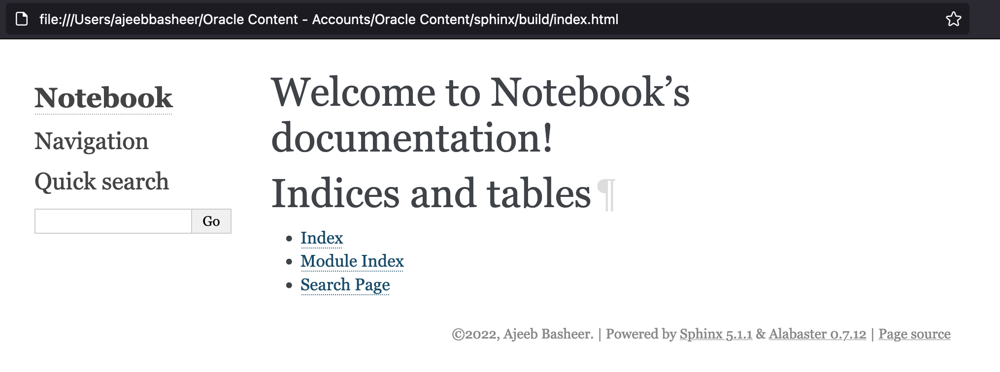
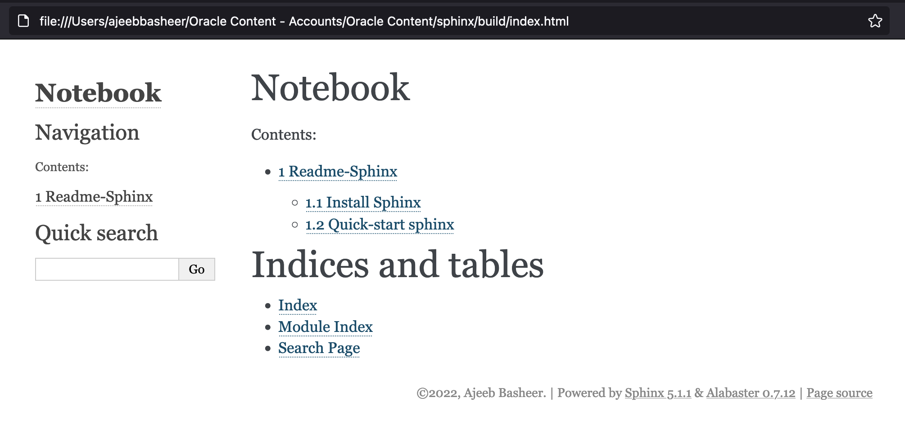

==============
Readme-Sphinx
==============

.. sectnum::

.. contents::

Frequently Used Commands
=========================

::

	sphinx-build -b html source build -q

Install Sphinx
===============

Create virtual environment

::

	[2022-08-21 16:19:52]: ~/envs $ python3 -m venv sphinx

Install sphinx

::

	pip install sphinx

Can also install using yum, apt-get or brew as follows:

::

	apt-get install python3-sphinx
		or
	yum install python-sphinx
		or
	brew install sphinx-doc

Quick-start sphinx
===================

::

	$ sphinx-quickstart

::

	(sphinx) [2022-08-21 16:26:33]: Oracle Content/sphinx $ sphinx-quickstart
	Welcome to the Sphinx 5.1.1 quickstart utility.

	Please enter values for the following settings (just press Enter to
	accept a default value, if one is given in brackets).

	Selected root path: .

	You have two options for placing the build directory for Sphinx output.
	Either, you use a directory "_build" within the root path, or you separate
	"source" and "build" directories within the root path.
	> Separate source and build directories (y/n) [n]: y

	The project name will occur in several places in the built documentation.
	> Project name: Notebook
	> Author name(s): Ajeeb Basheer
	> Project release []: 

	If the documents are to be written in a language other than English,
	you can select a language here by its language code. Sphinx will then
	translate text that it generates into that language.

	For a list of supported codes, see
	https://www.sphinx-doc.org/en/master/usage/configuration.html#confval-language.
	> Project language [en]: 

	Creating file /Users/ajeebbasheer/Oracle Content - Accounts/Oracle Content/sphinx/source/conf.py.
	Creating file /Users/ajeebbasheer/Oracle Content - Accounts/Oracle Content/sphinx/source/index.rst.
	Creating file /Users/ajeebbasheer/Oracle Content - Accounts/Oracle Content/sphinx/Makefile.
	Creating file /Users/ajeebbasheer/Oracle Content - Accounts/Oracle Content/sphinx/make.bat.

	Finished: An initial directory structure has been created.

	You should now populate your master file /Users/ajeebbasheer/Oracle Content - Accounts/Oracle Content/sphinx/source/index.rst and create other documentation
	source files. Use the Makefile to build the docs, like so:
	   make builder
	where "builder" is one of the supported builders, e.g. html, latex or linkcheck.

Files created 
--------------

::

	(sphinx) [2022-08-21 16:35:57]: Oracle Content/sphinx $ ls
	Makefile		build			make.bat		source

Makefile
^^^^^^^^^

::
	
	$ cat Makefile
	# Minimal makefile for Sphinx documentation
	#

	# You can set these variables from the command line, and also
	# from the environment for the first two.
	SPHINXOPTS    ?=
	SPHINXBUILD   ?= sphinx-build
	SOURCEDIR     = source
	BUILDDIR      = build

	# Put it first so that "make" without argument is like "make help".
	help:
		@$(SPHINXBUILD) -M help "$(SOURCEDIR)" "$(BUILDDIR)" $(SPHINXOPTS) $(O)

	.PHONY: help Makefile

	# Catch-all target: route all unknown targets to Sphinx using the new
	# "make mode" option.  $(O) is meant as a shortcut for $(SPHINXOPTS).
	%: Makefile
		@$(SPHINXBUILD) -M $@ "$(SOURCEDIR)" "$(BUILDDIR)" $(SPHINXOPTS) $(O)

make.bat
^^^^^^^^^

::

	$ cat make.bat
	@ECHO OFF

	pushd %~dp0

	REM Command file for Sphinx documentation

	if "%SPHINXBUILD%" == "" (
		set SPHINXBUILD=sphinx-build
	)
	set SOURCEDIR=source
	set BUILDDIR=build

	%SPHINXBUILD% >NUL 2>NUL
	if errorlevel 9009 (
		echo.
		echo.The 'sphinx-build' command was not found. Make sure you have Sphinx
		echo.installed, then set the SPHINXBUILD environment variable to point
		echo.to the full path of the 'sphinx-build' executable. Alternatively you
		echo.may add the Sphinx directory to PATH.
		echo.
		echo.If you don't have Sphinx installed, grab it from
		echo.https://www.sphinx-doc.org/
		exit /b 1
	)

	if "%1" == "" goto help

	%SPHINXBUILD% -M %1 %SOURCEDIR% %BUILDDIR% %SPHINXOPTS% %O%
	goto end

	:help
	%SPHINXBUILD% -M help %SOURCEDIR% %BUILDDIR% %SPHINXOPTS% %O%

	:end
	popd

build
^^^^^^

No files created in this folder.

::

	$ ls -ltr build 

source 
^^^^^^^

::

	$ ls -ltr source 
	total 16
	drwxr-xr-x  2 ajeebbasheer  staff   64 Aug 21 16:34 _templates
	drwxr-xr-x  2 ajeebbasheer  staff   64 Aug 21 16:34 _static
	-rw-r--r--  1 ajeebbasheer  staff  912 Aug 21 16:34 conf.py
	-rw-r--r--  1 ajeebbasheer  staff  440 Aug 21 16:34 index.rst

source/_templates
~~~~~~~~~~~~~~~~~~

::

	$ ls -lrt source/_templates

source/_static
~~~~~~~~~~~~~~~

::

	$ ls -lrt source/_static  
 

source/conf.py
~~~~~~~~~~~~~~~

::

	$ cat source/conf.py 
	# Configuration file for the Sphinx documentation builder.
	#
	# For the full list of built-in configuration values, see the documentation:
	# https://www.sphinx-doc.org/en/master/usage/configuration.html

	# -- Project information -----------------------------------------------------
	# https://www.sphinx-doc.org/en/master/usage/configuration.html#project-information

	project = 'Notebook'
	copyright = '2022, Ajeeb Basheer'
	author = 'Ajeeb Basheer'

	# -- General configuration ---------------------------------------------------
	# https://www.sphinx-doc.org/en/master/usage/configuration.html#general-configuration

	extensions = []

	templates_path = ['_templates']
	exclude_patterns = []

	# -- Options for HTML output -------------------------------------------------
	# https://www.sphinx-doc.org/en/master/usage/configuration.html#options-for-html-output

	html_theme = 'alabaster'
	html_static_path = ['_static']

source/index.rst
~~~~~~~~~~~~~~~~~

- The main function of the root document is to serve as a welcome page, and to contain the root of the “table of contents tree” (or toctree). his is one of the main things that Sphinx adds to reStructuredText, a way to connect multiple files to a single hierarchy of documents.
- The toctree directive initially is empty, and looks like so:

::

	$ cat source/index.rst 
	.. Notebook documentation master file, created by
	   sphinx-quickstart on Sun Aug 21 16:34:02 2022.
	   You can adapt this file completely to your liking, but it should at least
	   contain the root `toctree` directive.

	Welcome to Notebook's documentation!
	====================================

	.. toctree::
	   :maxdepth: 2
	   :caption: Contents:

	Indices and tables
	==================

	* :ref:`genindex`
	* :ref:`modindex`
	* :ref:`search`

- You add documents listing them in the content of the directive:

Run the build
----------------

::

	$ sphinx-build -b html source build   
	Running Sphinx v5.1.1
	building [mo]: targets for 0 po files that are out of date
	building [html]: targets for 1 source files that are out of date
	updating environment: [new config] 1 added, 0 changed, 0 removed
	reading sources... [100%] index                                                                                                                               
	looking for now-outdated files... none found
	pickling environment... done
	checking consistency... done
	preparing documents... done
	writing output... [100%] index                                                                                                                                
	generating indices... genindex done
	writing additional pages... search done
	copying static files... done
	copying extra files... done
	dumping search index in English (code: en)... done
	dumping object inventory... done
	build succeeded.

	The HTML pages are in build.

Files created
^^^^^^^^^^^^^^^

::

	(sphinx) [2022-08-21 18:51:57]: Oracle Content/sphinx $ cd build 
	(sphinx) [2022-08-21 18:52:06]: sphinx/build $ tree
	.
	├── _sources
	│   └── index.rst.txt
	├── _static
	│   ├── _sphinx_javascript_frameworks_compat.js
	│   ├── alabaster.css
	│   ├── basic.css
	│   ├── custom.css
	│   ├── doctools.js
	│   ├── documentation_options.js
	│   ├── file.png
	│   ├── jquery-3.6.0.js
	│   ├── jquery.js
	│   ├── language_data.js
	│   ├── minus.png
	│   ├── plus.png
	│   ├── pygments.css
	│   ├── searchtools.js
	│   ├── underscore-1.13.1.js
	│   └── underscore.js
	├── genindex.html
	├── index.html
	├── objects.inv
	├── search.html
	└── searchindex.js

- Click on index.html

Add an image 
-------------

let's add an image in the root folder.

::

	(sphinx) [2022-08-21 18:44:01]: sphinx/source $ ls -lrt welcome_page.png 
    -rw-r--r--@ 1 ajeebbasheer  staff  168910 Aug 21 16:43 welcome_page.png

Now run the build command.

::

	(sphinx) [2022-08-21 18:45:00]: sphinx/source $ cd ..
	(sphinx) [2022-08-21 18:45:01]: Oracle Content/sphinx $ sphinx-build -b html source build 
	Running Sphinx v5.1.1
	loading pickled environment... done
	building [mo]: targets for 0 po files that are out of date
	building [html]: targets for 1 source files that are out of date
	updating environment: 0 added, 1 changed, 1 removed
	reading sources... [100%] index                                                                                                                               
	looking for now-outdated files... none found
	pickling environment... done
	checking consistency... done
	preparing documents... done
	writing output... [100%] index                                                                                                                                
	generating indices... genindex done
	writing additional pages... search done
	copying static files... done
	copying extra files... done
	dumping search index in English (code: en)... done
	dumping object inventory... done
	build succeeded.

	The HTML pages are in build.

You can see nothing changed in the build directory:

Unless you add this image to an RST file, nothing will be changed. So, let's add
an another rst file and add the image there.

::

	(sphinx) [2022-08-21 18:58:08]: sphinx/source $ ls _images/readme_sphinx/
	welcome_page.png

	$ ls readme_sphinx.rst
	readme_sphinx.rst

In the rst file:

::

	.. image:: _images/readme_sphinx/welcome_page.png
	  :width: 600
	  :align: center

.. important:: now add the readme_sphinx.rst in the index.rst

::

	(sphinx) [2022-08-21 19:05:20]: Oracle Content/sphinx $ cat source/index.rst
	.. Notebook documentation master file, created by
	sphinx-quickstart on Sun Aug 21 16:34:02 2022.
	You can adapt this file completely to your liking, but it should at least
	contain the root `toctree` directive.

	Notebook
	=========

	.. toctree::
	   :maxdepth: 2
	   :caption: Contents:

	   readme_sphinx

	Indices and tables
	==================

	* :ref:`genindex`
	* :ref:`modindex`
	* :ref:`search`

Run the build:

::

	(sphinx) [2022-08-21 19:07:10]: Oracle Content/sphinx $ sphinx-build -b html source build 
	Running Sphinx v5.1.1
	loading pickled environment... done
	building [mo]: targets for 0 po files that are out of date
	building [html]: targets for 2 source files that are out of date
	updating environment: 0 added, 0 changed, 0 removed
	looking for now-outdated files... none found
	preparing documents... done
	writing output... [100%] readme_sphinx                                                                                                                        
	generating indices... genindex done
	writing additional pages... search done
	copying images... [100%] _images/readme_sphinx/welcome_page.png                                                                                                
	copying static files... done
	copying extra files... done
	dumping search index in English (code: en)... done
	dumping object inventory... done
	build succeeded.

	The HTML pages are in build.

See the build folder.
- You can see a new folder `_images` created.
- You can see the rst file added to `_sources`.

::

	(sphinx) [2022-08-21 19:08:49]: sphinx/build $ tree 
	.
	├── _images
	│   └── welcome_page.png
	├── _sources
	│   ├── index.rst.txt
	│   └── readme_sphinx.rst.txt
	├── _static
	│   ├── _sphinx_javascript_frameworks_compat.js
	│   ├── alabaster.css
	│   ├── basic.css
	│   ├── custom.css
	│   ├── doctools.js
	│   ├── documentation_options.js
	│   ├── file.png
	│   ├── jquery-3.6.0.js
	│   ├── jquery.js
	│   ├── language_data.js
	│   ├── minus.png
	│   ├── plus.png
	│   ├── pygments.css
	│   ├── searchtools.js
	│   ├── underscore-1.13.1.js
	│   └── underscore.js
	├── genindex.html
	├── index.html
	├── objects.inv
	├── readme_sphinx.html
	├── search.html
	└── searchindex.js

How to add a copy to clipboard option in rst 
----------------------------------------------

- Install sphinx-copybutton 

::

	$ pip install sphinx-copybutton 

- Add to extensions in `conf.py`.

::

	extensions = ['sphinx_copybutton']

- Add the following in rst file.

::

	Run the command::

    $ uname -a

- Rerun th build `sphinx-build -b html source build`. You can see the copy to clipboard option.

