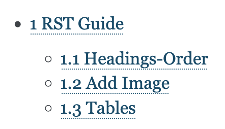
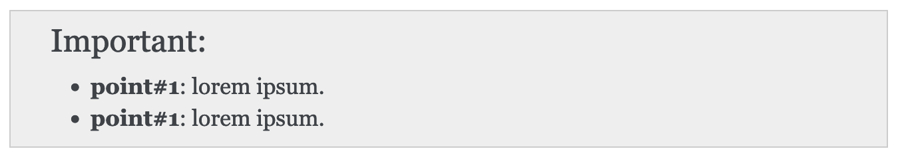

==========
RST Guide
==========

.. sectnum::

.. contents::

Headings-Order
==============

::

    ============
    Main Title
    ============

    ============
        ------------
            ^^^^^^^^^^^^
                ~~~~~~~~~~~~
                    ''''''''''''

Add Image 
==========

::

    .. image:: _images/readme-sphinx/readme_sphinx.png
      :width: 600
      :align: center

Tables
==========

csv table
-----------

::

    .. csv-table:: 
       :header: "Category", "Command", "Use"
       :widths: 10, 20, 15

       a, b, c
       e, f, g

list-table
-----------

::

    .. list-table:: Frozen Delights!
        :widths: 15 10 30
        :header-rows: 1

        * - Treat
          - Quantity
          - Description
        * - Albatross
          - 2.99
          - On a stick!
        * - Crunchy Frog
          - 1.49
          - If we took the bones out, it wouldn't be
            crunchy, now would it?
        * - Gannet Ripple
          - 1.99
          - On a stick!

Directives
===========

section numbers
-----------------

Provide this directive at the top::

    .. sectnum::

important
-----------

::

    .. important::
        - **point#1**: lorem ipsum. 
        - **point#1**: lorem ipsum. 

Notes::

    .. note::

Warnings::

    .. warning::

::
    
    .. hlist::
       :columns: 3

       * A list of
       * short items
       * that should be
       * displayed
       * horizontally

Tips
------

- Superscript: E = mc\ :sup:`2`.
- Subscript: H\ :sub:`2`\ 0.

Substitutions
^^^^^^^^^^^^^^^

::

    .. |Product| replace:: Apple

    My phone is built by |Product|