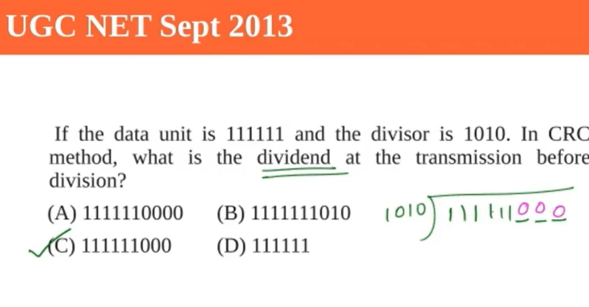
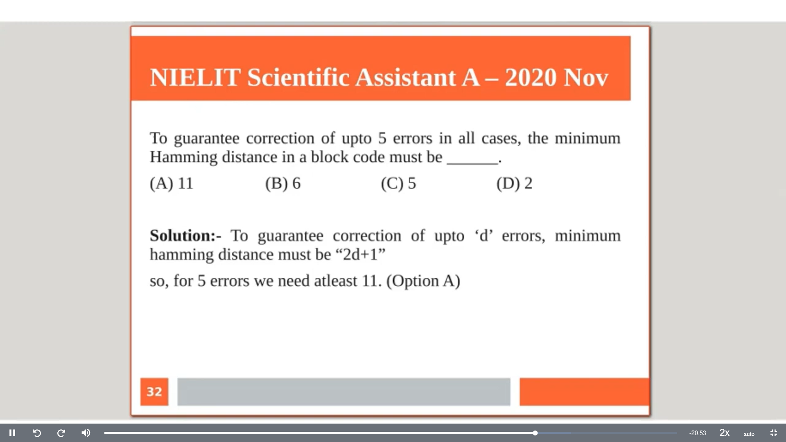
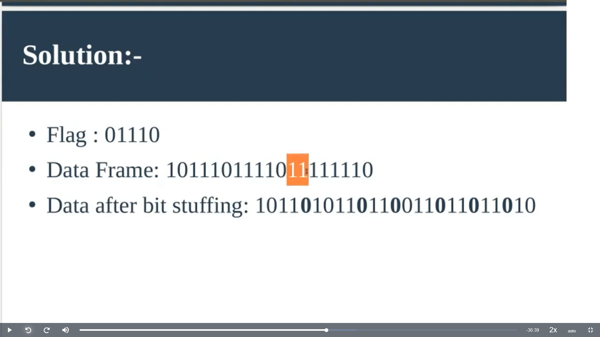
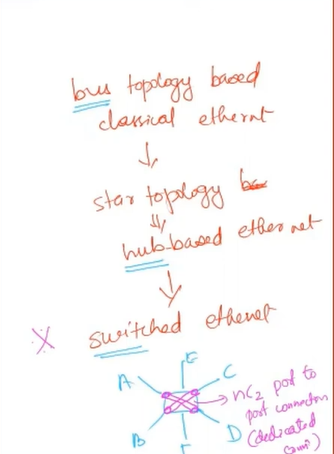

===============
DataLink Layer
===============

Main Duty: **HOP-TO-HOP** Communication

.. important:: As per TCP/IP model, error handling happens in Datalink layer, network layer or in transport layer.
    - Useful technic found in data link control protocols such as **HDLC** and in Transport protocols such as **TCP**

We can discuss this in general here.

- CSMA/CD - In reality we don't use this. We used switched ethernet.

.. important::
    - Currently, the typical speed of LAN or ethernet is **10 Gbps**. 30 years ago we had only classic ethernet which has only **10Mbps** speed.
    - Classical ethernet (10Mbps) was implemented by three organizations called **DIX** (DEC, Intel and Xerox). We call it DIX Ethernet.
    - Classic ethernet uses bus topology.
    - Then IEEE took it and released as 802.3 standard.
    - At that time the main competetor for ethernet was **Token Ring (by IBM)**. It offerred 100Mbps (when ethernet had only 10Mbps). So, rich companies started using token ring.
    - Later on after 10 years, ethernet acheived a speed of 100Mbps without increasing cost. This is called **FAST ETHERNET** at that times. We changed **bus topology** to **switched topology** at this time. i.e, we changed the **hub** to **switch**.
    - Ethernet was opensource but Token Ring was proprietary.
    - Then we saw 10000Mbps/ Gigabit ethernet and this is what we are using now.

- Hub: a shared common media. **Single collision domain**.
- Switch: there is a dedicated port-to-port connection is there. So collision domain is in single pair of ports.
    - topology is **Hybrid**. Star and Mesh.
- CSMA/CD Classical ethernet which uses bus --> Hub based ethernet with single collission domain --> Switched ethernet with Hybrid topology (this is what we are using now)

Error Detection
=================

- Error: 0 is recieved as 1 at reciever side or vise versa.
- Single Bit Error: isolated error and does not affect nearby bits.
- Burst error: in contiguous sequence of N bits in which first and last bits and any number of intermediate bits are recieved in error. Caused by,
    - **impulse noise**.
    - fading in wireless communication.

- Probabilities

- Note that there are cases in which the error detection/correction algorithms reports False positive or false negatives. i.e, reports error even if no error or vise versa. We have to tolerate such cases and they are rare. These errors are called **residual/undetected errors**.  
- We need to have algorithms with minimal residual errors.

General process of all error detection algorithms
---------------------------------------------------

- We have a message of k bits. You're passing this k bits through a function (CRC or any other algorithm).
- This function translate the k bits of data to some sequence of bits. This is E and this will help to find out if there was any error at the reciever side.
- Now we have n bits and this n bits are being recieved at reciever. We compare the k bits passed through the same function with n-k bits at the end.

Parity Check
^^^^^^^^^^^^^

- Simplest error detection algorithm.
- Append a parity bit at the beginning/end of message. 
- Example: A parity bit is attached to each 7 bit IRA (ASCII) code.

Cycle-Redundancy-Checks
^^^^^^^^^^^^^^^^^^^^^^^^

- We have a message M of length K. let's say the Message + FCS will be of length N.
- We have a patten P of length N-K. when we divide message with pattern, we should get a remainder of length N-K-1, i.e. one less than the pattern we use.
- CRC uses **modulo-2 arithmetic, ie, just ignore carry = Exclusive OR**.
- We can use polynomals as well for CRC. 

- Remainder should be one bit less than the length of pattern we use.
- Reciever will devide the entire message (k + (n-k)) with the same pattern.
    - If remainder == 0, then there is no error.(Don't forget about residual error, there is always a possibility for residual errors)
- Ethernet has frame size 1500 Bytes. In that, they use is a 32 bits for CRC pattern. So, the remainder will be **31 bits which is the actual FCS (Frame Check Sequence) in ethernet**.

**Why CRC works?**

- T = D + F (i.e, we need to do a concatenation not an addition here). That's why we shift the D bits (n-k) times. That's why we added (n-k) zeros in the calculation. left shift is nothing but multiplication by 2.

- Now we want the entire message exactly divisible by P with remainder 0.

CRC Pattern as polynomals:

CRC performance (Questions asked for GATE)
  

Widely used polynomals

  
.. important:: 
    - CRC-12: for transmission of streams of 6-bit characters and generates a 12-bit FCS.
    - CRC-16 and CRC-CCITT are popular for 8-bit characters, in US and Europe resp. and both results in 16-bit FCS.
    - **CRC-32**: is used in IEEE 802 LAN standards, i.e. **Ethernet** and **Token Rings**. 

Solution: 

.. image:: images/datalink/crc_prob4_sol.png
  :width: 500
  :align: center

Error Correction
==================

Error correction is better than error detection & retransmission in the following cases:

1. In more error prone communications such as **wireless communication**, error detection & retransmission is also an expensive thing as the probability of bit error is too high.
2. When propagation delay is too high. Example: **satellite communications**.

Also, retransmission requires retrasmitting the frame in error + all subsequent frames. This is another overhead.

Common Error Correction Process
----------------------------------

- FEC: forward error correction.
- Instead of appending to the end, we map k bit data to the n bit **codeword**. It can be anywhere.
    - (n, k) Block code means, we encode k-bit data bits into n-bit codeword.
    - with (n, k) block there are 2^k valid codewords out of 2^n possible codeword.
- **redundancy of the code** = redundant bits/data bits =  (n-k)/k.
- **code rate** = data bits/code bit = k/n

There are 4 cases at the reciever end:

1. No error.
2. Error is there, but correctable.
3. Detectable error but not correctable.
4. Algorithm is helpless here. We can't even detect the error. residual error. 

Hamming code - popular error correction algorithm
---------------------------------------------------

- **Hamming Distance** = d(v1, v2) = number of bits in which v1 and v2 disagree.
    - Applicable to all error correction algorithms, not only to hamming code.

- To find hamming distance of a system of code words, find the hamming distance bw all pair of code words and take the minimum.

In this case, we have data block of 2 bits (total 4 combination) and codeword of length 5 bits (total 32 combinations).
We map the 4 data blocks to 4 codewords using a mapping algorithm (**HAMMING CODE**). So, we have only 4 valid codewords and 28 other codewords are invalid.

Suppose we want to send a message "010011010010", we split them as 2 bits and codewords mapped to them will be sent to the reciever.

In the reciever end we check the message with the mapping table and if any of the code word belongs to the invalid 28 combination, then we can say there was an error in the communication.

Ok, now how can we correct the error?

We calculate the hamming distance between the recieved code and each valid codeword and take the unique one with minimum hamming distance.

- All 1 bit errors are correctable.
- All 2 bits errors are detected by this mapping table. But can't get corrected.

Note that the mapping table creation is very important and the algorithm to generate the table is called hamming code.

.. important:: 
    - **if a system with hamming distance of '2t+1' can correct all 't' bit errors**.
    - **to detect all 'x' bit errors, then the system should have a hamming distance of 'x+1'**
    - Increase Dmin (min of hamming distance between all pairs in the system) is the main challenge for an error correction algorithm. Hamming code is such an algorithm.

problems
^^^^^^^^^^

Solution.

if the value is a fraction, then take floor.

Hamming code
---------------

- Hamming code is a popular error correction code proposed by Richard W Hamming.

.. important:: If minimum hamming distance is D_min, then
    - Bit errors that can be **detected** is **D_min - 1**.
    - Bit errors that can be **corrected** is **(D_min - 1)/2**.
    - D_min = 3 means 2 bit errors can be detected, 1 bit errors can be corrected. 
    - We should focus on maximising the minimum hamming distance D_min to have an efficient error correction code.

- Hamming code can detect upto 2-bit errors or correct 1-bit errors without detection of uncorrected errors.
- So, D_min = 3.
- Hamming mainly focused on Hamming(7, 4) code. This adds 3 parity bits to 4 bits of data

How hamming code works
^^^^^^^^^^^^^^^^^^^^^^^^

We need to be able to detect and correct if there is any error occured at the reciever side.

Suppose the data to be transmitted is 1011001. The bits will be placed as follows.

First figure out the extra redundant to be added using formula "2^r >= m + r + 1", where m is 7 here. Find a 'r' which satisfy this condition and the value is 4.

So, we need to add 4 extra redundant bit. They are represented as R1, R2, R4, R8.

Now, we need to find the redundant bit. How to find R1, R2, R4 and R8?

R1 => Focus of all the bits in which it has a '1' in the least signficant position. Then fix R1 in such a way that the the bits in these fields will have even parity.

In this case, 3 (1), 5 (0), 7 (1), 9(1), 11(1) means we have 4 1's so to have even parity R1 must be 0

R2 => focus on the second last position
R4 => focus on the 3rd last position.
R8 => focus on MSB

The final message we transmit is "10101001110"

We know that Hamming code can correct 1 bit error. So, let's introduce a one bit error at 6th position.

reciever should understand that an error occured at 6th position.

- R1: 1, 3, 5, 7, 9, 11 => 4 1's means no even parity violation. => 0
- R2: 2, 3, 6, 7, 10, 11 =>  5 1's means there is a violation. => 1
- R4: 4, 5, 6, 7 => 3 1's => means there is a violation => 1
- R8: 8, 9, 10, 11 => 2 1's => no even parity violation => 0

==> 0 1 1 0 => 6 => There is an error at 6th position!

DataLink Layer Design Issues
=============================

Functions of DLL:
- Provide a service interface to network layer.
- Error control
- Flow control (slow sender and fast reciever or vice versa mismatch)
- Takes the data it gets from network layer and encapsulate them into **FRAMES** for transmission.
- PDU(Protocol data unit) in DLL is called frames.
- Each frame will have **Frame Header**, **Payload for holding the packet** and **frame trailer**.

.. image:: images/datalink/actual_commn.png
  :width: 200
  :align: center

DataLink layer can be designed to offer various services which vary from protocol to protocol. 3 reasonable possibilities are

**DO WE HAVE THE CONCEPT OF ACK IN ETHERNET??** - NO ACK CONCEPT IN CLASSIC ETHERNET!!!
    - WHY? - Ethernet is a cost-effective solution. They have compromised in many places.
        - used manchester encoding even though differential manchester is better. Token Ring uses differential manchester.
        - No ack in ethernet to make is cost-effective.
        - Their design philosophy is cost saving.
    - Ethernet is wired lan. We uses twisted pair and all so that noice and error will be very less. This is why we don't have ack service in ethernet.

Framing
--------

- It is important to mark start and end of a frame. **start of a frame delimit** to indicate the frame start.
- It is a 8byte string in ethernet. Using this we can identify the beginning of a frame.
- What if the data itself is having the same Preamble? There will be interframe delay.
- **Preamble** is added by phyical layer.

A good design should make it easy for reciever to determine the start of new frames with less Bandwidth usage.

There are 4 such methods

1. Byte count

the total number of bytes (including the count) is added at the beginning

if there is any error in byte count, then we will loose all the sync.

2. Flag bytes with byte stuffing

- use flags, i.e. some special pattern.
- no problem to use flag at the beginning but **for the end, what if the original data itself contains the flag bits?**
- we can overcome this by putting another flag called ESC. similar to escape sequence we use in strings.
- if there is ESC symbol, then reciever will not consider it as end delimiter.

- in the worst case, if all data is ESC or FLAG bits, then there will be heavy overload.

3. Flag bits with bits stuffing (IMPORTANT)

- It was developed for **HDLC Highlevel Data Link Control** protocol.
- If 0 followed by N 1's, then stuf a 0 at the N-1th position

4. Physical layer coding violations

- 4B/5B encoding
- 8B/10B encoding

Framing in ethernet and 802.11
--------------------------------

- Many data link protocols use combinations of different framing techniques
- begin with a well-defined pattern called **Preamble**.
- This pattern might be long (72 bits for 802.11) to allow reciever to prepare for an incoming packet
- Preamble then followed by a **length/count** field in the header that is used to locate the end of a frame.

.. important:
    - We know that **bit stuffing** is the best method among the 4 but **Ethernet does not use that**.
    - Ethernet uses **Byte count** as the end delimter technique.

problems
---------

Answer: B

 
Flow Control
==============

- Speed balancing between sender and reciever.
- We can overcome this using a buffer. **How much buffer we can allocate**? What ever size we give, if the sender is too fast then buffer can get overflowed.
- We use feedback mechanism. Whenever the reciever is not able to follow the fast sender, sender will wait for a feedback or ack and only after recieving the ACK, semder will send the next packet.

Stop and wait
--------------

Issue 1: Lost Data
^^^^^^^^^^^^^^^^^^^

Sender thinks that reciever is taking time to send ack, reciever thinks that sender did not send the data.

Solution: Introduce a **timer**. 
- This value is decided by **2Tp (2 times propagation delay) or RTT (Round Trip Time)**. Then we can set 2RTT as timeout.
- We can use this 2RTT as timer in Data Link Layer HOP-TO-HOP communication. But, in transport layer, end-to-end communication, it is not a better way as there will be lot of devices in between and lot of delays.
- Once timeoout expire, we will retransmit the frame.

Issue 2: Lost ACK
^^^^^^^^^^^^^^^^^^

Sender don't know if the data or ack is lost. So, when timeout expires, sender will retransmit. This will result in 2 copies of same data being recieved at reciever.

How the reciever will distinguish the original and duplicate?

Solution: We use **FRAME SEQUENCE NUMBER**. The purpose of sequence number is to identify duplicates.

Issue 3: Delayed ack
^^^^^^^^^^^^^^^^^^^^^

See this scenario. 

- D1's ack is delayed. 
- After timeout expiry, D1 is retransmitted.
- Sender get's ack. So sender sends next frame D2 and D2 is lost.
- However we recieved the delayed ack now. So, sender will send the next data D3.
- **Both sender and reciever is unaware of the data loss here**

- We have **ACK NUMBER** to resolve such issues.
- ACK number = Last recieved sequence number + 1

.. important::
    - The above 3 problems are resolved by **STOP AND WAIT ARQ (Automatic Repeat Request)**
    - Stop & Wait ARQ = Stop & Wait + Timeout + Seq. No (Data) + Seq. No (Ack)

**Stop and Wait** is an inefficient algorithm.

To improve the efficiency of stop and wait, introduce **Sliding Window Protocol**. 2 Variations
    - Go back
    - Selective Repeat

.. important:: Useful terms
  - Stop & Wait = Sliding window protocol with window size=1
  - Frame transmission delay (Tt): Time to transmit the packet from **host to outgoing link**.
  - **Tt = L/B sec** where B(bps) is the bandwidth and L(bits) is frame length. Bandwidth B means it will take 1/B seconds to send a single bit to the medium.
  - propagation delay **Tp** = Time taken by a packet to make a Physical journey from **one node to another node**.
  - Tp = Distance b/w nodes / Velocity of propagation
  - Round Trip Time **(RTT) = 2 * Tp**.
  - Time to live (TTL) = 2*Timeout. (Max TTL is 180 secs)

Transmission delay (Tt):

.. important::
  - Note that ACK is also a frame (though small). We need to consider Tt and Tp for ACK as well.
  - **Total Delay** = Tt (Frame) + Tp(Frame) + Tt (Ack) + Tp (Ack) + Tq + Tproc 
  - Tq - Queuing delay. Tproc: Processing delay.
  - Tt (ack) - is actually insignificant.
  - Tp (ack) - is signficant just like Tp(frame)

**Efficiency of stop and wait**::

	Efficiency = useful time / total time = Tt / (Tt + 2Tp)

or::

	Efficiency = 1 / (1+2a) where a = Tp/Tt

**Throughput of stop and wait**

To send L bits --> "Tt + 2Tp" sec.
Number of bits that can be transmitted in 1 second = L/ (Tt + 2Tp)

i.e.::

	Throughput = L / (Tt + 2Tp) bps

Then what is bandwidth which is also in bps??? Let's change the formula a little bit.

i.e::

	Throughput (for stop & wait) = Efficiency * Bandwidth

.. important::
	- Bandwidth: How many bits per second is being supported by the underlying hardware technology.
	- Throughput: How many bits per second is actually possible to transmit considering the delays.
	- We can get much better bandwidth if we use optical fibre instead of coaxial cable. This is the hardware technology. However, we have software algorithms also running. i.e. **Even though you have high-end hardware technology, if you are using an old software,, there is no use**.
	- Throughput is **Bandwidth utilization.**

Ans: 13.79%

Ans: 32 kbps

Ans: 2500 bytes/sec

Piggibacking
^^^^^^^^^^^^^

- If reciever want to send a data frame, it can piggyback the ack of previously received frame in the header.
- Uses a flag called **ack flag** to indicate that the frame is being piggybacked.
- **ack timer**: reciever sometimes wait for a frame till this time so that it can piggy back. If the timer expires, reciever will send the frame without piggy backing.

Capacity of the link - stop and wait algorithm
^^^^^^^^^^^^^^^^^^^^^^^^^^^^^^^^^^^^^^^^^^^^^^^^^^^

- Number of bits a channel/link can hold at maximum is its capacity.
- **Capacity = B (bandwidth) * Tp (Propagation delay)**.
- Let's say B = 10 bps, Tp = 5sec. 
	- 1st sec: 10 bits in the medium.
	- 2nd sec: Added 10 more bits. first 10 bits moved ahead.
	- 5th sec: 50 bits present in the n/w medium and it is fully packed. 
	- 6th sec: first 10 bits start to get processed. 
- For Full Duplex: **Capacity = 2 * (B * Tp)**.

.. important::
	- Capacity is not at all utilized in stop and wait. We need to wait for the ack for the first frame in the network.
	- **Sliding Window Protocol**: The goal is to utilize full capacity.

Sliding Window Protocol (Pipelining)
--------------------------------------

**Stop and Wait** is an inefficient algorithm.

To improve the efficiency of stop and wait, introduce **Pipelining concept** in **Sliding Window Protocol**.

Let's say sending 1 frame will take 500ns (Tt + 2Tp).

Let's say Tt = 100ns. This means we can actually send 5 frames in 500ns. This is the window size.

i.e::

	Window size = 500ns/100ns = 5

- Note that we use the same stop and wait algorithm but with a window size > 1. 
- **Optimal Window**: Number of frames sender can send without waiting for ack.
- Suppose we got the first ack, then sender can send another frame. i.e. window is sliding.
- sometimes reciever uses **cumulative ack**, ie, single ack to acknoledge multiple frame receival. I.e, ack no=5 means I have received all frames till seq no=4 and is waiting for frame of seq no=5. 
- Receiever uses a **ack timeout timer** and will send cumulative ack only if it recieve the other frames within this timeout.
- i.e. sliding window can be single frame sliding or multiple window sliding based on the ack type. Note that it is not jumping. it is sliding only.

Window size formula::

	Optimal window size = 1 + 2a where a=Tp/Tt 

.. important:: We know that efficiency of stop and wait = 1/(1+2a). This means I could have sent (1+2a) frames but I am sending only 1. 

**How many bits are requiresd to identify sequence numbers**??

- At a given time, network always will have window size number of frames. That means, we just need to identify that many numbers uniquely.

::

	Number of bits in the seq no field = ceil(log WS) ; base=2
	= ceil (log 1+2a)

- Note that the value `a` depends on the hardware technology. When you design a DLL protocol, you also need to decide sequence number field.

.. important::
	- if sequence number is N bits, window size should be 2^N.
	- i.e: Window size = MIN (2^N, 1+2a)
	- Optimal window size = 2^N
	- i.e, when asked about window size, use the 1+2a formula. If the question mentions that the particular DLL protocol frame's sequence number bits, consider 2^N also and choose the minimum.

Efficiency of sliding window protocol::

	Efficiency =  Window size / (1+2a) where a = Tp/Tt

How we got window size 1+2a?

- We can choose 10 as the answer as we don't hve the option 11.

So far we learned about **Sender window (by default window)**

Based on the error handling, for **receiver window**, There are 2 variants for sliding window protocol.
- Go back
- Selective Repeat

**Receiever Window** = "Max" no of (out of order) frames that the receiver can handle.

- Out of order means: suppose frames 1, 2, 4, 5 recieved correctly but frame 3 got correupted. So, receiver has to hold 4 & 5 and these are out of order frames. 

**Go Back N ARQ**: Receiver window can handle single frame. The out of order frames are discarded.  Sender has to retransmit all the frames from that point. Not that inefficient as it seems.
**Selective Repeat ARQ**: Use extra buffer and store the out of order frames. Increase in cost. 

::
	
	ack no = (last received seq no + 1)% WindowSize

**Example for Go Back 4**

In Selective repeat, set **Receiver Window = Sender Window**.

8281461114 - Geethumol 

To speedup this process, we can use NACK. If receiver got seq no 3 before seq no 2, then receiver will send a NACK thinking that something has happened to frame 2. Normally, reciever will wait for timeout but NACK can improve the performance.

- Implicit retransmission: using timeout
- Explicit retransmission: using NACK

**What happens when a cumulative ack is lost?!!**

Sender thinks that it lost all the 4 frames and retransmit all the 4. However, these all frames were duplicates and reciever can't identify that because it expects the same seq nos 0, 1, 2 & 3. So, it will give the frames to higher layer.

To resolve this, just add one more number to the sequence no.

i.e::

	0, 1, 2, 3
	4, 0, 1, 2,

This extra one is the receiver window size.

i.e.::

	No of distinct seq no required in ANY sliding window protocol >= Ws + Wr
	Min no of seq no: Ws + Wr 

.. important:: Window is sender window by default!

For the above question, what if it is GobackN??? instead of selective reject?

GobackN::
	
	Ws + Wr = K + 1
	2^N >= K + 1 
	2^N - 1 >= K  
	Answer: C

Stop and wait??::

	Answer = 1 as stop and wait always send one frame at a time

.. important:: WINDOW SIZE IS NOTHING BUT THE NUMBER OF FRAMES CAN BE SENT WITHOUT WAITING FOR ACK!

What would be the answer if using Selective Reject? what would be for Stop & Wait??

The MAC (Media Access Control) layer
======================================

- To control the common shared media. When frame pass through a shared medium, then we need to ensure the frame will reach the destination. We need to handle collision.
- use MAC addressing. Hard coded address in the NIC.
- MAC Address is used in Ethernet and that's why it is famous.
- Appletalk is using some alternative to MAC address.
- Token Ring: (IEEE 802.5)- is **Collision Free**.

- Classic ethernet is **Bus topology**. They changed it to **start** with a **hub** in the middle.
- Fast ethernet is **switched ethernet**. using **star topology** only but they changed the hub to a switch.
- inside a switch there is a dedicated connection between each and every pair of ports. So, it becomes a star - mesh combination.

