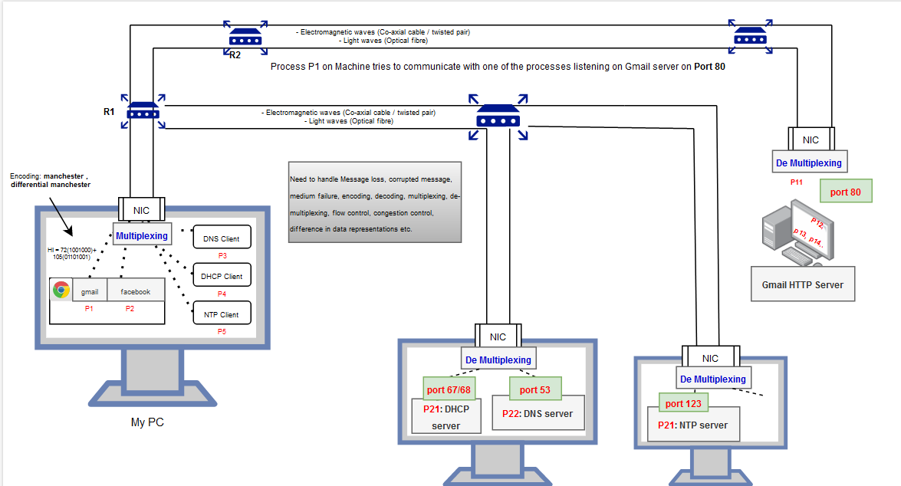
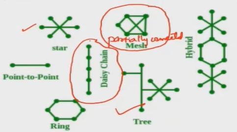
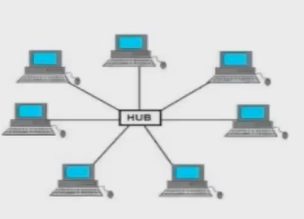
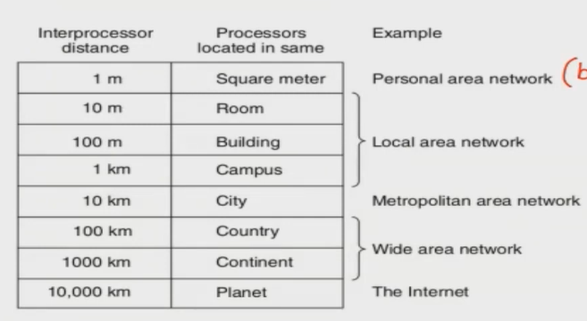
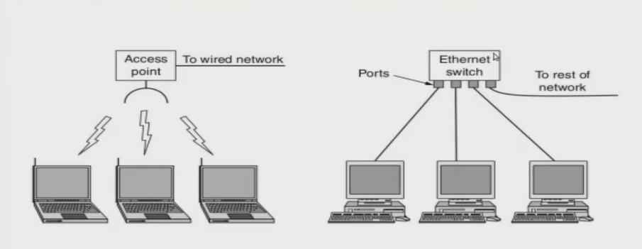
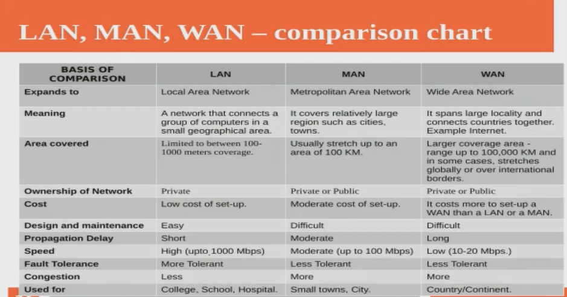

===========
Overview
===========

Why computer networks?
=======================

Imagine there is no computer networking.

- We can communicate only through tele-phone or fax.
- Printers must be attached to the computer which requires printing. Sharing of printers will be difficult.
- Requires removable media like thumd drives to transfer files.
- Email, SMS, internet phone etc. are not feasible.

What is a Computer network
===========================

- Computers connected together and communicate with each other.
- There can be many connecting devices like router, switch, repeaters etc. between source and destination.
    - These connecting devices forwards/amplifies/or decides the route using different shortest path routing algorithms.
- Medium: telephone lines, co-axial cables (electro-magnetic signals), optical fibres (light waves), satellite links etc.
- Information represented as: 
    - Binary (bits) in computers.
    - Signals by medium.
- Machines are communicating each other actually means **A process inside one machine is trying to communicate with a process residing on a remote machine**.
    - Process: is program in execution which means **a datastructure which setup all execution environment (including stacks, heaps etc.) for running a program.**
    - The end-user of a network communication is ultimately a process.
    - Each browser tab can be one or more processes trying to communicate with processes in one or more remote servers.
    - **Ports** are used to address a process.
    - This is why we say end-to-end communication is the responsibility of transport layer.
- We can represent a network as a graph where,
    - Each machine is a node/vertex, and the connections are edges.
    - Or each process as a vertex, a dynamic graph. 
- Communication is possible with or without connection establishment, depending on the requirement.
    - Connection-oriented: Sender and Reciever will get to know each others capacity and negotiations can be made. Also, resources can be reserved.
    - Connection-less: Can save time.
- NIC: Network Interface Card.
    - NIC is a chip with pre-defined algorithms running to collect information from all processes.
    - NIC takes your information from all processes as a single unit out to the network.
    - Multiplexing - many to one.
    - Demultiplexing - Each process arriving at a server can be from different clients. 
- Server address can be IP address (logical address in OS), or MAC address (Physical address in OS).
    - MAC - Permenantly stored in the NIC.
    - To identify processes with in a machine, we use **port numbers**, similar to process-id in OS.
- Depending on the source & dest:
    - **hop-by-hop**: hop is one jump b/w MyPC and R1, b/w R1 & R2 etc. Address: **MAC address**
    - **node-by-node**: between end machines, in this case b/w MyPC and Gmail Server. Address: **IP address**
    - **end-to-end (process-to-process)**, b/w P1 in MyPC and P11 in Gmail Server. Address: **Port Number**

Inter process communication: OS vs CN
======================================
In Operating system, we've learned process to process communication within the same machine. 

We know that communication between two machines actually means that a process in source communicates with process in destination machine. So, in computer network, we take inter-process communicatinon to the next level, i.e, processes are residing in remote machines here.

Communication among processes residing in different machines is not as easy as inter-process communication in the same machine. What is the guarentee that the message you send will be recieved by the reciever?

Challenges
-----------

- Message loss
- Delivered information can be corrupted. When you send a "Hello", it should be delivered as it is in the destination.
- Entire path can break and have to find an alternative path.
- Failure of medium
- Signal encoding/decoding required: The 0's and 1's we pass have to change it to signals.
- Error detection needed: at least reciever should know that an error occurred.
- Error correction may needed if the reciever is capable.
- We need to run multiplexing algorithms.
- Flow control: if sender's speed is not in match with reciever speed.
- Congestion control in the network.
- Each machine architecture can be different, some use mac books, some use windows. Some represent information in big endian, some in little endian (Intel). Doesn't matter, we need to make the process-to-process communication possible.

.. important::
    - **We prefer error detection over error correction**: Correction is costly. So, in practical the algorithm to detect an error takes very less time compared to error correction algorithms. So, in practical we follow **Error detection + Retransmission**. 
    - **Hamming code**: Popular algorithm for error correction.
    - **CRC (Cycle-Redundancy-Checks) & Checksum**: Error detection algorithms.

So, we need an architecture to implement all these aspects. We use layered approach to solve all these problems.

- Physical layer: takes care of things related to communication medium (i.e. signal encoding, decoding etc.)
- Data link layer: Flow control, media access control etc.
- Network layer: routing, Congestion etc.
- Transport layer: end-to-end.
- Application layer: Message formatting, compression, encryption, decryption etc.

**We have algorithm for everything, whether it is signal encoding, error handling, flow control, congestion control, and for everything.**.

- *Open system*: System active for communication, *Closed system*: System down.
- **Protocols**: similar to grammer in english. Two people who know different languages can't communicate with each other.
- *Guided medium vs Unguided medium*:
    - Guided: waves are guided along a phyical path. (twisted pair, coaxial cable, optical fibre).
    - Unguided: wireless (through air, sea water or vaccum). more noise, requires amplifying, need to take care of signal attenuation etc. Information is not protected from external disturbances.

- Point to point vs multi-point communication
    - point to point (not practical): a guided non-shared media is avaiable between every pair of devices. total nC2 connections are required. costly!
    - multi-point: every device is connected to a common line. Requires **collision handling**.

- Signal attenuation can be addressed by placing a **repeater (regenerator)** in all the places where the signal is attenuated.
- Repeater is not an amplifier. It just regenerate the signal. i.e. an amplifier which regenerate signal with the same amplitude.

- We add **header** which contain all information about the destination is used to reach the reciever.
- Unicasting: To a single destination.
- Broad-casting: One to ALL. 2 use cases,
    - To broad cast a message to all machines.
    - To help in Unicasting.
- Multi-casting: One to many

.. important:: We may depend on Broad-casting to do a Unicasting because most cases, there won't be a direct link.

- Transmission modes:
    - Simple: TV, Radio, Key-word to monitor communication.
    - Half-duplex: Walkie-talkie over over. Both direction is possible, but one at a time.
    - Duplex: Simultanious communication in both direction. tele-phone.

.. important:: 
    - **ANSI**: Default. Simplex, Half-duplex and duplex concepts are there.
    - **ITU-T**: No Half-duplex. They call it simplex. Duplex means full duplex.
    - n devices in a network, number of duplex links required for mesh topology = n(n-1)/2 = nC2
    - n devices in a network, number of duplex links required for star topology = n-1
    - n devices in a network, number of ports required for mesh topology = nC2 - 1

- Network topology: Layout arrangements of the different devices in a network.
    - star, mesh (fully connected, partially connected), tree (bus+star), daisy-chain, point-to-point, ring, hybrid.
    - Physical topology of FDDI is Ring topology.

Hub is a term used with star topology

- Classification of interconnected processors.
    - Personal area networks: Bluetooth, zigbee.
    - Local area networks: Ethernet (popular in wired), wifi (popular in wireless)
        - Ethernet: **IEEE 802.3** - Ethernet Switch
            - 10 Mbits/sec = 10 Base T = Ethernet   # T for twisted pair.
            - 100 Mbits/sec = 100 Base T = Fast Ethernet
            - 1000 Mbits/sec = 1000 Base T = Giga Ethernet
        - Wifi: **IEEE 802.11** - Wifi Access point
        - FDDI (fibre distributed data interface) is also a LAN network but it is obsolete by Fast Ethernet which offers same speed (**100Mbits/sec.**) but with lower cost. Ethernet comes with faster technology without compromising cost.
        - (If it uses coper instead of fibre, it is called CDDI.)
        - **Maximum Frame Size of Ethernet = 1500bytes**. Max Frame size of FDDI 4352 bytes.
    - Metropolitian area network: WiMAX (**IEEE802.16**)

In wired lan, systems are connected using Ethernet Switch.
In wireless we call it Wifi Access point.

Detailed comparison.

.. important:: **ARPANET**: The first network (Advanced Research Project Agency Network).
    
    - First wide-area **Packet Switching** network with distributed control.
    - First network to implement the TCP/IP protocol suite.
    - We had **Circuit switching** earlier. i.e. tele-phone network which requires establishment of a circuit and communication occurs through that permenant circuit. It is not that feasible for computer networks. So we needed a better model. That's where **packet switching** comes in picture.
    - In packet switching, we don't establish a permenant circuit. Instead, we divide information into pieces and each packet is switched through different path. Finally the packets will be combined at destination using sequence number and all.
    - Note that **there is no network implemented using ISO/OSI model**. It is just a reference model.

