===============
Physical Layer
===============

Electro-magnetic signals
==========================

- Analog vs digital signals.
- Periodic and Aperiodic signals.

A signal s(t) is periodic only if ::

    s(t+T) = s(t)   where -INFINITY < t < +INFINITY

- Sine wave is the fundamental periodic signal. 
- 3 parameters to represent a sine wave
    - peak amplitude: 
    - frequency: cycles/sec (Hz). f = 1/T
        - Bandwidth: difference b/w upper & lower frequencies.
    - phase: Position of wave form relative to time 0. (radians(2pie) or degrees (360))
        - phase is the amount o*f shift
        - indicates the status of first cycle.
        - 360 degree shifted: complete period.
        - 180 degree: one-half a period

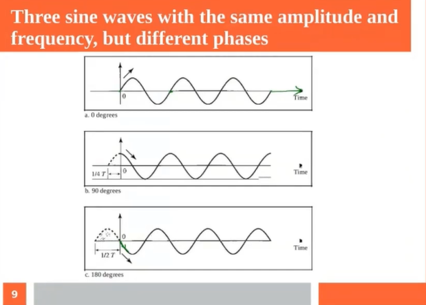

- **Wavelength**: distance a signal can travel in one period.
    - Wavelength is a property of any signal.
    - distance travelled by the `signal = velocity X time = T * V`
- A signal doesn't really exist before time 0.

.. important:: 
    - Frequency is independent of the medium.
    - Wavelength depends on both frequency and medium.
    - Wavelength is the property of any type of signal

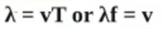

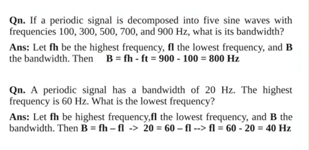

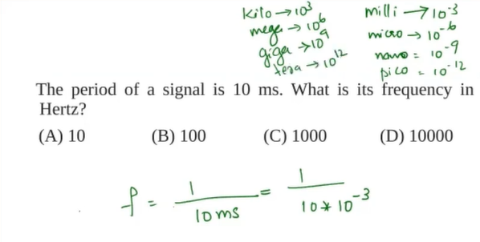

Network performance parameters
================================

- Bandwidth (Manufacture point of view):
    - in Hertz (Electronics): range of frequencies contained in a composite signal.
    - in Bits/sec (CS): No of bits/sec that a channel/link/network can transmit.
    - **Increase Bandwidth in Hz will increase bits per sec**
    - Ethernet Bandwidth:
        - Ethernet: 10 Mbits/sec.
        - Fast Ethernet: 100 Mbits/sec. [after 10 years]
        - Giga Ethernet: 1000 Mbits/sec. [after 10 years]

- Throughput (Bandwidth utilisation): bits/sec.
- Latency: **Propagation delay** + **Transmission time** + **Queuing time** + **Processing Delay**.
    - **Bit duration/bit length**: Time taken to trasmit one bit. If BW=100Mbps, Then 10*10^6bits/sec. For 1bit, 0.1Micro sec.
    - [Transmission time for a message of length L bits = L/B sec] where B is the Bandwidth.
    - [Propagation delay = distance/velocity]

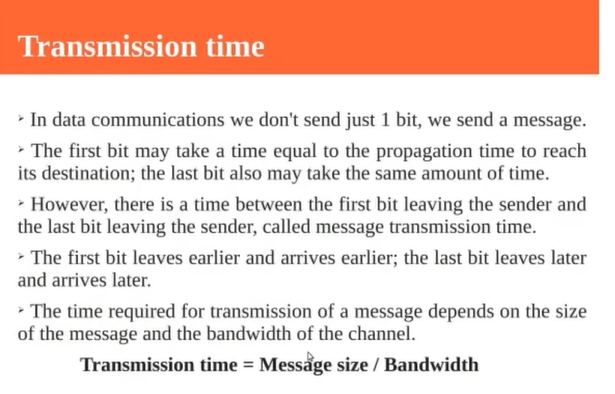

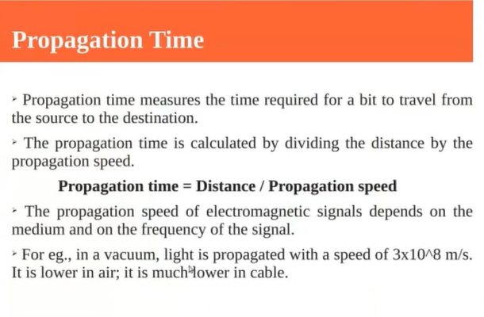

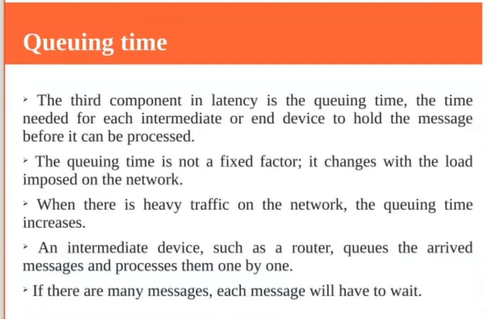

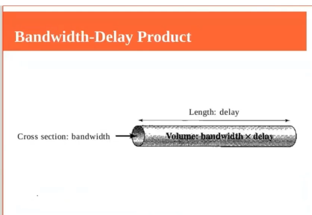

- Jitter: If different packets of data encounter different delays. Delay for first packet 5sec, deley for 2nd packet 12sec.
    - Example: Audio vidoe mismatch.

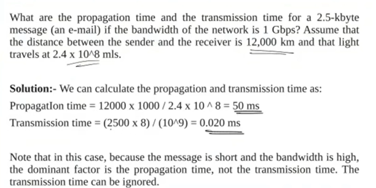

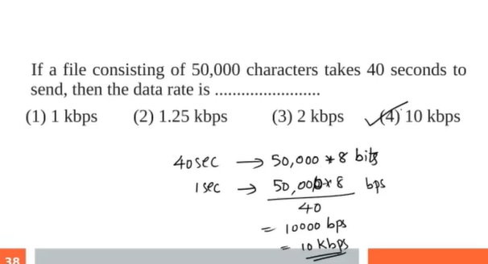

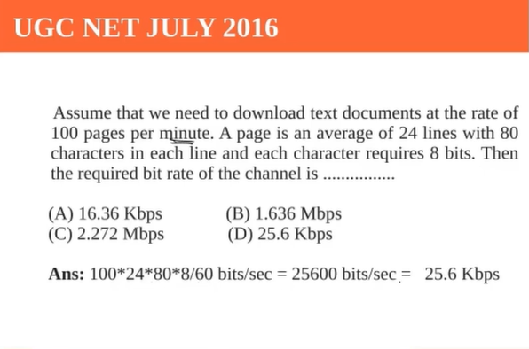

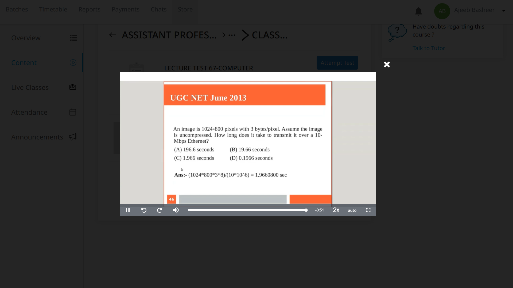
